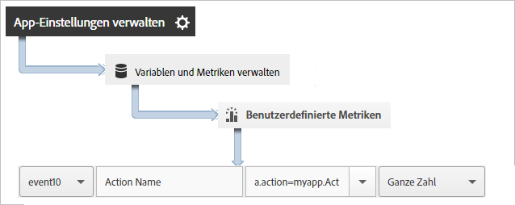
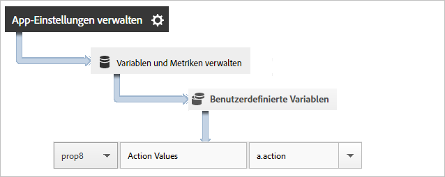
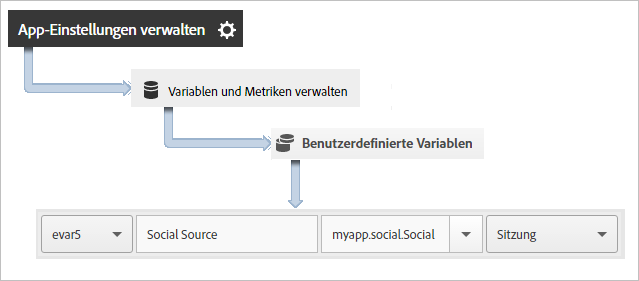

# App-Aktionen verfolgen {#track-app-actions}

Aktionen sind die Ereignisse in der Android-App, die Sie messen möchten.

Jede Aktion weist mindestens eine zugehörige Metrik auf, die bei jedem Vorkommen des Ereignisses erhöht wird. So könnten Sie z. B. einen `trackAction`-Aufruf für jedes neue Abonnement, jeden Artikelaufruf oder jeden Levelabschluss senden. Aktionen werden nicht automatisch verfolgt. Sie müssen `trackAction` aufrufen, wenn ein zu verfolgendes Ereignis auftritt, und die Aktion dann einem benutzerdefinierten Ereignis zuordnen.

## Aktionen verfolgen {#section_380DF56C4EE4432A823940E4AE4C9E91}

1. Fügen Sie die Bibliothek zu Ihrem Projekt hinzu und implementieren Sie den Lebenszyklus.

   Weitere Informationen finden Sie unter *SDK und Konfigurationsdatei zu Ihrem IntelliJ IDEA- oder Eclipse-Projekt hinzufügen* in [Grundlegende Implementierung und Lebenszyklus](/help/android/getting-started/dev-qs.md).

1. Importieren Sie die Bibliothek:

   ```java
   import com.adobe.mobile.*;
   ```

1. Wenn die zu verfolgende Aktion in Ihrer App auftritt, rufen Sie `trackAction` auf, um einen Treffer für diese Aktion zu senden:

   ```java
   Analytics.trackAction("myapp.ActionName", null);
   ```

1. Wählen Sie Ihre App in der Benutzeroberfläche von Adobe Mobile Services aus und klicken Sie auf **[!UICONTROL App-Einstellungen verwalten]**.
1. Klicken Sie auf **[!UICONTROL Variablen und Metriken verwalten]** und dann auf die Registerkarte **[!UICONTROL Benutzerdefinierte Metriken]**.

1. Weisen Sie den Kontextdatennamen, der in Ihrem Code definiert ist (z. B. `myapp.ActionName`), einem benutzerdefinierten Ereignis zu.

   

Sie können auch eine Eigenschaft für alle Aktionswerte festlegen, indem Sie eine benutzerdefinierte Eigenschaft mit einem Namen wie **[!UICONTROL Benutzerdefinierte Aktionen]** zuordnen und den Wert auf `a.action` festlegen.



## Zusätzliche Daten senden {#section_3EBE813E54A24F6FB669B2478B5661F9}

Zusätzlich zum Aktionsnamen können Sie mit jedem trackAction-Aufruf zusätzliche Kontextdaten senden:

```java
HashMap<String, Object> exampleContextData = new HashMap<String, Object>(); 
exampleContextData.put("myapp.social.SocialSource", "Twitter"); 
Analytics.trackAction("myapp.SocialShare", exampleContextData);
```

Die Kontextdatenwerte müssen benutzerdefinierten Variablen in Adobe Mobile Services zugeordnet werden:



## Aktionsberichte {#section_0F6A54AB7A3F42C9BB042D86A0FC4630}

| Schnittstelle | Bericht |
|--- |--- |
| Adobe Mobile Services | Bericht **[!UICONTROL Aktionspfade]**:  Zeigen Sie die Reihenfolge an, in der Aktionen in Ihrer App aufgetreten sind. Sie können auch auf **[!UICONTROL Anpassen]** klicken, um die Aktionen in Rang- oder Trendansicht bzw. aufgeschlüsselt anzuzeigen, oder Sie nutzen Filter, um nur Aktionen für ein bestimmtes Segment anzuzeigen. |
| Marketing Reports and Analytics | Bericht **[!UICONTROL Benutzerspezifisches Ereignis]**:  Nachdem eine Aktion einem benutzerdefinierten Ereignis zugewiesen wurde, können Sie mobile Ereignisse ähnlich anzeigen wie alle anderen Analytics-Ereignisse. |
| Ad-hoc-Analysen | Bericht **[!UICONTROL Benutzerspezifisches Ereignis]**:  Nachdem eine Aktion einem benutzerdefinierten Ereignis zugewiesen wurde, können Sie mobile Ereignisse ähnlich anzeigen wie alle anderen Analytics-Ereignisse. |

