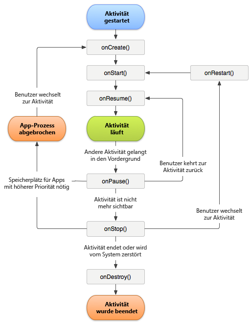

# Nachverfolgen von App-Abstürzen {#track-app-crashes}

Mithilfe dieser Informationen können Sie ermitteln, wie Abstürze verfolgt werden und wie Sie am besten mit fälschlich gemeldeten Abstürzen umgehen.

>[!TIP]
>
>App-Abstürze werden als Teil der Lebenszyklusmetriken verfolgt. Bevor Sie Abstürze verfolgen können, fügen Sie die Bibliothek Ihrem Projekt hinzu und implementieren Sie den Lebenszyklus. Weitere Informationen finden Sie unter *SDK und Config File to your intellij IDEA oder Eclipse Project* in [Core Implementation and Lifecycle](/help/android/getting-started/dev-qs.md).

Wenn die Lebenszyklusmetriken implementiert sind, wird `Config.collectLifecycleData` in der Methode `OnResume` jeder Aktivität aufgerufen. In the `onPause` method, a call is made to `Config.pauseCollectingLifeCycleData`.

In `pauseCollectingLifeCycleData` wird eine Markierung gesetzt, um die ordnungsgemäße Beendigung anzuzeigen. Wenn die App erneut gestartet oder wieder aufgenommen wird, überprüft `collectLifecycleData` diese Markierung. Wenn die App laut Flag-Status nicht ordnungsgemäß beendet wurde, werden mit dem nächsten Aufruf `a.CrashEvent`-Kontextdaten gesendet und es wird ein Absturzereignis gemeldet.

Um präzise Absturzberichte zu gewährleisten, müssen Sie `pauseCollectingLifeCycleData` in der Methode `onPause` jeder Aktivität aufrufen. Um zu verstehen, warum dies wichtig ist, sehen Sie hier den Android-Aktivitätslebenszyklus:



Weitere Informationen zum Lebenszyklus von Android-Aktivitäten finden Sie unter [Aktivitäten](https://developer.android.com/guide/components/activities.html).

*Diese Darstellung des Android-Lebenszyklus wurde[vom Android Open Source Project erstellt und veröffentlicht](https://source.android.com/)und wird gemäß[Creative Commons 2.5 Attribution License](https://creativecommons.org/licenses/by/2.5/)verwendet.*

## Wie kann es passieren, dass fälschlicherweise ein Absturz gemeldet wird?

1. Wenn Sie mit einer IDE debuggen, z. B. mit Android Studio, und die App von der IDE aus erneut startet, während sich die App im Vordergrund befindet, führt dies zu einem Absturz.

   >[!TIP]
   >
   >Sie können diesen Absturz vermeiden, indem Sie die App beenden, bevor Sie erneut aus der IDE starten.

1. If the last foreground Activity of your app is backgrounded and does not call `Config.pauseCollectingLifecycleData();` in `onPause`, and your app is manually closed or killed by the OS, the next launch results in a crash.

## Wie gehe ich mit Fragmenten um?

Fragmente verfügen über App-Lebenszyklusereignisse, die Aktivitäten ähnlich sind. Fragmente können jedoch nicht aktiv sein, ohne an eine Aktivität angehängt zu sein.

>[!IMPORTANT]
>
>Sie müssen sich auf die Lebenszyklusereignisse verlassen, mit denen die entsprechenden Aktivitäten Ihren Code ausführen können. Dies erfolgt über die übergeordnete Ansicht des Fragments.

## (Optional) Implementieren Sie Lebenszyklusrückrufe für Aktivitäten.

Seit API-Version 14 erlaubt Android globale Lebenszyklus-Rückrufe für Aktivitäten. For more information, see [Application](https://developer.android.com/reference/android/app/Application).

You can use these callbacks to ensure that all of your Activities correctly call `collectLifecycleData()` and `pauseCollectingLifecycleData()`. Sie benötigen diesen Code nur in Ihrer Hauptaktivität und anderen Aktivitäten, in der Ihre App möglicherweise gestartet wird:

```js
import com.adobe.mobile.Config; 
  
public class MainActivity extends Activity { 
... 
    @Override 
    protected void onCreate(Bundle savedInstanceState) { 
        super.onCreate(savedInstanceState); 
        setContentView(R.layout.activity_main); 
  
        getApplication().registerActivityLifecycleCallbacks(new Application.ActivityLifecycleCallbacks() { 
            @Override 
            public void onActivityResumed(Activity activity) { 
                Config.setContext(activity.getApplicationContext()); 
                Config.collectLifecycleData(activity); 
            } 
  
            @Override 
            public void onActivityPaused(Activity activity) {     
                Config.pauseCollectingLifecycleData(); 
            } 
    
            // the following methods aren't needed for our lifecycle purposes, but are required to be implemented 
            // by the ActivityLifecycleCallbacks object 
            @Override 
            public void onActivityCreated(Activity activity, Bundle savedInstanceState) {} 
            @Override 
            public void onActivityStarted(Activity activity) {} 
            @Override 
            public void onActivityStopped(Activity activity) {} 
            @Override 
            public void onActivitySaveInstanceState(Activity activity, Bundle outState) {} 
            @Override 
            public void onActivityDestroyed(Activity activity) {} 
        }); 
    } 
... 
}
```

To send additional context data with your lifecycle call by using `Config.collectLifecycleData(Activity activity`, `Map<String`, `Object> contextData)`, you must override the `onResume` method for that Activity and ensure that you call `super.onResume()` after manually calling `collectLifecycleData`.

```js
@Override 
protected void onResume() { 
    HashMap<String, Object> cdata = new HashMap<>(); 
    cdata.put("someKey", "someValue"); 
    Config.collectLifecycleData(this, cdata); 
  
    super.onResume(); 
}
```

