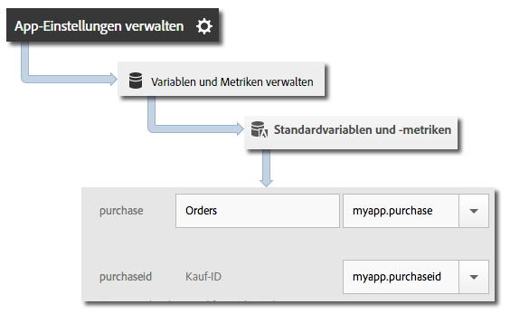

# Products variable {#products-variable}

Die Variable „products“ kann nicht mithilfe von Verarbeitungsregeln festgelegt werden. Im Mobile-SDK müssen Sie im Kontextdatenparameter eine spezielle Syntax verwenden, um „products“ direkt im Server-Aufruf festzulegen.

To set the *products* variable, set a context data key to `"&&products"`, and set the value by using the syntax that is defined for the *products* variable:

```java
cdata.put("&&products", "Category;Product;Quantity;Price[,Category;Product;Quantity;Price]");
```

Beispiel:

```java
//create a context data dictionary 
HashMap cdata = new HashMap<String, Object>(); 
 
// add products, a purchase id, a purchase context data key, and any other data you want to collect. 
// Note the special syntax for products 
cdata.put("&&products", ";Running Shoes;1;69.95,;Running Socks;10;29.99"); 
cdata.put("myapp.purchase", "1"); 
cdata.put("myapp.purchaseid", "1234567890"); 
 
// send the tracking call - use either a trackAction or TrackState call. 
// trackAction example: 
Analytics.trackAction("purchase", cdata); 
// trackState example: 
Analytics.trackState("Order Confirmation", cdata);
```

The *products* variable is set on the image request, and the other variables are set as context data. Sämtliche Kontextdatenvariablen müssen mithilfe von Verarbeitungsregeln zugeordnet werden:



Sie müssen die Variable *products* variable by using processing rules because this variable is set directly on the image request by the SDK.
