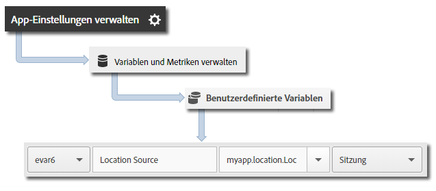

# Geostandort und Zielpunkte {#geo-location-and-points-of-interest}

Mit dem Geostandort können Sie mithilfe von Längen- und Breitengrad und vordefinierten POIs in Ihren Android-Apps Positionsdaten messen.

Jeder `trackLocation`-Aufruf sendet folgende Informationen:

* Längengrad, Breitengrad und Standort als POI, der in der Adobe Mobile Services UI definiert ist.

   Diese Informationen werden für die automatische Berichterstellung an die Variablen der mobilen Lösung übergeben.

* Entfernung vom Zentrum und Genauigkeit werden als Kontextdaten weitergegeben.

   Diese Variablen werden nicht automatisch erfasst. Sie müssen diese Variablen für Kontextdaten mithilfe der Anweisungen im Abschnitt *Zusätzliche Daten senden* unten zuordnen.

## Dynamische POI-Aktualisierungen {#section_3747B310DD5147E2AAE915E762997712}

Ab Version 4.2 werden POIs in der Adobe Mobile-UI definiert und dynamisch mit der App-Konfigurationsdatei synchronisiert. Diese Synchronisation erfordert die Einstellung `analytics.poi` in der [ADBMobile JSON-Konfiguration](/help/android/configuration/json-config/json-config.md):

```js
“analytics.poi”: “https://assets.adobedtm.com/…/yourfile.json”,
```

Wenn dies nicht konfiguriert ist, müssen Sie eine aktualisierte Version der Datei `ADBMobile.json` herunterladen und sie zu Ihrer App hinzufügen. Weitere Informationen finden Sie unter [SDK und Testwerkzeuge herunterladen](/help/android/getting-started/requirements.md).

## Geostandort und Zielpunkte verfolgen {#section_B1616E400A7548F9A672F97FEC75AE27}

1. Fügen Sie die Bibliothek zu Ihrem Projekt hinzu und implementieren Sie den Lebenszyklus.

   Weitere Informationen finden Sie unter *SDK und Konfigurationsdatei zu Ihrem IntelliJ IDEA- oder Eclipse-Projekt hinzufügen* in [Grundlegende Implementierung und Lebenszyklus](/help/android/getting-started/dev-qs.md).

1. Importieren Sie die Bibliothek:

   ```java
   import com.adobe.mobile.*;
   ```

1. Rufen Sie `trackLocation` auf, um den aktuellen Standort zu verfolgen:

   ```java
   Location currentLocation = new Location("my location here"); 
   Analytics.trackLocation(currentLocation, null);
   ```

   >[!TIP]
   >
   >Sie können `trackLocation` jederzeit aufrufen.

   Sie können Standortstrategien nutzen, um den Standort zu bestimmen, der an den `trackLocation`-Aufruf übergeben wird. Weitere Informationen finden Sie unter [Android-Standortstrategien](https://developer.android.com/guide/topics/location/strategies.html).

Darüber hinaus wird, wenn sich der Standort innerhalb eines definierten Radius zum POI befindet, eine `a.loc.poi`-Kontextdatenvariable mit dem `trackLocation`-Treffer gesendet und als POI im Bericht **[!UICONTROL Aufschlüsselung nach Ort]** aufgeführt. Außerdem wird eine `a.loc.dist`-Kontextvariable gesendet, die den Abstand von den definierten Koordinaten in Metern enthält.

## Zusätzliche Daten senden {#section_3EBE813E54A24F6FB669B2478B5661F9}

Zusätzlich zum Standortnamen können Sie mit jedem trackLocation-Aufruf zusätzliche Kontextdaten senden:

```java
HashMap<String, Object> locationContextData = new HashMap<String, Object>(); 
locationContextData.put("myapp.location.LocationSource", "GPS"); 
 
Location currentLocation = new Location("my location here"); 
Analytics.trackLocation(currentLocation, locationContextData);
```

Die Werte der Kontextdaten müssen in der Adobe Mobile Services UI benutzerdefinierten Variablen zugewiesen werden.



## Standort-Kontextdaten {#section_FFB71E6653F9410A89CC6ACC0C9164A9}

Die Längen- und Breitengrade werden mit drei verschiedenen Kontextdatenparametern gesendet, wobei jeder Parameter einen anderen Genauigkeitsgrad für insgesamt sechs Kontextdatenparameter darstellt.

Beispielsweise stellen die Koordinaten lat = 40,93231, long = -111,93152 einen Standort mit einer Genauigkeit von 1 m dar. Dieser Standort wird entsprechend der Genauigkeit auf die folgenden Variablen aufgeteilt:

`a.loc.lat.a` = 040,9

`a.loc.lat.b` = 32

`a.loc.lat.c` = 31

`a.loc.lon.a` = -111,9

`a.loc.lon.b` = 31

`a.loc.lon.c` = 52

Einige Präzisionsstufen werden je nach Präzision des aktuellen Standorts möglicherweise als `00` angezeigt. Wenn der Standort beispielsweise auf 100 Meter genau ist, enthalten `a.loc.lat.c` und `a.loc.lon.c` den Wert `00`.

Beachten Sie die folgenden Informationen:

* Eine `trackLocation`-Anfrage sendet das Äquivalent eines `trackAction`-Aufrufs.

* POIs werden nicht als Teil der typischen `trackAction`- und `trackState`-Aufrufe übergeben. Sie müssen also einen `trackLocation`-Aufruf verwenden, um POIs zu verfolgen.

* `trackLocation` muss so oft wie nötig aufgerufen werden, um Standorte und POIs zu verfolgen.

   Wir empfehlen, `trackLocation` beim Start der App und dann je nach App-Anforderungen nach Bedarf aufzurufen.

* POIs werden nur eingefügt, wenn sie in der App-Konfigurationsdatei definiert sind.

   Die POIs werden nicht auf bereits gesendete `trackLocation`-Aufrufe angewendet.
* `trackLocation`-Aufrufe unterstützen das Senden zusätzlicher Kontextdaten – ähnlich wie `trackAction`-Aufrufe.

* Wenn sich die Radien zweier POIs überschneiden, wird der erste POI verwendet, der den aktuellen Standort enthält.

   Wenn sich Ihre POIs überschneiden, sollten Sie die POIs in der Reihenfolge der größten bis zur niedrigsten Granularität auflisten, um sicherzustellen, dass der POI mit der größten Granularität gemeldet wird.
