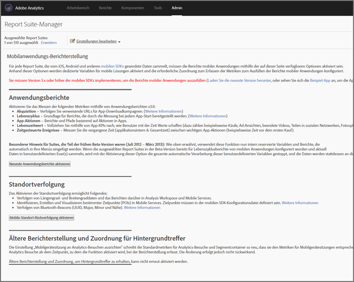

# Analytics {#analytics}

Nachdem Sie die Bibliothek Ihrem Projekt hinzugefügt haben, können Sie beliebige Analysemethodenaufrufe überall in Ihrer Anwendung nutzen (importieren Sie unbedingt ADBMobile.h in Ihre Klasse).

## Enable mobile application reports in Analytics {#task_3DA1354942CF4BF4B11B9CC97588A9ED}

Bevor Sie Code hinzufügen, bitten Sie Ihren Analytics-Administrator, folgende Schritte auszuführen, um Mobile App-Lebenszyklus-Tracking zu ermöglichen. Dadurch wird sichergestellt, dass Ihre Report Suite zur Erfassung von Metriken bereit ist, wenn Sie die Entwicklung beginnen.


1. Open **[!UICONTROL Admin Tools]** &gt; **[!UICONTROL Report Suites]** and select your mobile report suite(s).
1. Click **[!UICONTROL Edit Settings]** &gt; **[!UICONTROL Mobile Management]** &gt; **[!UICONTROL Mobile Application Reporting]**.

   

1. Klicken Sie auf **[!UICONTROL Neueste Anwendungsberichte aktivieren]**.

   Optionally, you can also click **[!UICONTROL Enable Mobile Location Tracking]** and **[!UICONTROL Enable Legacy Reporting and Attribution for background hits]**.

   

Lifecycle metrics are now ready to be captured, and Mobile Application Reports] appear in the **[!UICONTROL Reports]** menu in the marketing reports interface.

## Erfassen von Lebenszyklusmetriken {#task_25D469C62DF84573AEB5E8E950B96205}

1. To collect lifecycle metrics in your app, call `collectLifecycleData()` in the `ApplicationUI` constructor.

   Beispiel:

   ```java
   ApplicationUI::ApplicationUI(bb::cascades::Application *app): QObject(app) { 
   //... 
   ADBMobile::collectLifecycleData(); 
   } 
   ```

   If `collectLifecycleData()` is called twice in the same session, then your application will report a crash on every call after the first. Das SDK setzt eine Markierung, wenn die Anwendung heruntergefahren wird, um eine erfolgreiche Beendigung anzugeben. If this flag is not set, `collectLifecyleData()` reports a crash.

## Events, props, and eVars {#concept_B885D5A71A5D45129CE7C1C3426A7D28}


Wenn Sie sich die [adbmobile-Klassen- und Methodenreferenz](/help/blackberry/methods.md)angesehen haben, stellen Sie sicher, wo Sie Ereignisse, evars, Props, Höhen und Listen festlegen. In Version 4 können Sie diese Variablentypen nicht mehr direkt in Ihrer Anwendung zuweisen. Stattdessen nutzt das SDK Kontextdaten und Verarbeitungsregeln, um Ihre App-Daten zwecks Reporting Analytics-Variablen zuzuordnen.

Verarbeitungsregeln bieten mehrere Vorteile:

* Sie können Ihre Datenzuweisung ändern, ohne ein Update im App Store einzureichen.
* Sie können relevante Namen für Ihre Daten verwenden, anstatt Variablen festzulegen, die spezifisch für eine Report Suite sind.
* Es ist kaum Aufwand nötig, um zusätzliche Daten zu senden. Diese Werte werden erst dann in Berichten angezeigt, wenn sie mithilfe von Verarbeitungsregeln zugeordnet werden.

Werte, die Sie Variablen direkt zugewiesen haben, müssen stattdessen zur HashMap `data` hinzugefügt werden.

## Verarbeitungsregeln {#concept_3EA4CD602AF4488A896B0EDD3BA2D969}

Verarbeitungsregeln werden verwendet, um die in Kontextdatenvariablen gesendeten Daten in eVars, Eigenschaften und andere Variablen für Berichte zu kopieren.

[Training zu Verarbeitungsregeln](https://tv.adobe.com/embed/1181/16506/) beim Summit 2013

[Verarbeitungsregeln](https://docs.adobe.com/content/help/en/analytics/admin/admin-tools/processing-rules/processing-rules.html)

[Autorisierung zur Verwendung von Verarbeitungsregeln](https://helpx.adobe.com/analytics/kb/processing-rules-authorization.html)

Es ist empfehlenswert, die Kontextdatenvariablen mithilfe von „Namespaces“ zu gruppieren, um eine logische Ordnung beizubehalten. Wenn Sie beispielsweise Informationen zu einem Produkt erfassen möchten, können Sie die folgenden Variablen definieren:

```js
"product.type":"hat" 
"product.team":"mariners" 
"product.color":"blue"
```

Kontextdatenvariablen werden auf der Verarbeitungsregeloberfläche alphabetisch sortiert. Mit Namespaces können Sie schnell nachvollziehen, welche Variablen sich im selben Namespace befinden.

Wir haben außerdem erfahren, dass einige von Ihnen Kontextdatenschlüssel mithilfe der eVar- oder prop-Nummer benennen:

```js
"eVar1":"jimbo"
```

Dadurch wird es *etwas* einfacher, wenn Sie die einmalige Zuordnung in den Verarbeitungsregeln durchführen. Sie verlieren dadurch jedoch auch die Lesbarkeit während des Debuggings und künftiger Codeaktualisierungen, was wiederum komplizierter sein kann. Es wird stattdessen dringend empfohlen, dass Sie beschreibende Namen für Schlüssel und Werte verwenden:

```js
"username":"jimbo"
```

Kontextvariablen, die Zählerereignisse definieren, können denselben Schlüssel und denselben Wert aufweisen:

```js
"logon":"logon"
```

Kontextvariablen, die Inkrementereignisse definieren, können das Ereignis als Schlüssel und die zu erhöhende Menge als Wert aufweisen:

```js
"levels completed":"6"
```

>[!TIP]
>
>Adobe behält sich den Namespace `a.`vor. Neben dieser kleinen Einschränkung müssen Kontextvariablen nur eindeutig für Ihre Unternehmensanmeldung sein, um Konflikte zu vermeiden.

## Enable offline tracking {#concept_402F4ECE240B4CA1B779322A7BFCB8DE}

To store hits when the device is offline, you can optionally enable offline tracking in the `ADBMobileConfig.json` file.

Achten Sie sehr genau auf die Zeitstempelanforderungen, die in der Konfigurationsdatei-Referenz beschrieben werden, bevor Sie die Offline-Verfolgung aktivieren.

## Analytics-Methoden

Eine Liste der für blackberry verfügbaren Analytics-Methoden finden Sie unter *Analytics-Methoden* in der [Adobe Mobile Klassen- und Methodenreferenz](/help/blackberry/methods.md).