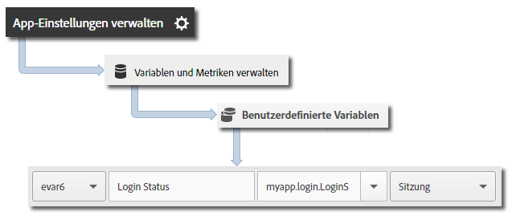

# App-Zustände verfolgen {#track-app-states}

Status sind die verschiedenen Bildschirme oder Ansichten in der Anwendung. Jedes Mal, wenn in Ihrer Anwendung ein neuer Status angezeigt wird, z. B. wenn ein Benutzer von der Startseite zum News-Feed navigiert, sollte ein Verfolgungsstatusaufruf gesendet werden. Unter iOS wird ein Status normalerweise in der viewDidLoad-Methode jeder Ansicht verfolgt.

>[!TIP]
>
>Rufen Sie `trackState` auf, um den Status zu verfolgen. Status werden nicht automatisch verfolgt.

## Status verfolgen {#section_380DF56C4EE4432A823940E4AE4C9E91}

1. Fügen Sie die Bibliothek zu Ihrem Projekt hinzu und implementieren Sie den Lebenszyklus.

   Weitere Informationen finden Sie unter *SDK und Konfigurationsdatei zum Projekt hinzufügen* im Abschnitt [Grundlegende Implementierung und Lebenszyklus](/help/ios/getting-started/dev-qs.md).
1. Importieren Sie die Bibliothek.

   ```objective-c
   #import "ADBMobile.h"
   ```

1. Rufen Sie `trackState` auf, um einen Treffer für diese Statusansicht zu senden.

   ```objective-c
   [ADBMobile trackState:@"Login Screen"  
                    data:nil];
   ```

In Adobe Mobile Services wird der **[!UICONTROL State Name]** in der Variablen *`View State`* gemeldet und für jeden -Aufruf wird eine Ansicht aufgezeichnet`trackState`. In anderen Analytics-Oberflächen wird **[!UICONTROL Status anzeigen]** als **[!UICONTROL Seitenname]** und Statusansichten als Seitenansichten aufgeführt.

## Zusätzliche Daten senden {#section_CFDB4F944496401786A145C209AB387C}

Zusätzlich zum **[!UICONTROL Statusnamen]** können Sie bei jedem Verfolgungsaktionsaufruf zusätzliche Kontextdaten senden:

```objective-c
NSMutableDictionary *contextData = [NSMutableDictionary dictionary]; 
[contextData setObject:@"logged in" forKey:@"myapp.login.LoginStatus"]; 
[ADBMobile trackState:@"Home Screen" data:contextData];
```

Die Kontextdatenwerte müssen benutzerdefinierten Variablen zugeordnet werden:



## App-Statusberichte {#section_0F6A54AB7A3F42C9BB042D86A0FC4630}

Zustände werden in der Regel mithilfe eines Pfadberichts angezeigt, sodass Sie sehen können, wie Benutzer in Ihrer App navigieren und welche Zustände am häufigsten angezeigt werden.

|  |  |
|--- |--- |
| Adobe Mobile Services | Der Bericht **[!UICONTROL Status anzeigen]**: Dieser Bericht basiert auf den Pfaden, die Benutzer in Ihrer Anwendung durchlaufen. A sample path is  **[!UICONTROL Home]**  >  **[!UICONTROL Settings]**  > **[!UICONTROL Feed]**. |
| Adobe Analytics | Status können überall dort angezeigt werden, wo auch Seiten angezeigt werden können, z. B. in den Berichten **[!UICONTROL Seiten]**, **[!UICONTROL Seitenansichten]** oder **[!UICONTROL Pfad]**. |
| Ad-hoc-Analysen | Status können überall dort angezeigt werden, wo auch Seiten angezeigt werden, z. B. in der Dimension **[!UICONTROL Seite]**, der Metrik **[!UICONTROL Seitenansichten]** und dem Bericht **[!UICONTROL Pfad]**. |
