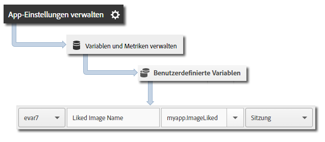

# Zeitgesteuerte Aktionen {#timed-actions}

Zeitgesteuerte Aktionen ermöglichen Ihnen die Messung der in der App verbrachten Zeit sowie der Gesamtzeit zwischen Start und Ende einer Aktion. Das SDK berechnet die Zeit in der Sitzung und die Gesamtzeit (sitzungsübergreifend) berechnen, die zum Abschluss der Aktion erforderlich ist. Sie können zeitgesteuerte Aktionen nutzen, um Segmente zu definieren. So können Sie verschiedene zeitliche Aspekte vergleichen, wie z. B. die Zeit bis zum Tätigen eines Kaufs oder Abschluss eines Levels, den Ablauf des Kaufvorgangs usw.

Die folgenden Metriken werden für zeitgesteuerte Aktionen gemeldet:

* Gesamtanzahl der Sekunden in der App zwischen Start und Ende – sitzungsübergreifend
* Gesamtanzahl der Sekunden zwischen Start und Ende (Uhrzeit)

Bei einem optionalen Callback können Sie zusätzliche Aktionen ausführen, wenn die zeitgesteuerte Aktion abgeschlossen ist:

* Code ausführen und eine Logik hinzufügen – optionale benutzerdefinierte Logik basierend auf den Ergebnissen der Dauer.
* Kontextdaten vor der Übergabe von Dauern hinzufügen.
* Treffer und noch nicht gesendete Dauern abbrechen.

## Zeitgesteuerte Aktionen verfolgen {#section_FF5B1EDC1A5340A5B13BC0F1BF2E13E1}

1. Fügen Sie die Bibliothek zu Ihrem Projekt hinzu und implementieren Sie den Lebenszyklus.

   Weitere Informationen finden Sie unter *SDK und Konfigurationsdatei zum Projekt hinzufügen* im Abschnitt [Grundlegende Implementierung und Lebenszyklus](/help/ios/getting-started/dev-qs.md).
1. Importieren Sie die Bibliothek:

   ```objective-c
   #import "ADBMobile.h"
   ```

1. Rufen Sie `trackTimedActionStart` auf und geben Sie einen Namen sowie optional Kontextdaten für die zeitgesteuerte Aktion an.

   ```objective-c
   [ADBMobile trackTimedActionStart:@"TimeUntilPurchase"  
                               data:@{@"ExperienceName" : experience}];
   ```

1. (Optional) Wenn Sie weitere Kontextdaten hinzufügen möchten, können Sie `trackTimedActionUpdate` mit dem zeitlich beschränkten Aktionsnamen aufrufen.

   ```objective-c
   [ADBMobile trackTimedActionUpdate:@"TimeUntilPurchase"  
                                data:@{@"myapp.ImageLiked" : imageName}];
   ```

1. Rufen Sie `trackTimedActionEnd` auf und geben Sie den Namen der zeitgesteuerten Aktion und `TimedActionBlock` (Callback) weiter, wenn das Ereignis abgeschlossen wird. Dadurch werden alle Daten nachgeschlagen und die Zeitdauer berechnet.

   Zeitgesteuerte Ereignismetriken werden in Variablen für die mobile Lösung gespeichert, um automatisches Reporting zu ermöglichen.

   ```objective-c
   [ADBMobile trackTimedActionEnd:@"TimeUntilPurchase"  
                            logic:nil];
   ```

## Zusätzliche Daten senden {#section_3EBE813E54A24F6FB669B2478B5661F9}

Zusätzlich zum zeitgesteuerten Aktionsnamen können Sie weitere Kontextdaten mit den Aufrufen zum Starten und Aktualisieren der Aktion senden:

```objective-c
[ADBMobile trackTimedActionUpdate:@"TimeUntilPurchase"  
                             data:@{@"myapp.ImageLiked" : imageName}];
```

Die Kontextdatenwerte müssen benutzerdefinierten Variablen zugeordnet werden:



## Beispiel {#section_7BA344B8BD4F48DCBAE27AC9320CBCEA}

```objective-c
// Timed Action Start Example 
[ADBMobile trackTimedActionStart:@"TimeUntilPurchase"  
                            data:@{@"ExperienceName" : experience}];

// Timed Action Update Example 
[ADBMobile trackTimedActionUpdate:@"TimeUntilPurchase"  
                             data:@{@"ImageLiked" : imageName}];

// Timed Action End Example 
[ADBMobile trackTimedActionEnd:@"TimeUntilPurchase"  
                         logic:nil]; 
 
// Timed Action End Example with Callback 
[ADBMobile trackTimedActionEnd:@"TimeUntilPurchase"  
                         logic:^BOOL(NSTimeInterval inAppDuration,  
                                     NSTimeInterval totalDuration,  
                                     NSMutableDictionary *data) { 
                                        [data setObject:@"PurchaseItem" forKey:@"Item453"]; 
                                        return YES; //return YES to send the hit, NO to cancel 
                                     }];
```

