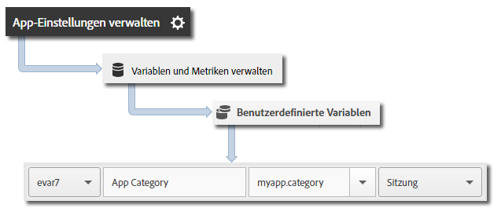

# Grundlegende Implementierung und Lebenszyklus {#core-implementation-and-lifecycle}

Diese Informationen helfen Ihnen beim Implementieren der iOS-Bibliothek und beim Erfassen von Lebenszyklusmetriken wie Starts, Upgrades, Sitzungen, eingebundene Benutzer usw.

## SDK herunterladen {#section_99FE1A17A36D4A2C943939023CF6265C}

>[!IMPORTANT]
>
>Zum Herunterladen der SDK **müssen** Sie iOS 6 oder höher verwenden.

**Voraussetzung**

Bevor Sie das SDK herunterladen, führen Sie die Schritte unter *Report Suite erstellen* in [Grundlegende Implementierung und Lebenszyklus](/help/ios/getting-started/requirements.md) aus, um eine Entwicklungs-Report Suite einzurichten und eine vorab ausgefüllte Version der Konfigurationsdatei herunterzuladen.

So laden Sie das SDK herunter:

1. Laden Sie `[Your_App_Name_]AdobeMobileLibrary-4.*-iOS.zip` herunter, entpacken Sie sie und stellen Sie sicher, dass Sie über folgende Software-Komponenten verfügen:

   * `ADBMobile.h`: Hierbei handelt es sich um die Objective-C-Header-Datei, die für iOS AppMeasurement verwendet wird.
   * `ADBMobileConfig.json`: die SDK-Konfigurationsdatei, die für Ihre App angepasst ist.
   * `AdobeMobileLibrary.a`: Hierbei handelt es sich um eine Bitcode-fähige Fat Binary, die die Bibliotheks-Builds für iOS-Geräte (armv7, armv7s, arm64) und Simulatoren (i386, x86_64) enthält.

      Diese Fat Binary sollte verknüpft werden, wenn das Ziel für eine iOS-App vorgesehen ist.

   * `AdobeMobileLibrary_Extension.a`: Hierbei handelt es sich um eine Bitcode-fähige Fat Binary, die die Bibliotheks-Builds für iOS-Geräte (armv7, armv7s, arm64) und Simulatoren (i386, x86_64) enthält.

      Diese Fat Binary sollte verknüpft werden, wenn das Ziel für eine iOS-Erweiterung vorgesehen ist.

   * `AdobeMobileLibrary_Watch.a`: Hierbei handelt es sich um eine Bitcode-fähige Fat Binary, die die Bibliotheks-Builds für Apple Watch-Geräte (armv7k) und Simulatoren (i386, x86_64) enthält.

      Diese Fat Binary sollte verknüpft werden, wenn das Ziel für eine App mit Apple Watch-Erweiterung (watchOS 2) vorgesehen ist.

   * `AdobeMobileLibrary_TV.a`: Hierbei handelt es sich um eine Bitcode-fähige Fat Binary, die die Bibliotheks-Builds für neue Apple TV-Geräte (arm64) und für den Simulator (x86_64) enthält.

      Diese Fat Binary sollte verknüpft werden, wenn das Ziel für eine Apple TV-App (tvOS) vorgesehen ist.

>[!IMPORTANT]
>
>Wenn Sie das SDK außerhalb der Adobe Mobile Services-Benutzeroberfläche herunterladen, muss die Datei `ADBMobileConfig.json` manuell konfiguriert werden. Wenn Sie mit Analytics und dem Mobile SDK noch nicht vertraut sind, lesen Sie den Abschnitt [Vorbereitung](/help/ios/getting-started/requirements.md), um eine Entwicklungs-Report Suite einzurichten und eine vorinstallierte Version der Konfigurationsdatei herunterzuladen.

## SDK und Konfigurationsdatei zum Projekt hinzufügen {#section_93C25D893B4A4CD3B996CF3C5590C8DC}

1. Starten Sie die XCode IDE und öffnen Sie die App.
1. Ziehen Sie im Projektnavigator den Ordner `AdobeMobileLibrary` und legen Sie ihn unter Ihrem Projekt ab.
1. Stellen Sie Folgendes sicher:

   * Das Kontrollkästchen **[!UICONTROL Elemente kopieren, sofern erforderlich]** ist aktiviert.
   * **[!UICONTROL Gruppen erstellen]** ist ausgewählt.
   * Keines der Kontrollkästchen im Abschnitt **[!UICONTROL Zu Zielen hinzufügen]** ist aktiviert.

   

1. Klicken Sie auf **[!UICONTROL Fertigstellen]**.
1. Wählen Sie im **[!UICONTROL Projektnavigator]** **`ADBMobileConfig.json`** aus.
1. Fügen Sie in der **[!UICONTROL Dateikontrolle]** die JSON-Datei zu den Zielen in Ihrem Projekt hinzu, die das Adobe SDK verwenden.

   

1. Führen Sie im **[!UICONTROL Projektnavigator]** die folgenden Schritte aus:

   1. Klicken Sie auf Ihre App.
   1. Wählen Sie auf der Registerkarte **[!UICONTROL Allgemein]** Ihre Ziele aus und verknüpfen Sie die erforderlichen Frameworks und Bibliotheken in den Abschnitten **[!UICONTROL Verknüpfte Frameworks]** und **[!UICONTROL Bibliotheken]**.
   * **iOS-App-Ziele**
      * `SystemConfiguration.framework`
      * `WebKit.framework`
      * `libsqlite3.0.tbd`
      * `AdobeMobileLibrary.a`
      * `CoreLocation.framework` (optional, aber für Geo-Tracking-Funktionen erforderlich)
   * **iOS-Erweiterungsziel**

      * `SystemConfiguration.framework`
      * `libsqlite3.0.tbd`
      * `AdobeMobileLibrary\_Extension.a`
   * **Apple Watch-Ziel (watchOS 2)**

      * `libsqlite3.0.tbd`
      * `AdobeMobileLibrary\_Watch.a`
   * **Apple TV-(tvOS)-Ziel**

      * `SystemConfiguration.framework`
      * `libsqlite3.0.tbd`
      * `AdobeMobileLibrary\_TV.a`

   >[!CAUTION]
   >
   > Das Verknüpfen von mehr als einer Datei `AdobeMobileLibrary*.a` im selben Ziel führt zu einem unerwarteten Verhalten oder dazu, dass das Erstellen nicht möglich wird.

1. Bestätigen Sie, dass Ihre App ohne Fehler erstellt wird.

## Lebenszyklusmetriken implementieren {#section_532702562A7A43809407C9A2CBA80E1E}

>[!IMPORTANT]
>
>iOS sendet Lebenszyklusinformationen sowohl mit als auch ohne den Aufruf von `collectlifecycledata`. `collectlifecycledata` ist zudem die einzige Möglichkeit, den Lebenszyklus zu einem früheren Zeitpunkt in der Startsequenz der App zu initiieren.

Nachdem Sie den Lebenszyklus aktiviert haben, wird bei jedem Start Ihrer App ein Treffer gesendet, um Starts, Upgrades, Sitzungen, erreichte Benutzer und viele andere [Lebenszyklusmetriken](/help/ios/metrics.md) zu messen.

Fügen Sie einen `collectLifecycleData`-/`collectLifecycleDataWithAdditionalData`-Aufruf in `application:didFinishLaunchingWithOptions` hinzu:

```objective-c
- (BOOL)application:(UIApplication *)application didFinishLaunchingWithOptions:(NSDictionary *)launchOptions { 
 [ADBMobile collectLifecycleData]; 
    return YES; 
}
```

### Zusätzliche Daten zu Lebenszyklusaufrufen hinzufügen

Verwenden Sie `collectLifecycleDataWithAdditionalData`, um zusätzliche Daten mit Lebenszyklusmetrikdaten einzubeziehen:

>[!IMPORTANT]
>
>Daten, die über `collectLifecycleDataWithAdditionalData:` an das SDK weitergegeben werden, verbleiben durch das SDK dauerhaft in `NSUserDefaults`. Das SDK entfernt die Werte im Parameter `NSDictionary`, die nicht vom Typ `NSString` oder `NSNumber` sind.

```objective-c
- (BOOL)application:(UIApplication *)application didFinishLaunchingWithOptions:(NSDictionary *)launchOptions { 
    NSMutableDictionary *contextData = [NSMutableDictionary dictionary]; 
    [contextData setObject:@"Game" forKey:@"myapp.category"]; 
    [ADBMobile collectLifecycleDataWithAdditionalData:contextData]; 
    return YES; 
}
```

Zusätzliche Kontextdatenwerte, die mit `collectLifecycleDataWithAdditionalData` gesendet werden, müssen benutzerdefinierten Variablen in Adobe Mobile Services zugeordnet sein:



Andere Lebenszyklusmetriken werden automatisch erfasst. Weitere Informationen finden Sie unter [Lebenszyklusmetriken](/help/ios/metrics.md).

## Nächste Schritte {#section_A24DC703359D4B5C8F493D6421306FD3}

Führen Sie die folgenden Aufgaben aus:

* [App-Zustände verfolgen](/help/ios/analytics-main/states.md)
* [App-Aktionen verfolgen](/help/ios/analytics-main/actions.md)
