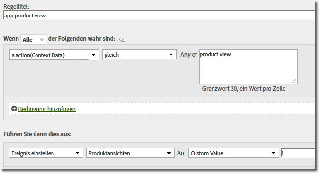

# Migrating to the 4.x iOS library{#migrating-to-the-x-ios-library}

Diese Informationen helfen Ihnen beim Migrieren von den Versionen 3.x oder 2.x zu Version 4.x der iOS-Bibliothek.

>[!IMPORTANT]
>
>The SDK uses `NSUserDefaults` to store data that is needed to calculate unique users, lifecycle metrics, and other data related to core SDK functionality.  Wenn Sie in `NSUserDefaults` die Werte, die vom SDK erwartet werden, ändern oder entfernen, kann dies zu unerwartetem Verhalten in Form von Dateninkonsistenzen führen.

In Version 4.x der iOS SDK-Bibliothek werden die öffentlichen Methoden in einem Header zusammengefasst. Darüber hinaus ist die Funktionalität jetzt über Methoden auf Klassenebene verfügbar, sodass Sie keine Zeiger, Instanzen oder Singletons verfolgen müssen.

## Events, props, and eVars {#section_76EA6F5611184C5CAE6E62956D84D7B6}

In Version 4 ist es nicht mehr möglich, Variablen direkt in Ihrer App zuzuweisen, beispielsweise events, eVars, props, heirs und lists. Das SDK verwendet stattdessen Kontextdaten und Verarbeitungsregeln, um Ihre App-Daten mit Analytics-Variablen für die Berichterstellung zu verknüpfen.

Verarbeitungsregeln bieten folgende Vorteile:

* Sie können Ihre Datenzuweisung ändern, ohne ein Update im App Store einzureichen.
* Sie können relevante Namen für Ihre Daten verwenden, anstatt Variablen festzulegen, die spezifisch für eine Report Suite sind.
* Es ist kaum Aufwand nötig, um zusätzliche Daten zu senden.

   Diese Werte werden nicht in Berichten angezeigt, bis sie mithilfe von Verarbeitungsregeln zugeordnet wurden.

>[!TIP]
>
>Values that you were assigning directly to variables should now be added to the `data` NSDictionary.

## Remove unused properties {#section_145222EAA20F4CC2977DD883FDDBBFC5}

Die neue Datei `ADBMobileConfig.json` enthält anwendungsspezifische, globale Einstellungen und ersetzt die meisten Konfigurationsvariablen, die in vorherigen Versionen zum Einsatz kamen. Im Folgenden finden Sie ein Beispiel für eine `ADBMobileConfig.json`-Datei:

```js
{ 
    "version" : "1.0", 
    "analytics" : { 
        "rsids" : "coolApp", 
        "server" : "my.CoolApp.com", 
        "charset" : "UTF-8", 
        "ssl" : true, 
        "offlineEnabled" : true, 
        "lifecycleTimeout" : 5, 
        "privacyDefault" : "optedin", 
        "poi" : [ 
                    ["san francisco",37.757144,-122.44812,7000], 
                    ["santa cruz",36.972935,-122.01725,600] 
                ] 
    }, 
 "target" : { 
  "clientCode" : "myTargetClientCode", 
  "timeout" : 5 
 }, 
 "audienceManager" : { 
  "server" : "myServer.demdex.com" 
 } 
}
```


### Verschieben der Konfigurationsdatei

So verschieben Sie die Konfigurationsdatei:

1. Verschieben Sie den Wert, der für die Variable in der ersten Spalte festgelegt ist, zur Variablen in der zweiten Spalte.
1. Entfernen Sie die alte Konfigurationsvariable aus Ihrem Code.

### Migration information

Die folgende Tabelle enthält die Konfigurationsvariablen, die Sie in die Konfigurationsdatei verschieben müssen.

#### Migration von Version 3.x

Verschieben Sie den Wert aus der ersten Spalte zu der Variablen in der zweiten Spalte.

| Konfigurationsvariable | Variable in the `ADBMobileConfig.json` file |
|--- |--- |
| offlineTrackingEnabled | „offlineEnabled“ |
| offlineHitLimit | „batchLimit“ |
| reportSuiteIDs | „rsids“ |
| trackingServer | „server“ |
| charSet | „charset“ |
| currencyCode | „currency“ |
| ssl | „ssl“ |
| linkTrackVars | Entfernen: Nicht länger verwendet. |
| linkTrackEvents | Entfernen: Nicht länger verwendet. |


#### Migration von Version 2.x

Verschieben Sie den Wert aus der ersten Spalte zu der Variablen in der zweiten Spalte.

| Konfigurationsvariable | Variable in the `ADBMobileConfig.json` file |
|--- |--- |
| trackOffline | „offlineEnabled“ |
| offlineLimit | „batchLimit“ |
| account | „rsids“ |
| trackingServer | „server“, remove the  prefix. `"https://"` Das Protokollpräfix wird automatisch entsprechend der „ssl“-Einstellung hinzugefügt. |
| trackingServerSecure | Entfernen. Definieren Sie für sichere Verbindungen „server“ und aktivieren Sie dann „ssl“. |
| charSet | „charset“ |
| currencyCode | „currency“ |
| ssl | „ssl“ |
| linkTrackVars | Entfernen: Nicht länger verwendet. |
| linkTrackEvents | Entfernen: Nicht länger verwendet. |
| timestamp | Entfernen: Nicht länger konfigurierbar. |
| dc | Entfernen: Nicht länger verwendet. |
| userAgent | Entfernen: Nicht länger konfigurierbar. |
| dynamicVariablePrefix | Entfernen: Nicht länger verwendet. |
| visitorNamespace | Entfernen: Nicht länger verwendet. |
| usePlugins | Entfernen: Nicht länger verwendet. |
| useBestPractices  Alle Aufrufe für massenhafte Messung (getChurnInstance ) | Remove, replaced by lifecycle metrics. Weitere Informationen finden Sie unter [Lebenszyklusmetriken](//help/ios/metrics.md). |


## Update track calls and tracking variables {#section_96E7D9B3CDAC444789503B7E7F139AB9}

Anstelle der auf das Web ausgelegten Aufrufe `track` und `trackLink` verwendet Version 4 des SDK folgende Methoden:

* `trackState:data:` states are the views that are available in your app, such as , , , and so on.`home dashboard``app settings``cart`

   Diese Statusangaben sind mit den Seiten in einer Website vergleichbar, und `trackState`-Aufrufe inkrementieren die Seitenansichten.

* `trackAction:data:` actions , such as , , , and other metrics that occur in your app and that you want to measure.`logons``banner taps``feed subscriptions`

Beim Parameter `data` für beide dieser Methoden handelt es sich um ein `NSDictionary`, das Namen-Wert-Paare enthält, die als Kontextdaten gesendet werden.

### Events, props, eVars

In Version 4 ist es nicht mehr möglich, Variablen direkt in Ihrer App zuzuweisen, beispielsweise events, eVars, props, heirs und lists. Das SDK nutzt jetzt Kontextdaten und Verarbeitungsregeln, um Ihre App-Daten zwecks Reporting Analytics-Variablen zuzuordnen.

Verarbeitungsregeln bieten folgende Vorteile:

* Sie können Ihre Datenzuweisung ändern, ohne ein Update im App Store einzureichen.
* Sie können relevante Namen für Ihre Daten verwenden, anstatt Variablen festzulegen, die spezifisch für eine Report Suite sind.
* Es ist kaum Aufwand nötig, um zusätzliche Daten zu senden.

   Diese Werte werden in Berichten nicht angezeigt, bis sie mithilfe von Verarbeitungsregeln zugeordnet werden. Weitere Informationen finden Sie unter [Verarbeitungsregeln und Kontextdaten](/help/ios/getting-started/proc-rules.md).

Werte, die Sie direkt zu Variablen zugewiesen haben, sollten stattdessen zum   `data``NSDictionary` hinzugefügt werden. This means that calls to `setProp`, `setEvar`, and assignments to persistent context data should all be removed and the values be added to the `data` parameter.

### AppSection/Server, GeoZip, Transaktions-ID, Kampagne und andere Standardvariablen

Daten, die Sie im Messobjekt festgelegt haben, einschließlich der oben aufgeführten Variablen, sollten stattdessen zum   `data``NSDictionary` hinzugefügt werden. Die einzigen Daten, die mit dem Aufruf `trackState` oder `trackAction` gesendet werden, beinhalten die Nutzlast des Parameters `data`.

### Tracking-Aufrufe ersetzen

Ersetzen Sie in Ihrem Code folgende Methoden durch einen Aufruf von `trackState` oder `trackAction`:

#### Migration von Version 3.x

* `trackAppState (trackState)`
* `trackEvents (trackAction)`
* `track (trackAction)`
* `trackWithContextData (trackAction)`
* `trackLinkURL (trackAction)`

#### Migration von Version 2.x

* `track (trackState)`
* `trackLink (trackAction)`

## Custom visitor ID {#section_2CF930C13BA64F04959846E578B608F3}

Replace the `visitorID` variable with a call to `setUserIdentifier:`.

## Offline tracking {#section_5D4CD8CD1BE041A79A8657E31C0D24C6}

Offline tracking is enabled in the `ADBMobileConfig.json` file, and all other offline configuration is done automatically.

Entfernen Sie aus Ihrem Code Aufrufe folgender Methoden:

### Version 3.x

* `setOnline`
* `setOffline`

### Version 2.x

* `forceOffline`
* `forceOnline`

## Products variable {#section_AFBA36F3718C44D29AF81B9E1056A1B4}

Da die Variable „“ in Verarbeitungsregeln nicht verfügbar ist, können Sie die folgende Syntax zum Festlegen von `products`products verwenden:

```objective-c
//create a processing rule to set the corresponding product event. 
// for example, set prodView event when context data a.action = "product view" 
[ADBMobile trackAction:@"LikeButtonClicked"  
                  data:@{@"&&products" : @";Cool Shoe"}];
```

