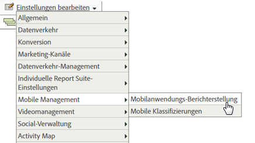

# Analysen {#analytics}

Nachdem Sie die Bibliothek zu Ihrem Projekt hinzugefügt haben, können Sie beliebige Analytics-Methodenaufrufe an einer beliebigen Stelle in Ihrer App durchführen.

>[!TIP]
>
>Importieren Sie `ADBMobile.h` zu Ihrer Klasse.

## Mobile-App-Berichte in Analytics aktivieren {#section_F2F9234009184F20BA36B5CDE872B424}

Bevor Sie Code hinzufügen, bitten Sie Ihren Analytics-Administrator, Folgendes auszuführen, um das Lebenszyklus-Tracking für die Mobile-App zu aktivieren. Dadurch wird sichergestellt, dass Ihre Report Suite zu Beginn der Entwicklung Metriken erfassen kann.

1. Öffnen **[!UICONTROL Admin Tools]** > **[!UICONTROL Report Suites]** und wählen Sie Ihre mobilen Report Suites aus.

1. Klicken **[!UICONTROL Einstellungen bearbeiten]** > **[!UICONTROL Mobile-Verwaltung]** > **[!UICONTROL Mobile Application Reporting]**.

   

1. Klicken **[!UICONTROL Aktuelle App-Berichte aktivieren]**.

   Optional können Sie auch auf **[!UICONTROL Mobile-Standortverfolgung aktivieren]** oder **[!UICONTROL Ältere Berichterstellung und Attribution für Hintergrundtreffer aktivieren]**.

   

Lebenszyklusmetriken können jetzt erfasst werden und Mobile-Anwendungsberichte werden im **[!UICONTROL Berichte]** in der Benutzeroberfläche der Marketing-Berichte angezeigt.

### Neue Versionen

In regelmäßigen Abständen werden neue Versionen der Mobile-App-Berichterstellung veröffentlicht. Neue Versionen werden nicht automatisch auf Ihre Report Suite angewendet. Wiederholen Sie diese Schritte, um das Upgrade durchzuführen. Jedes Mal, wenn Sie Ihrer App neue Experience Cloud-Funktionen hinzufügen, empfehlen wir, diese Schritte zu wiederholen, um sicherzustellen, dass Sie über die aktuelle Konfiguration verfügen.

## Lebenszyklusmetriken {#section_532702562A7A43809407C9A2CBA80E1E}

Um Lebenszyklusmetriken in Ihrer App zu erfassen, fügen Sie Aufrufe zu hinzu, wenn die Anwendung aktiviert wird, wie in den folgenden Beispielen dargestellt.

### WinJS in default.js

```js
app.onactivated = function (args) { 
  if (args.detail.kind === activation.ActivationKind.launch) { 
   ... 
   // launched and resumed stuff  
   ADBMobile.Config.collectLifecycleData(); 
  } 
}; 
app.oncheckpoint = function (args) { 
  ADBMobile.Config.pauseCollectingLifecycleData(); 
};
```

### C# in App.xaml.cs

```js
public App() 
{ 
    this.InitializeComponent(); 
    this.Resuming += OnResuming; 
    this.Suspending += OnSuspending; 
} 
protected override void OnLaunched(LaunchActivatedEventArgs e) 
{   ... 
    ADBMobile.Config.CollectLifecycleData(); 
    ... 
} 
private void OnResuming(object sender, object e) 
{ 
    ... 
    ADBMobile.Config.CollectLifecycleData(); 
    ... 
} 
private void OnSuspending(object sender, SuspendingEventArgs e) 
{ 
    ... 
    ADBMobile.Config.PauseCollectingLifecycleData(); 
    ... 
}
```

### C++/CX in App.xaml.cpp

```js
App::App() 
{ 
 InitializeComponent(); 
 Resuming += ref new EventHandler<Object ^>(this, &App::OnResuming); 
 Suspending += ref new SuspendingEventHandler(this, &App::OnSuspending); 
} 
void App::OnResuming(Object ^sender, Object ^args) 
{ 
 ... 
 ADBMobile::Config::CollectLifecycleData(); 
 ... 
} 
void App::OnSuspending(Object^ sender, SuspendingEventArgs^ e) 
{ 
 ... 
 ADBMobile::Config::PauseCollectingLifecycleData(); 
 ... 
} 
void App::OnLaunched(Windows::ApplicationModel::Activation::LaunchActivatedEventArgs^ e) 
{ 
 ... 
 ADBMobile::Config::CollectLifecycleData(); 
 ... 
}
```

Wenn `CollectLifecycleData()` zweimal in derselben Sitzung aufgerufen wird, meldet Ihre Anwendung bei jedem Aufruf nach dem ersten einen Absturz. Das SDK legt eine Markierung fest, wenn die Anwendung heruntergefahren wird, die auf einen erfolgreichen Beenden hinweist. Wenn dieses Flag nicht gesetzt ist, `CollectLifecyleData()` meldet einen Absturz.

## Events, Props und eVars {#section_76EA6F5611184C5CAE6E62956D84D7B6}

Wenn du dich angesehen hast [SDK-Methoden](/help/universal-windows/c-configuration/methods.md), fragen Sie sich wahrscheinlich, wo Sie Ereignisse, eVars, Props, Erben und Listen festlegen können. In Version 4 können Sie diese Variablentypen nicht mehr direkt in Ihrer App zuweisen. Stattdessen verwendet das SDK Kontextdaten und Verarbeitungsregeln, um Ihre App-Daten Analytics-Variablen für die Berichterstellung zuzuordnen.

Verarbeitungsregeln bieten Ihnen verschiedene Vorteile:

* Sie können Ihre Datenzuordnung ändern, ohne eine Aktualisierung an den Appstore zu senden.
* Sie können aussagekräftige Namen für Daten verwenden, anstatt Variablen festzulegen, die für eine Report Suite spezifisch sind.
* Das Senden zusätzlicher Daten hat geringe Auswirkungen. Diese Werte werden erst dann in Berichten angezeigt, wenn sie mithilfe von Verarbeitungsregeln zugeordnet werden.

Alle Werte, die Sie Variablen direkt zugewiesen haben, sollten stattdessen zu Kontextdaten hinzugefügt werden.

## Verarbeitungsregeln {#section_66EE762EEA5E4728864166201617DEBF}

Verarbeitungsregeln werden verwendet, um die in Kontextdatenvariablen gesendeten Daten in eVars, Props und andere Variablen für die Berichterstellung zu kopieren.

[Hilfe zu Verarbeitungsregeln](https://experienceleague.adobe.com/docs/analytics/admin/admin-tools/processing-rules/processing-rules.html)

Adobe empfiehlt, Ihre Kontextdatenvariablen mithilfe von &quot;Namespaces&quot;zu gruppieren, da dies die logische Reihenfolge bewahrt. Wenn Sie beispielsweise Informationen zu einem Produkt erfassen möchten, können Sie die folgenden Variablen definieren:

```javascript
"product.type":"hat";
"product.team":"mariners";
"product.color":"blue";
```

Kontextdatenvariablen werden in der Benutzeroberfläche der Verarbeitungsregeln alphabetisch sortiert, sodass Sie mit Namespaces schnell Variablen sehen können, die sich im selben Namespace befinden.

Wir haben auch gehört, dass einige von Ihnen Kontextdatenschlüssel mithilfe der eVar- oder Prop-Nummer benennen:

```js
"eVar1":"jimbo";
```

Dies könnte *leicht* einfacher, wenn Sie die einmalige Zuordnung in Verarbeitungsregeln durchführen. Sie verlieren jedoch Lesbarkeit während des Debuggens und bei zukünftigen Code-Aktualisierungen. Stattdessen empfehlen wir dringend die Verwendung beschreibender Namen für Schlüssel und Werte:

```js
"username":"jimbo";
```

Legen Sie Kontextvariablen, die Zählerereignisse definieren, auf den Wert &quot;1&quot;fest:

```js
"logon":"1";
```

Kontextdatenvariablen, die Inkrementierungsereignisse definieren, können den zu inkrementierenden Wert aufweisen:

```js
"levels completed":"6";
```

>[!TIP]
>
>Adobe behält sich den Namespace `a.` vor. Abgesehen von dieser Einschränkung müssen Kontextdatenvariablen nur in Ihrem Anmeldeunternehmen eindeutig sein, um Konflikte zu vermeiden.

## Variable „products“ {#section_AFBA36F3718C44D29AF81B9E1056A1B4}

Zum Festlegen *`products`* im mobilen SDK müssen Sie eine spezielle Syntax verwenden. Weitere Informationen finden Sie unter [Variable &quot;products&quot;](/help/universal-windows/analytics/products.md).

## (Optional) Offline-Verfolgung aktivieren {#section_955B2A03EB854742BDFC4A0A3C287009}

Um Treffer zu speichern, wenn das Gerät offline ist, können Sie die Offline-Verfolgung im [SDK-Methoden](/help/universal-windows/c-configuration/methods.md) -Datei. Beachten Sie die in der Referenz zur Konfigurationsdatei beschriebenen Zeitstempelanforderungen, bevor Sie die Offline-Verfolgung aktivieren.

## Geostandort und Zielpunkte {#section_BAD34A8DD013454DB355121316BD7FD4}

Mit der Geolokation können Sie Standortdaten (Längen- und Breitengrad) und vordefinierte Zielpunkte messen. Jeder `TrackLocation` -Aufruf sendet:

* Breitengrad/Längengrad und POI (sofern innerhalb eines im `ADBMobileConfig.json` Konfigurationsdatei).

   Diese werden für die automatische Berichterstellung an Variablen für mobile Lösungen übergeben.

* Entfernung vom Zentrum und Genauigkeit werden als Kontextdaten weitergegeben.

   Erfassen Sie mithilfe einer Verarbeitungsregel.

So verfolgen Sie einen Ort:

```js
var ADB = ADBMobile; 
ADB.Analytics.trackLocation(37.75345, -122.33207, null);
```

Wenn der folgende POI im `ADBMobileConfig.json` Konfigurationsdatei:

```js
"poi" : [ 
            ["San Francisco",37.757144,-122.44812,7000], 
        ]
```

Wenn die Geräteposition innerhalb eines Radius von 7000 Metern vom definierten Punkt bestimmt wird, wird ein `a.loc.poi` Kontextdatenvariable mit dem Wert `San Francisco` wird mit der `TrackLocation` Treffer. Ein `a.loc.dist` -Kontextvariable mit dem Abstand in Metern von den definierten Koordinaten gesendet.

## Lebenszeitwert {#section_D2C6971545BA4D639FBE07F13EF08895}

Mit dem Lebenszeitwert können Sie für jeden Benutzer einen Lebenszeitwert messen und vorgeben. Sobald Sie einen Wert mit `TrackLifetimeValueIncrease` senden, wird der Wert zum vorhandenen Wert hinzugefügt. Der Lebenszeitwert wird auf dem Gerät gespeichert und kann jederzeit mithilfe von `GetLifetimeValue` abgerufen werden. Dies kann verwendet werden, um Lebenszeiteinkäufe, Banneranzeigen, abgeschlossene Videos, Informationen zur Freigabe in sozialen Netzwerken, Fotouploads usw. zu speichern.

```js
// Lifetime Value Example 
var ADB = ADBMobile; 
var purchasePrice = 39.95; 
var cdata = new Windows.Foundation.Collections.PropertySet(); 
cdata["ItemPurchaseEvent"] = "ItemPurchaseEvent"; 
cdata["PurchaseItem"] = "Item453"; 
cdata["PurchasePrice"] = purchasePrice; 
ADB.Analytics.trackLifetimeValueIncrease(purchasePrice, cdata);
```

## Zeitgesteuerte Aktionen {#section_7FF8B6A913A0460EAA4CAE835E32D8C1}

Mit zeitgesteuerten Aktionen können Sie die In-App-Zeit und die Gesamtzeit zwischen dem Start und dem Ende einer Aktion messen. Das SDK berechnet die Zeit in der Sitzung und die Gesamtzeit (sitzungsübergreifend), die zum Abschluss der Aktion erforderlich ist. Dies kann verwendet werden, um Segmente zu definieren, die von Zeit zu Kauf, Bestand, Checkout-Fluss usw. verglichen werden.

* Gesamtanzahl der Sekunden in der App zwischen Start und Ende – sitzungsübergreifend
* Gesamtanzahl der Sekunden zwischen Start und Ende (Uhrzeit)

```js
// Timed Action Start Example 
var ADB = ADBMobile; 
var cdata = new Windows.Foundation.Collections.PropertySet(); 
cdata["ExperienceName"] = experience; 
ADB.Analytics.trackTimedActionStart("TimeUntilPurchase", cdata);
```

```js
// Timed Action Update Example 
var ADB = ADBMobile; 
var cdataUpdate = new Windows.Foundation.Collections.PropertySet(); 
cdataUpdate["ImageLiked"] = imageName; 
ADB.Analytics.trackTimedActionStart("TimeUntilPurchase", cdata); 
```

```js
// Timed Action End Example 
var ADB = ADBMobile; 
ADB.Analytics.trackTimedActionEnd("TimeUntilPurchase");
```
