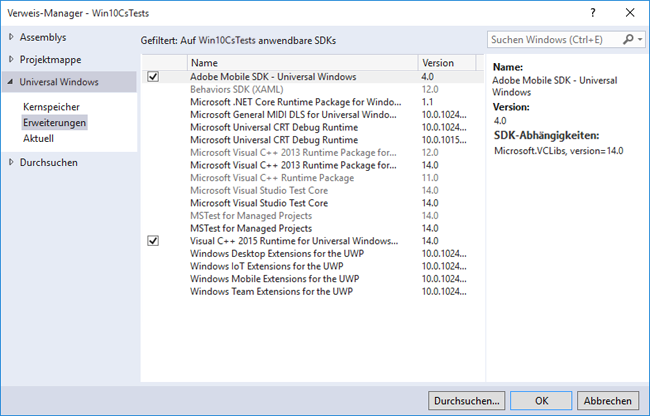

# Windows Visual Studio-Erweiterungen für Experience Cloud-Lösungen mit SDK 4.x {#windows-visual-studio-extensions-for-experience-cloud-solutions-x-sdk}

Diese Erweiterung bietet eine wesentlich einfachere Möglichkeit, die Referenz des Windows SDK für Experience Cloud Solutions 4.x in Ihr Projekt einzufügen.

## Bibliothek aus GitHub installieren {#section_F55DB6241EF1475286C05FEAEBF996A3}

1. Laden Sie das Windows Universal SDK von [GitHub](https://github.com/Adobe-Marketing-Cloud/mobile-services/releases)herunter.
1. Dekomprimieren Sie die heruntergeladene Datei lokal.
1. Klicken Sie mit der Dublette auf die Datei **[!UICONTROL ADBMobileUniversalWindowsVSIX.vsechsl]** , um das Installationsprogramm zu öffnen.
1. Wählen Sie &quot; **[!UICONTROL Globaler Speicherort]** &quot;und installieren Sie die Bibliothek.

## hinzufügen Verweise auf Ihr Projekt {#section_00C14FE9243D4330BE1F4BB56FCF08B1}

1. Öffnen Sie Ihr Windows 10-Projekt.
1. Öffnen Sie das Dialogfeld &quot;Referenz-Manager&quot;.

   

1. Suchen Sie auf der Registerkarte **[!UICONTROL Erweiterungen]** nach **[!UICONTROL Adobe Mobile SDK]** und wählen Sie es aus.
1. Klicken Sie auf **[!UICONTROL OK]** , um es zu speichern.

   Das Adobe Mobile SDK wird Ihrem Projekt hinzugefügt. Wenn das **[!UICONTROL Microsoft Visual C++ Runtime]** -Paket noch nicht hinzugefügt wurde, wird dieses Paket auch Ihrem Projekt hinzugefügt.

1. Wählen Sie im Configuration Manager einen Plattformtyp aus und beginnen Sie mit dem Testen der App.

