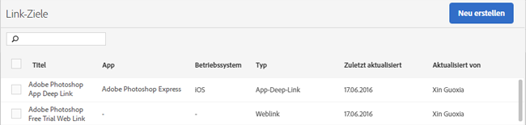

# Link-Ziele erstellen und verwalten {#create-and-manage-link-destinations}

Auf der Seite „Link-Ziele verwalten“ können Sie Link-Ziele erstellen, bearbeiten, archivieren/dearchivieren und löschen. Diese Ziele können Sie inline aufrufen, wenn Sie Marketinglinks, Push-Benachrichtigungen oder In-App-Nachrichten erstellen.

So zeigen Sie die Seite Link-Ziele verwalten an:

1. Klicken Sie im linken Navigationsmenü auf **[!UICONTROL Apps verwalten]**.
1. Klicken Sie auf den Namen der App, damit die zugehörige Seite „App-Informationen“ angezeigt wird.
1. Klicken Sie oben rechts auf **[!UICONTROL Link-Ziele verwalten]**.

Auf der Seite „Link-Ziele“ werden die Link-Ziele zusammen mit Optionen zum Erstellen, Archivieren, Bearbeiten und Löschen angezeigt.

Beispiel:

