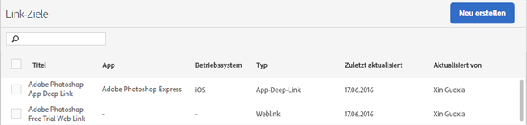

# Link-Ziele verwalten {#manage-link-destinations}

Auf der Seite „Link-Ziele“ können Sie vorhandene Ziele bearbeiten, archivieren, deren Archivierung aufheben oder löschen.

So zeigen Sie die Seite Link-Ziele verwalten an:

1. Klicken Sie in der Mobile Services-Benutzeroberfläche auf **[!UICONTROL Apps verwalten]**.
1. Klicken Sie auf der Seite „App-Informationen“ Ihrer App auf **[!UICONTROL Link-Ziele verwalten]**.

   

1. (Bedingt) Hier können Sie folgende Aktionen durchführen:

   * **Vorlage**

      Um ein vorhandenes Link-Ziel zu bearbeiten, klicken Sie in der Liste auf dessen Namen und bearbeiten Sie die entsprechenden Felder. Weitere Informationen finden Sie in [Neues Link-Ziel erstellen](/help/using/acquisition-main/c-manage-link-destinations/t-create-new-app-deep-link-destination.md).

      >[!IMPORTANT]
      >
      >Es kann bis zu 15 Minuten dauern, bis diese Änderungen wirksam werden.

   * **Archivieren**

      Sie können Link-Ziele archivieren, die Sie beibehalten, aber aus der Liste **[!UICONTROL Link-Ziele]** entfernen möchten.

      Aktivieren Sie die Kontrollkästchen neben den entsprechenden Link-Namen und klicken Sie auf **[!UICONTROL Ausgewählte archivieren]**, um die Link-Ziele zu archivieren. Da Sie die Archivierung Ihrer Link-Ziele jederzeit aufheben können, müssen Sie diese Aktion nicht bestätigen.

   * **Dearchivieren**

      Sie können die Archivierung von Link-Zielen aufheben, wenn Sie sie wieder in der Liste Link-Ziele anzeigen möchten.

      Archivierung eines Link-Ziels aufheben:

      1. Klicken Sie auf **[!UICONTROL Archiv anzeigen]**.
      1. Aktivieren Sie die Kontrollkästchen neben den Link-Namen, deren Archivierung Sie aufheben möchten.
      1. Klicken Sie auf **[!UICONTROL Archivierung der Ausgewählten aufheben]**.

      Die Option **[!UICONTROL Archiv anzeigen]** zeigt nur zuvor archivierte Link-Ziele an.

   * **Löschen**

      Wenn Sie ein Link-Ziel löschen möchten, aktivieren Sie die Kontrollkästchen neben den Links, die Sie löschen möchten, und klicken Sie auf **[!UICONTROL Ausgewählte löschen]** und anschließend auf **[!UICONTROL Löschen]**, um die Aktion zu bestätigen.

      >[!IMPORTANT]
      >
      >Das Löschen eines Link-Ziels ist **dauerhaft**. Falls Sie sich nicht sicher sind, ob Sie ein Link-Ziel löschen können, sollten Sie es stattdessen archivieren.
