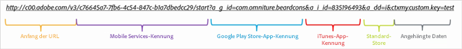
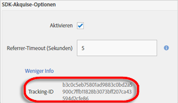

# Akquise-Links manuell erstellen {#create-acquisition-link-manually}

Sie können Marketinglinks erstellen, um auf die Schnelle neue App-Benutzer zu gewinnen, indem Sie die URL-Parameter manuell konfigurieren.

>[!IMPORTANT]
>
>Diese Funktion setzt SDK-Version 4.6 oder höher voraus. Weitere Informationen finden Sie unter [Voraussetzungen für die Akquise](/help/using/acquisition-main/c-acquisition-prerequisites.md).

Die folgende Abbildung zeigt die Komponenten eines manuell erstellten Tracking-Links sowie die verschiedenen URL-Parameter, die Sie beim manuellen Erstellen von Akquise-Links korrekt konfigurieren müssen.

Dieser Link ist so konfiguriert, dass eine plattformspezifische Weiterleitung für eine App zum Google Play Store oder zum Apple App Store durchgeführt wird. Wenn das Ziel nicht ermittelt werden kann, wurde der Standard-Store auf den Apple App Store gesetzt. Nachdem die App installiert wurde, wird der benutzerdefinierte Kontextschlüssel `my.custom.key:test` an den Treffer für die Analytics-Installation angehängt.

Wenn Sie Links manuell erstellen, verwenden Sie das folgende URL-Format:

`http(s)://c00.adobe.com/v3/ {mobile-services-app-hash}/start? {parameters}`

>[!TIP]
>
>Die Version Ihres Android-SDK hat auf diesen Prozess keinen Einfluss.

Stellen Sie bei iOS sicher, dass Sie das richtige Protokoll verwenden:

* Verwenden Sie **HTTP**, wenn Sie iOS SDK vor Version 4.7.0 verwenden oder wenn Sie das iOS SDK 4.7.0 oder höher verwenden und auf der Seite „App-Einstellungen verwalten“ die Option **[!UICONTROL HTTPS verwenden]** **nicht** aktiviert ist.
* Verwenden Sie **HTTPS**, wenn Sie das iOS SDK 4.7.0 oder höher verwenden und **[!UICONTROL HTTPS verwenden]** auf der Seite „App-Einstellungen verwalten“ aktiviert **ist**.

Wo folgende Bedingungen erfüllt wurden:

* `{mobile-services-app-hash}` entspricht der App-ID in der `acquisition:appid `-Konfigurationsdatei.

   Sie finden `{mobile-services-app-hash}` auf der Seite „App-Einstellungen verwalten“ unter den Akquise-SDK-Optionen im Feld „Tracking-ID“.

   

* `{parameters}` ist eine Liste von speziell benannten Standard-URL-Abfrageparametern.

Im Folgenden finden Sie eine Liste der Parameter:

* **`a_g_id`**

   App-Kennung für Google Play Store.

   * Beispielwert: `com.adobe.beardcons`

* **`a_g_lo`**

   Gebietsschema-Überschreibung für Google Play Store.

   * Beispielwert: `ko`

* **`a_i_id`**

   App-Kennung für iTunes.

   * Beispielwert: `835196493`

* **`a_i_lo`**

   Gebietsschema-Überschreibung für iTunes.

   * Beispielwert: `jp`

* **`a_dd`**

   Standard-Store für automatische Umleitung.

   * Beispielwert: `i | g`

* **`a_cid`**

   Benutzerdefinierte ID-Überschreibung (allgemein IDFA für iOS und ADID für Android).

   * Beispielwert: `Any String < 255 characters (UTF-8 encoded)`

* **`ctx*`**

   Schlüssel mit vorangestelltem `ctx` landen in Kontextdaten des resultierenden Start-Treffers.

   * Beispielwert: `ctxmy.custom.key=myValue`

* **`ctxa.referrer.campaign.name`**

   Name der Akquise-Kampagne.

   Dieser Parameter ist für das Reporting erforderlich, wenn Sie die Performance verschiedener Akquise-Links vergleichen möchten.

   * Beispielwert: Gipfelkonferenz 2015

* **`ctxa.referrer.campaign.trackingcode`**

   Trackingcode

   Dieser Parameter ist für das Reporting erforderlich, wenn Sie die Performance verschiedener Akquise-Links vergleichen möchten.

   * Beispielwert: `lexsxouj`

* **`ctxa.referrer.campaign.source`**

   Die Quelle.

   * Beispielwert: Anzeigennetzwerk

* **`ctxa.referrer.campaign.medium`**

   Mittel

   * Beispielwert: E-Mail

* **`ctxa.referrer.campaign.content`**

   Inhalt

   * Beispielwert: Bild-Nr. 325689

* **`ctxa.referrer.campaign.term`**

   Begriff

   * Beispielwert: Wandern+Stiefel

Beachten Sie beim manuellen Erstellen von Akquise-Links die folgenden Informationen:

* Alle Parameter, die mit den in der oben stehenden Tabelle aufgeführten Parametern nicht übereinstimmen, werden als Teil der Appstore-Umleitung übergeben.
* Alle Parameter sind technisch optional, wenn jedoch mindestens eine Store-ID angegeben ist, funktioniert der Link nicht.

   Store-IDs lauten beispielsweise `a_g_id`/ `a_i_id`.

* Wenn der Ziel-Store nicht automatisch bestimmt werden kann und kein Standardwert bereitgestellt wird, wird der Fehler 404 zurückgegeben.

