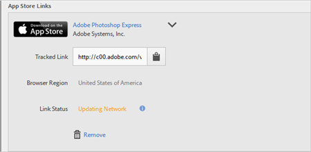

# Akquise-Link erstellen{#create-an-acquisition-link}

{#eol}

Sie können Appstore-Links erstellen, über die Apps direkt aus dem Apple App Store und aus Google Play heruntergeladen werden können. Über diese Links können Sie Erfolgsereignisse bei Downloads zuordnen.

1. Klicken Sie auf **[!UICONTROL Akquise]** > **[!UICONTROL Akquise-Links verwalten]** > **[!UICONTROL Neu erstellen]**.
1. Geben Sie die folgenden Informationen im Abschnitt **[!UICONTROL Link-Informationen]** ein:

   * (**Pflichtfeld**) **[!UICONTROL Name]**
Geben Sie einen beschreibenden Namen für den App-Link an.
   * **[!UICONTROL Trackingcode]**
Geben Sie den gewünschten Trackingcode an oder klicken Sie auf **[!UICONTROL Generieren]**, um einen neuen Trackingcode zu erstellen.
   * (**Pflichtfeld**) **[!UICONTROL Quelle]**
Geben Sie den ursprünglichen Referrer an, z. B. „Newsletter“ oder „Homepage“.
   * **[!UICONTROL Medium]**
Geben Sie das Marketing-Medium an, z. B. „Banner“ oder „E-Mail“.
   * **[!UICONTROL Inhalt]**
Geben Sie den Namen oder die ID der Anzeige mit dem Link an.
   * **[!UICONTROL Begriff]**
Geben Sie bezahlte Begriffe oder andere Suchbegriffe für die Anzeige an.
   >[!IMPORTANT]
   >
   >Die Werte in den oben genannten Feldern können nicht mehr geändert werden, nachdem der Akquise-Link erstellt wurde.

1. Geben Sie im Abschnitt **[!UICONTROL Appstore-Link hinzufügen]** Informationen in die Felder ein.

   * **[!UICONTROL Appstore]**

      Wählen Sie einen Appstore aus:
      * Apple App Store
      * Google Play

      Die Optionen für die einzelnen Appstores sind unterschiedlich, wie unten beschrieben.

   * **[!UICONTROL Browser-Region (nur Apple App Store)]**

      Geben Sie einen bestimmten regionalen App Store für Desktop-Browser an.

      Diese Einstellung erlaubt Ihnen, den regionalen App Store zu definieren, den Sie über einen Akquise-Link verbinden möchten, wenn ein Benutzer in einem Desktop-Browsers auf den Link klickt. Bei Mobilgeräten erfolgt eine automatische Weiterleitung je nach Geräteeinstellungen.

   * **[!UICONTROL Browser-Sprache (Google-Sprache (nur Google Play))]**

      Wählen Sie eine Sprache aus der Dropdown-Liste aus.

      Mit dieser Einstellung können Sie eine bestimmte Sprache definieren, die im Google Play Store für Desktop-Browser angezeigt werden soll. Bei Mobilgeräten wird die Sprache je nach Geräteeinstellungen angezeigt.

   * **[!UICONTROL Suchen nach Name]**

      * Wenn Sie beim Apple App Store die App-ID nicht kennen, können Sie die App anhand ihres Namens suchen.

         Sie können die Suche eingrenzen, indem Sie aus der Dropdown-Liste **[!UICONTROL in der Region]** eine optionale Region auswählen.

      * Wenn Sie bei Google Play den Paket-Namen nicht kennen, können Sie die App anhand ihres Namens suchen.
   * **[!UICONTROL App-ID (nur Apple App Store)]**

      Wenn Sie nach der App gesucht haben, wird dieses Feld automatisch ausgefüllt. Sie können den Wert für die App-ID direkt eingeben, statt nach der App zu suchen.

   * **[!UICONTROL Paket-Name (nur Google Play)]**

      Wenn Sie nach der App gesucht haben, wird dieses Feld automatisch ausgefüllt. Statt zu suchen, können Sie den Wert „Paketname“ auch direkt eingeben.

1. Um die Konfiguration zu speichern und den Link zu erstellen, klicken Sie auf **[!UICONTROL Hinzufügen]** > **[!UICONTROL Speichern]**.

   Der neu erstellte Link wird im Abschnitt **[!UICONTROL Appstore-Links]** angezeigt.

   

1. Klicken Sie auf , um den verfolgten Link in die Zwischenablage zu kopieren.

1. Fügen Sie den Link in Ihre Social-Media-Beiträge, Anzeigen, E-Mail-Nachrichten usw. ein.
