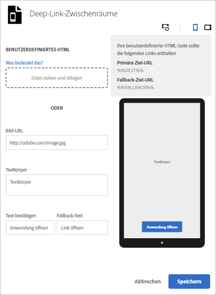

# Interstitials{#interstitials}

{#eol}

Sie können Benutzer abhängig davon, ob sie eine App installiert (App-Deep-Link) oder nicht installiert haben (Website oder Appstore), zu einem Ziel weiterleiten. Die Wahl des Routings überlassen Sie am besten den Benutzern. Marketingexperten können Benutzeroptionen bereitstellen, indem sie eine Interstitial-Seite konfigurieren, auf der die Benutzer die verfügbaren Einstiegsziele sehen.

So konfigurieren Sie einen Zwischenraum, während Sie  einen Marketinglink erstellen:

1. Klicken Sie auf **[!UICONTROL Deep-Link-Interstitial bearbeiten]**.

   

1. Geben Sie Informationen in folgende Felder ein:

   * **[!UICONTROL Benutzerdefiniertes HTML]**

      Wählen Sie eine HTML-Seite aus, die als Kundenzwischenraum dienen soll.

      Mithilfe benutzerdefinierter Interstitials können Marketing-Experten Interstitial-Landingpages mit benutzerdefiniertem HTML/CSS/JS anpassen, sodass Sie Ihre Seiten mit einem Branding versehen können.

      Hier sind die Anforderungen an die HTML-Seite:

      * Es muss sich um eine HTML-Datei handeln.
      * Sie muss die Platzhalter `%%DEST%%` und `%%FALLBACK%%` enthalten.
      * Die hochgeladene HTML-Seite wird in einem `<iframe>` dargestellt.

         Sie müssen sicherstellen, dass Ihre Link-Ziele auf das übergeordnete Fenster verweisen. Sie können `<base target="_parent" />` unter `<head>` angeben oder für jedes `<a/>`-Element eine eigene Zieleigenschaft festlegen.

         >[!TIP]
         >
         >Wenn Sie eine benutzerdefinierte HTML-Seite hochladen, werden die anderen vier Optionen in dieser Tabelle nur verwendet, wenn Sie die hochgeladene Datei entfernen.
   * **[!UICONTROL Bild-URL]**

      Geben Sie die URL zu einem Bild-Asset ein.

   * **[!UICONTROL Textkörper]**

      Geben Sie den Textkörper für das Interstitial ein.

   * **[!UICONTROL Text bestätigen]**

      Geben Sie den Text für die Textschaltfläche ein.

   * **[!UICONTROL Fallback-Text]**

      Geben Sie den anzuzeigenden Fallback-Text an.

      Dieses Feld aktualisiert die Textschaltfläche, wenn ein Deep-Link fehlschlägt. Benutzer werden zuerst zum Deep-Link weitergeleitet, um diesen auszuprobieren, bevor ihnen der Fallback zu einer anderen Option ermöglicht wird. Ein Fallback könnte z. B. auf einen Appstore zum Herunterladen und Installieren der App oder auf die Website des Unternehmens zurückgreifen. Über den Fallback-Text erfahren Benutzer, dass eine andere Option verfügbar ist, falls der Deep-Link fehlschlägt.

1. (**Optional**) Klicken Sie auf die Symbole über dem Bild, um zu sehen wie das Interstitial gedreht und auf unterschiedlichen Geräten aussieht.

   Sie können das Bild außerhalb von Mobile Services ändern oder bearbeiten, um sicherzustellen, dass es in verschiedenen Situationen korrekt angezeigt wird.
1. Klicken Sie auf **[!UICONTROL Speichern]**.
