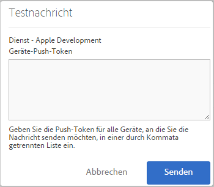

# Voraussetzungen für die Aktivierung der Push-Benachrichtigung {#prerequisites-to-enable-push-messaging}

Sie müssen diese Voraussetzungen erfüllen, bevor Sie Push-Nachrichten in Apps konfigurieren.

## Experience Cloud für Ihr Unternehmen aktivieren

Ihr Adobe Analytics-Unternehmen muss Experience Cloud-fähig sein. Sie können den Status bei Ihrem Adobe-Kundenbetreuer erfragen.

## Mobile SDK installieren und konfigurieren

* **Mobiles SDK installieren**

   Um Push-Nachrichten zu konfigurieren, müssen Sie mindestens Version 4.6 oder höher des Mobile SDK herunterladen und installieren. Weitere Informationen finden Sie in [SDK herunterladen](/help/using/c-manage-app-settings/c-mob-confg-app/t-config-analytics/download-sdk.md).

* **Push-Dienste konfigurieren**

   Sie müssen Push-Dienste im mobilen SDK konfigurieren.
Weitere Informationen finden Sie unter folgenden Themen:

   * [Push-Nachrichten in Android](/help/android/messaging-main/push-messaging/push-messaging.md)
   * [Push-Nachrichten in iOS](/help/ios/messaging-main/push-messaging/push-messaging.md)

## Beim Mobile-Core-Service mit Ihrer Adobe ID anmelden

>[!IMPORTANT]
>
>Um die Funktion für Push-Dienste zu verwenden, müssen sich Benutzer mit ihrer Adobe ID beim Mobile-Core-Service anmelden und ihr Analytics-Konto muss mit ihren Adobe IDs verknüpft sein. Die Funktion für Push-Dienste ist nicht verfügbar, wenn sich Benutzer mit ihren vorhandenen Adobe Analytics-Konten anmelden.

Wenn Benutzer keine Adobe IDs haben, führen Sie die folgenden Schritte aus:

1. (**Experience Cloud-Administrator**) Einladen der Benutzer zur Experience Cloud.

1. (**Benutzer**) Erstellen einer persönlichen Adobe ID anhand der vom Experience Cloud-Administrator erhaltenen Anweisungen.

   Nachdem der Administrator den vorherigen Schritt durchgeführt hat, wird an jeden Benutzer automatisch eine E-Mail gesendet.

1. (**Benutzer**) Anmelden bei Mobile mit der Adobe ID.

## Benutzerkonten in Experience Cloud verknüpfen

Jeder Benutzer muss das Analytics-Konto innerhalb der Experience Cloud-Organisation verknüpfen.

1. Um sich mit einer Adobe ID bei Experience Cloud anzumelden, geben Sie in einem Browser [https://marketing.adobe.com](https://marketing.adobe.com) ein.

1. Wählen Sie oben rechts den Namen des Analytics-Unternehmens aus.

1. Klicken Sie auf **[!UICONTROL Unternehmen hinzufügen]** und wählen Sie aus der Dropdown-Liste **[!UICONTROL Adobe SiteCatalyst/Adobe Social]** aus.

1. Geben Sie den Unternehmensnamen sowie Ihre alten Anmeldedaten für das angegebene Unternehmen ein und klicken Sie auf **[!UICONTROL Konto verknüpfen]**.

   Die Adobe ID ist jetzt mit Ihrem Analytics-Konto, -Unternehmen und den zugehörigen Anmeldedaten verknüpft.

Weitere Informationen finden Sie unter [Fehlerbehebung bei der Kontoverknüpfung](https://docs.adobe.com/content/help/de-DE/core-services/interface/manage-users-and-products/organizations.html).

## Push-Dienste und den SDK-ID-Dienst in der Mobile-Benutzeroberfläche konfigurieren

Bevor Sie den ID-Dienst für Ihre App aktivieren, ist der Abschnitt **[!UICONTROL Push-Dienste]** deaktiviert. Nach der Aktivierung des ID-Dienstes ist jedoch der Abschnitt „Push-Dienste“ aktiviert. Weitere Informationen zum Aktivieren von Push-Diensten finden Sie in [Optionen für SDK-ID-Dienst konfigurieren](/help/using/c-manage-app-settings/c-mob-confg-app/t-config-visitor.md).

>[!IMPORTANT]
>
>Klicken Sie auf **[!UICONTROL Speichern]**, um Ihre Änderungen zu speichern und die Push-Dienste zu aktualisieren.
>
>Sie können in jeder Report Suite eine App-Store-App für Apple und eine für Google konfigurieren. Wenn Sie zusätzliche Apps benötigen, z. B. eine für eine Produktionsumgebung und eine für eine Entwicklungsumgebung, richten Sie für jede Umgebung eine neue App-Store-App und eine neue Report Suite ein.

* Ziehen Sie für **Apple** Ihren privaten Schlüssel und/oder Ihr Zertifikat per Drag-and-Drop an die vorgesehene Stelle. Wenn Ihr privater Schlüssel passwortverschlüsselt ist, geben Sie das Passwort ein.

   * **Privater Schlüssel:** Ziehen Sie die Datei mit dem privaten Schlüssel per Drag and Drop in das Feld.

      Sie können auch auf **[!UICONTROL Durchsuchen]** klicken und die Datei auswählen. Dieses Feld zeigt den privaten Schlüssel. Das Zertifikat kann ebenfalls in dieser Datei enthalten sein (`.p12`, `pkcs12`, `.pfx`, `.key`, `.pem`).

   * Geben Sie für das **Passwort für den privaten Schlüssel** das entsprechende Passwort ein, wenn die Datei mit dem privaten Schlüssel verschlüsselt ist.

      (Bedingt) **Zertifikat:** Wenn noch kein Zertifikat aus der Schlüsseldatei vorhanden ist, ziehen Sie die Zertifikatsdatei in das Feld. Sie können auch auf **[!UICONTROL Durchsuchen]** klicken und die Datei auswählen. Dieses Feld ist kein Pflichtfeld, falls die Datei mit privatem Schlüssel auch das Zertifikat enthält (`.cert`, `.cer`, `.crt`, `.pem`).

* **Google:** Geben Sie den API-Schlüssel für die App an.

   Klicken Sie auf **[!UICONTROL Testen]**, um zu überprüfen, ob die App und Mobile Services richtig konfiguriert sind. Diese Option ist nützlich für das Debugging und die Fehlerbehebung.

   Geben Sie die Push-Token des Geräts ein, über die die Nachricht gesendet werden soll. Sie können die Nachricht an mehrere Geräte senden, indem Sie Token in einer durch Kommata getrennten Liste angeben.

   
