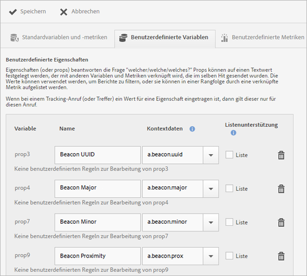
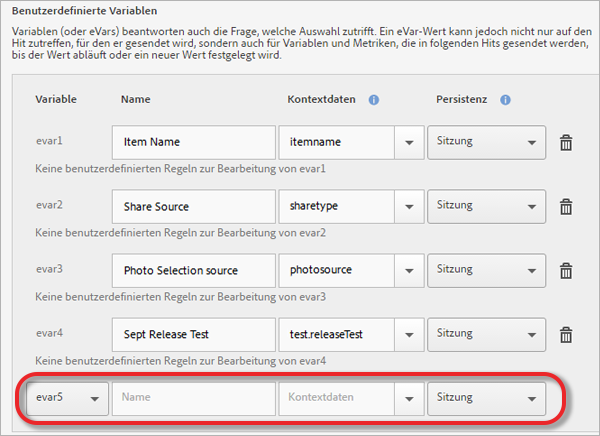

# Verwalten Ihrer App {#managing-your-app}

Sie können die Daten, die Sie von der App erhalten, verfolgen und verwalten, indem Sie verschiedene Variablen und Metriken konfigurieren.

## Variablen und Metriken verwalten {#section_EC2D58AC334F4ED49E764B81C2423A62}

* **Standardvariablen und Metriken**

   Jede App enthält Variablen und Metriken zur Verfolgung von Einkaufswagen- und Einkaufswagen-Aktivitäten. Einige Kaufinformationen können nicht mit Verarbeitungsregeln verarbeitet werden. Deshalb stellt das SDK die speziellen `"&&products"`-Kontextdaten bereit. Sie können beispielsweise Variablen wie Zusatz zum Einkaufswagen, Entnahmen aus dem Einkaufswagen, Kassengänge, Bestellungen usw. verwenden. Die Kontextdaten müssen den Daten in Adobe Analytics zugeordnet werden. Wenn diese Variable mittels einer einfachen Zuordnung aus Kontextdaten aufgefüllt wird, ist dies der Schlüssel für die Zuordnung. Wenn die Variable durch komplexere Regeln in Analytics Admin Tools aufgefüllt wird, lassen Sie dieses Feld leer.

   Weitere Informationen zu diesen Variablen und Metriken finden Sie unter folgenden Themen:

   * [Produktvariablen in Android](/help/android/analytics-main/products/products.md)
   * [Produktvariablen in iOS](/help/ios/analytics-main/products/products.md)

* **Benutzerdefinierte Variablen**

   Auf der Seite Benutzerdefinierte Variablen werden alle benutzerdefinierten Analytics-Variablen angezeigt, die für die Report Suite, die die Daten Ihrer App enthält, konfiguriert sind. Sie können auf dieser Seite weitere Variablen aktivieren und Kontextdaten Analytics-Variablen zuordnen.

### Kontextdaten Analytics-Variablen zuordnen

Click **[!UICONTROL Manage App Settings]** > **[!UICONTROL Manage Variables &amp; Metrics]** > **[!UICONTROL Custom Variables]**.

Diese Zuordnungen rufen dieselbe API auf, die in [Verarbeitungsregeln](https://docs.adobe.com/content/help/de-DE/analytics/admin/admin-tools/processing-rules/processing-rules.html) verwendet wird.

Im Folgenden finden Sie eine Liste der benutzerdefinierten Variablen, die Sie konfigurieren können:

* **[!UICONTROL Benutzerdefinierte Eigenschaften]** (bzw. „Props“) beantworten die Frage „Welcher/Welche/Welches?“. Props können auf einen Textwert gesetzt werden, der mit anderen Variablen und Metriken verknüpft wird, die im selben Treffer gesendet werden. Die Werte können zum Filtern von Berichten verwendet werden oder in Rangfolge durch eine zugehörige Metrik aufgeführt werden.

   Wenn ein Wert für eine Eigenschaft in einem Verfolgungsaufruf (oder Treffer) festgelegt wird, gilt er nur für diesen Aufruf.

* **[!UICONTROL Benutzerdefinierte Variablen]** (oder „eVars“) beantworten ebenfalls die Frage „Welcher/Welche/Welches?“. Ein eVar-Wert kann jedoch nicht nur auf den Hit zutreffen, für den er gesendet wird, sondern auch für Variablen und Metriken, die in folgenden Hits gesendet werden, bis der Wert abläuft oder ein neuer Wert festgelegt wird.
* **[!UICONTROL Benutzerdefinierte Listenvariablen (oder mehrwertige Variablen)]** weisen das gleiche Verhalten wie Variablen auf, ermöglichen Ihnen jedoch auch, aus einem einzigen Treffer mehrere Variablen zu erfassen. Weitere Informationen finden Sie unter [Listenvariablen](https://docs.adobe.com/content/help/de-DE/analytics/implementation/javascript-implementation/variables-analytics-reporting/page-variables.html).

Die folgenden Zuordnungen werden in Analytics als „in Mobile Services erstellt“ angezeigt.

* **[!UICONTROL Name]**

   Der Anzeigename der Datenerfassungsvariablen.

* **[!UICONTROL Kontextdaten]**

   Wenn diese Variable mittels einer einfachen Zuordnung aus Kontextdaten aufgefüllt wird, ist dies der Schlüssel für die Zuordnung. Wenn die Variable durch komplexere Regeln in Analytics Admin Tools aufgefüllt wird, lassen Sie dieses Feld leer.

   Klicken Sie in die Kontextdatenspalte und wählen Sie die Kontextdatenvariable aus, die Sie zuordnen möchten. Die Dropdown-Liste enthält Variablen, die in den letzten 30 Tagen empfangen wurden. Wenn sich die Kontextdaten, die Sie zuordnen möchten, nicht in der Liste befinden, können Sie sie eingeben.

* **[!UICONTROL Persistenz (benutzerdefinierte Variablen und benutzerdefinierte Listenvariablen)]**

   Die Persistenz bestimmt den Punkt, an dem der Wert einer benutzerdefinierten Variable (eVar) verfällt oder an dem sie nicht mehr mit zusätzlichen Hits verknüpft wird. Wenn eine eVar bereits abgelaufen ist, wenn ein Hit auftritt, wird für diese eVar der Wert Keine mit dem Hit verknüpft. Das bedeutet, dass kein eVar aktiv war, als der Treffer ausgelöst wurde.

   Sie können eine der folgenden Optionen auswählen:

   * **[!UICONTROL Session]**

      Der eVar-Wert bleibt über die Dauer des Analytics-Besuchs bestehen.

   * **[!UICONTROL Tracking-Anruf]**

      Der eVar-Wert bleibt nur für den Tracking-Aufruf oder Treffer bestehen, in dem er enthalten war.

   * **[!UICONTROL Unbeschränkte Gültigkeit]**

      Der eVar-Wert bleibt für alle nachfolgenden Tracking-Aufrufe bestehen.
   * **[!UICONTROL Advanced]**

      Adobe Analytics verfügt über eine erweiterte Benutzeroberfläche für die Einstellung der Persistenz von eVars. Wenn ein Persistenzwert für die eVar festgelegt wird, der in Mobile Services nicht unterstützt wird, wird dieser Wert in der Mobile Services-Benutzeroberfläche angezeigt.

      To manage eVars, click **[!UICONTROL Adobe Analytics Report Suite Manager]** > **[!UICONTROL Conversion Variables UI]**.

   * **[!UICONTROL Listenunterstützung]**

      Ermöglicht die Wiedergabe mehrerer Werte, die mit der Eigenschaft verknüpft werden sollen, in einem Tracking-Aufruf. Das Trennzeichen muss ein einzelnes Zeichen sein, das weder eine Null noch ein Leerzeichen ist.

   * **[!UICONTROL Trennzeichen]**

      Das Trennzeichen muss ein einzelnes Zeichen sein, das weder eine Null noch ein Leerzeichen ist.

### Zusätzliche Analytics-Variablen

Über die Dropdownliste am Ende jedes Variablenabschnitts können Sie weitere Variablen aktivieren.

Wählen Sie eine nicht verwendete Variablennummer und geben Sie einen Namen ein. Sie können optional die Kontextdatenvariable, die gespeichert werden soll, sowie alle weiteren Informationen angeben.

* **Benutzerspezifische Metriken**

   Metriken (oder Ereignisse) beantworten die Fragen *wie viel?* oder *wie viele?*. Ereignis können jedes Mal erhöht werden, wenn der Benutzer eine Aktion durchführt oder numerische Werte wie z. B. einen Preis enthalten. Zu den benutzerspezifischen Metriken zählen Ereignis wie das Erstellen einer App, das Herunterladen oder Exportieren der PDF- oder CSV-Datei, das Speichern einer Kampagne, das Herunterladen des SDK, die Ausführung eines Berichts, der Zusatz eines Links zum App Store, die Aktivierung einer In-App-Nachricht usw.

   Wählen Sie einen der folgenden benutzerdefinierten Metriktypen aus:

   * **[!UICONTROL Ganzzahl]**
   * **[!UICONTROL Dezimalzahl]**
   * **[!UICONTROL Währung]**

## Zielpunkte verwalten {#section_990EF15E4E3B42CC807FCD9BEC8DB4C6}

Mithilfe von Zielpunkten können Sie geografische Standorte definieren, die Sie für Korrelationszwecke, zum Ansprechen von Zielgruppen mit In-App-Nachrichten und vieles mehr verwenden können. Wenn ein Treffer innerhalb eines Zielpunkts gesendet wird, wird der Zielpunkt an den Treffer angehängt. Weitere Informationen zu Zielpunkten finden Sie unter [Zielpunkte verwalten](/help/using/location/t-manage-points.md).

## Link-Ziele verwalten {#section_F722A387E22A430187B063D358A87711}

Sie können Link-Ziele erstellen, bearbeiten, archivieren, dearchivieren und löschen. Diese Ziele können Sie dann inline aufrufen, wenn Sie Marketinglinks, Push-Nachrichten oder In-App-Nachrichten erstellen. Weitere Informationen zu Link-Zielen finden Sie in [Link-Ziele verwalten](/help/using/acquisition-main/c-manage-link-destinations/t-archive-unarchive-link-destinations.md).

## Postbacks verwalten {#section_78B0A8D7AE6940E78D85AE3AB829E860}

Mit Postbacks können Sie durch Adobe Mobile erfasste Daten an einen Drittanbieterserver senden. Mithilfe der gleichen Auslöser und Eigenschaften, die Sie zur Anzeige einer In-App-Nachricht verwenden, können Sie Mobile so konfigurieren, dass benutzerdefinierte Daten an ein Drittanbieterziel gesendet werden. Weitere Informationen zu Postbacks finden Sie unter [Postbacks konfigurieren](/help/using/c-manage-app-settings/c-mob-confg-app/signals.md).
