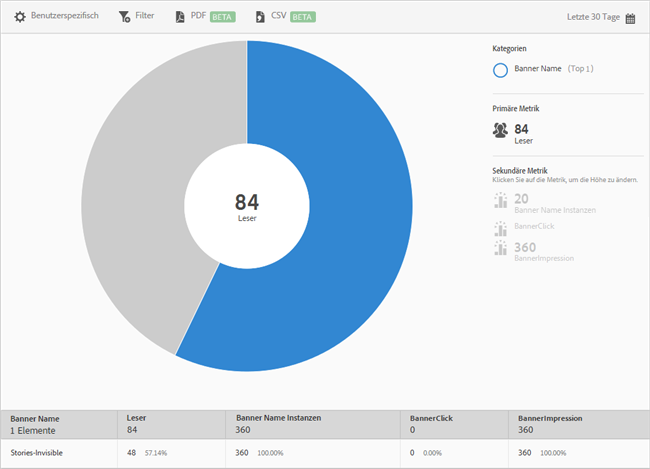

# Bannermetriken {#banner-metrics}

Der Bericht **[!UICONTROL Bannermetriken]** enthält eine Sunburst-Grafik mit Ihren vorhandenen Daten. Dieser Bericht ist nur für DPS-Kunden (Digital Publishing Suite) verfügbar.

Standardmäßig enthält dieser Bericht folgende Metriken:

* **[!UICONTROL Bannername]**: Name des Banners.
* **[!UICONTROL Leser]**: Anzahl der App-Benutzer.
* **[!UICONTROL Bannernameninstanzen]**: Häufigkeit, mit der durch Klicks und Impressionen auf das Banner verwiesen wurde.
* **[!UICONTROL Bannerklick]**: Häufigkeit, mit der Benutzer auf das Banner geklickt haben.
* **[!UICONTROL Bannerimpressionen]**: Häufigkeit, mit der das Banner auf einer Browser-Seite angezeigt wurde (oder sichtbar war).

Dieser Bericht ähnelt dem Bericht **[!UICONTROL Technologie]**. Informationen zum Navigieren in und Verwenden von Sunburst-Berichten, Hinzufügen von Aufschlüsselungen und Metriken, Erstellen von Zielaktivitäten, Erstellen von fixierbaren Filtern und Freigeben von Berichten finden Sie unter [Technologie](/help/using/usage/reports-technology.md). Mithilfe der Informationen unter diesem Thema können Sie den Bericht **[!UICONTROL Bannermetriken]** anpassen.
