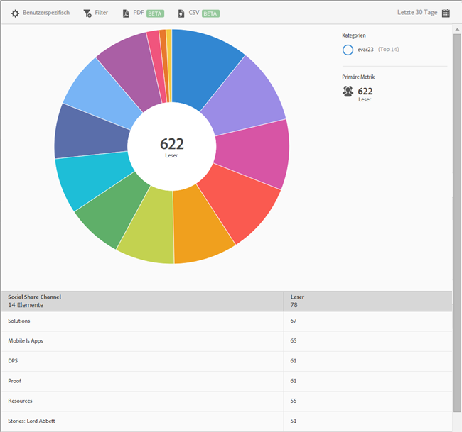

# Social Sharing {#social-sharing}

Der Bericht **[!UICONTROL Social Sharing]** enthält eine Sunburst-Grafik mit Ihren vorhandenen Daten. Dieser Bericht ist nur für DPS-Kunden verfügbar.

Dieser Bericht zeigt standardmäßig die Anzahl der Leser an, die Artikel über verschiedene Kanäle (E-Mail, Nachricht usw.) geteilt haben.

Dieser Bericht ähnelt dem Bericht **[!UICONTROL Technologie]**. Informationen zum Navigieren in und Verwenden von Sunburst-Berichten, Hinzufügen von Aufschlüsselungen und Metriken, Erstellen von Zielaktivitäten, Erstellen von fixierbaren Filtern und Freigeben von Berichten finden Sie unter [Technologie](/help/using/usage/reports-technology.md). Anhand der Informationen im Thema „Technologie“ kann der Bericht **[!UICONTROL Social Sharing]** angepasst werden.
