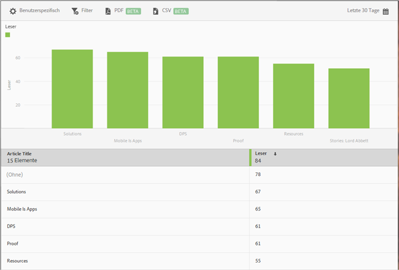

# Bericht „Die 50 beliebtesten Artikel“ {#top-articles}

Der Bericht **[!UICONTROL Die 50 beliebtesten Artikel]** enthält ein Balkendiagramm sowie einen Rangbericht, die die am häufigsten gelesenen Artikel zeigen, die mit der App angezeigt wurden. Dieser Bericht ist nur für DPS-Kunden verfügbar.

Der Bericht zeigt zwar standardmäßig Daten für die letzten 30 Tage nach der Anzahl der Leser an, Sie können den Bericht jedoch anpassen.

Dieser Bericht zeigt standardmäßig den Titel des Artikels und die Anzahl der Leser an.

Für diesen Bericht können folgende Optionen konfiguriert werden:

* **[!UICONTROL Zeitraum]**
Klicken Sie auf das Symbol **[!UICONTROL Kalender]** und wählen Sie einen benutzerdefinierten oder einen vorgegebenen Zeitraum aus der Dropdown-Liste aus.

* **[!UICONTROL Anpassen]**

   Passen Sie Ihre Berichte an, indem Sie beispielsweise die Option **[!UICONTROL Anzeigen nach]** ändern oder Metriken und Filter bzw. zusätzliche Reihen (Metriken) hinzufügen. Weitere Informationen finden Sie in [Berichte anpassen](/help/using/usage/reports-customize/reports-customize.md).

* **[!UICONTROL Filter]**

   Klicken Sie auf **[!UICONTROL Filter]**, um einen Filter zu erstellen, der verschiedene Berichte umfasst. Auf diese Weise können Sie die Performance eines Segments für alle Mobilberichte anzeigen. Mit einem fixierbaren Filter können Sie einen Filter definieren, der auf alle Berichte (außer auf Pfadsetzungsberichte) angewendet werden kann. Weitere Informationen finden Sie in [Fixierbaren Filter hinzufügen](/help/using/usage/reports-customize/t-sticky-filter.md).

* **[!UICONTROL Herunterladen]**

   Klicken Sie auf **[!UICONTROL PDF]** oder **[!UICONTROL CSV]**, um Dokumente herunterzuladen bzw. zu öffnen und diese mit Benutzern zu teilen, die keinen Zugriff auf Mobile Services haben, oder in Präsentationen zu verwenden.
