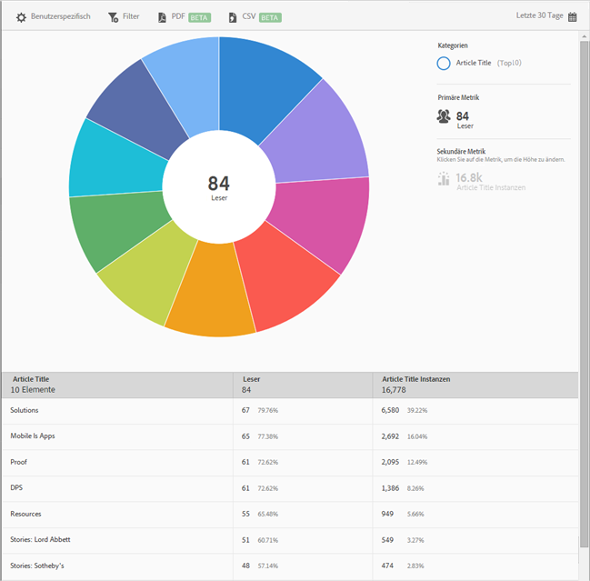

# Die 10 beliebtesten Artikel zur Verfügung{#top-articles}

Der Bericht **[!UICONTROL Die 10 beliebtesten Artikel]** enthält eine Sunburst-Grafik Ihrer Daten. Dieser Bericht ist nur für DPS-Kunden verfügbar.

Dieser Bericht zeigt standardmäßig den Artikeltitel, die Anzahl der Leser und den Prozentsatz der Gesamtanzahl an Lesern sowie die Instanzen des Artikeltitels mit dem jeweiligen Prozentsatz.

Dieser Bericht ähnelt dem Bericht **[!UICONTROL Technologie]**. Informationen zum Navigieren in und Verwenden von Sunburst-Berichten, Hinzufügen von Aufschlüsselungen und Metriken, Erstellen von Zielaktivitäten, Erstellen von fixierbaren Filtern und Freigeben von Berichten finden Sie unter [Technologie](/help/using/usage/reports-technology.md). Mit diesen Informationen können Sie den Bericht **[!UICONTROL Die 10 beliebtesten Artikel]** anpassen.
