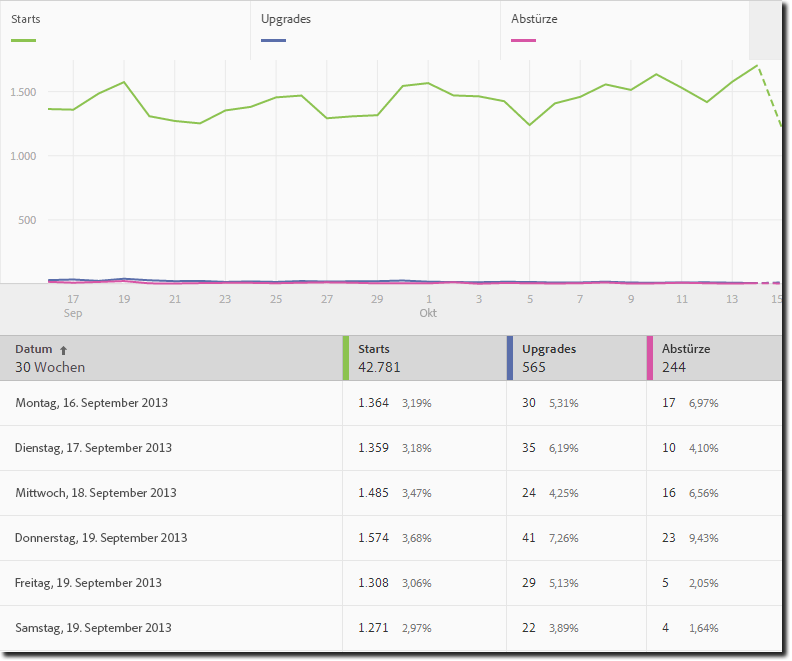
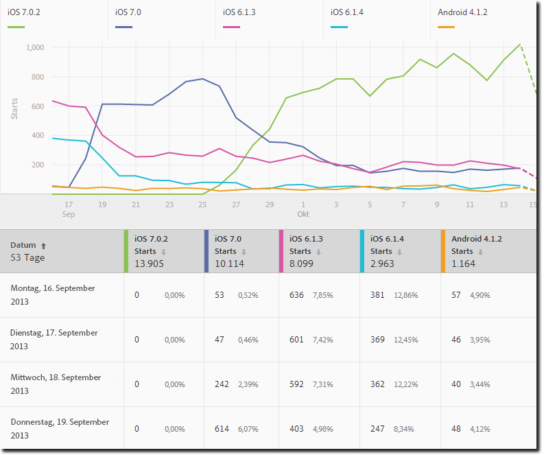
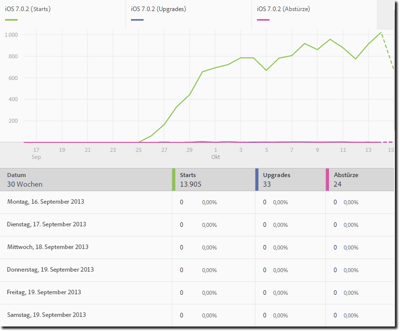
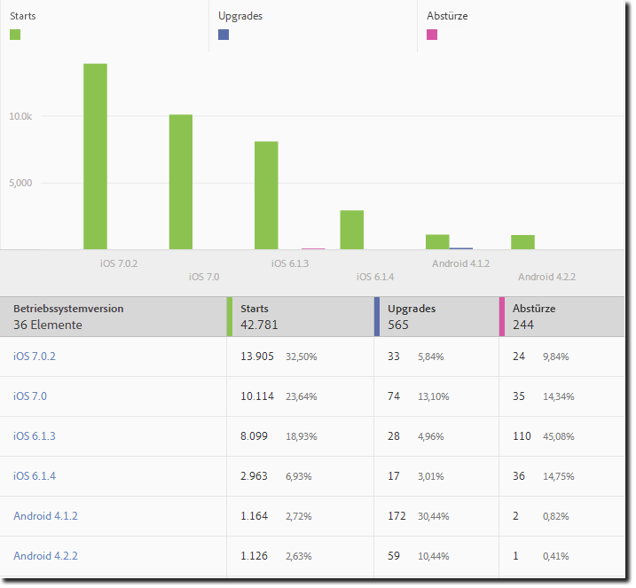
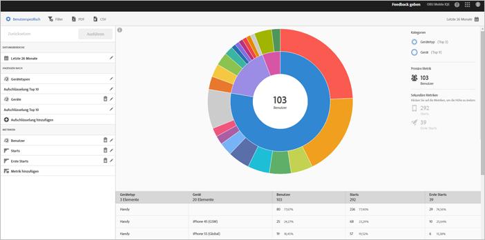
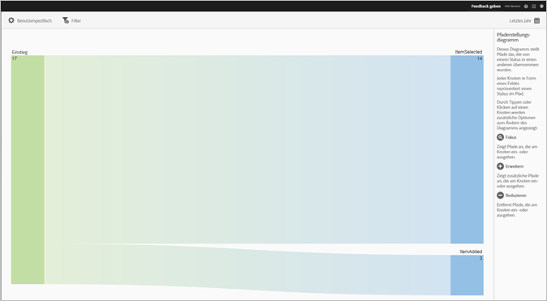
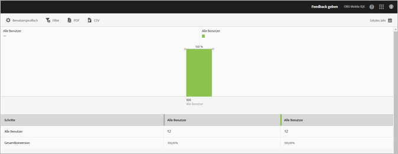

# Berichtstypen {#report-types}

Aufgrund der vielfältigen Möglichkeiten beim Anpassen von Berichten stellt sich vielleicht die Frage, welcher Typ von Bericht am besten geeignet ist, um die gewünschten Daten zu erhalten.

Bevor Sie Berichte anpassen, müssen Sie den Unterschied zwischen einer Metrik und einer Dimension verstehen.

* Metrik

   Eine Metrik dient zum Messen Ihrer Daten. Metriken sind Werte, die gezählt und hinzugefügt werden können und anhand derer ermittelt wird, wie oft bestimmte Aktionen in Ihrer App stattfinden. Zu den gebräuchlichsten Metriken gehören die Anzahl von Installations-, Start- und Anmeldevorgängen sowie der Umsatz und der Lebenszeitwert. So wird zum Beispiel bei jedem Start Ihrer App der Wert  für  „_launches_value“ um einen Zähler erhöht.

* Dimension

   Eine Dimension dient zum Beschreiben Ihrer Daten. Dimensionen werden mittels einer Zeichenfolge oder einer Zahl, die wie eine Zeichenfolge funktioniert (z. B. eine Postleitzahl) dargestellt. Sie werden genutzt, um Daten zu strukturieren und zu unterteilen. Beispiele für gängige Dimensionen sind Betriebssystemversion, Kampagnenname, Produktname und Mobilnetzbetreiber. Jede Dimension verfügt über eine Reihe spezifischer Werte, die mit dieser Dimension verknüpft sind. So verfügt zum Beispiel die Dimension „Betriebssystemversion“ über Werte wie _iOS 7_ und _Android 4.1.2_.

Im Folgenden finden Sie die Berichtstypen, die Sie in der Mobile-Benutzeroberfläche erstellen können:

## Zeitverlaufsbericht {#section_2741DA54C90C49AFB17C7B9BC7AD627D}

Zeitverlaufsberichte zeigen die Leistung von Metriken über einen bestimmten Zeitraum an, sodass Sie Spitzen und Trends schnell identifizieren können. Die Analyse beginnt oft in einem Zeitverlaufsbericht und geht in Trend- und Rangberichte über, während Sie die Faktoren aufschlüsseln, die zu einer Metrikspitze oder einem Trend beitragen könnten.

Wenn Sie z. B. eine Spitze bei den Starts feststellen, können Sie einen Trendbericht ausführen, der die Starts für die fünf wichtigsten Betriebssysteme anzeigt, um zu sehen, welche Betriebssysteme am meisten zur Spitze bei den Starts beitragen:

Um Dimensionswerte mit anderen Metriken in einem Zeitverlaufsbericht anzuzeigen, können Sie die Instanzmetrik verwenden und einen Dimensionsfilter definieren.

## Trendbericht  {#section_C9BE9A2EDBFF4D938B9AF14C8AA67883}

Anhand von Trendberichten können Sie sehen, wie Ihre beliebtesten Dimensionen hinsichtlich einer Metrik abschneiden. Mit diesem Bericht können Sie ermitteln, welche Werte am meisten zu einer Änderung in einer Metrik beitragen.

Um einen Trendbericht für eine Dimension anzuzeigen, fügen Sie einen fixierbaren Filter (z. B. „Betriebssystem = iOS 6.0.1“) zu einem Zeitverlaufsbericht hinzu, um dieselben Daten anzuzeigen. Als Bonus können Sie dem gefilterten Zeitverlaufsbericht fünf zusätzliche Metriken hinzufügen.

## Gefilterter Zeitverlaufsbericht {#section_F8FAF2A4496F449CA99EF1E052C71A2D}

Wenn Sie einen bestimmten Dimensionswert haben, den Sie anzeigen möchten, können Sie einem Zeitverlaufsbericht einen fixierbaren Filter hinzufügen. Der folgende Bericht zeigt die Starts, Upgrades und Abstürze einer bestimmten Betriebssystemversion über einen Zeitraum von 30 Tagen an.

## Rangbericht {#section_C073D744A95843AF99EE74FB5B013735}

Rangberichte zeigen Ihnen, wie oft die 50 wichtigsten Dimensionen zu einer Metrik beitragen. Dieser Bericht ist hilfreich, um den Gesamtbeitrag für einen Datumsbereich über eine große Anzahl von Werten anzuzeigen.

## Sunburst-Bericht  {#section_17A9842039174DE094A6B1E9837E35BB}

Sunburst-Berichte bestehen beispielsweise aus dem Basisbericht und Aufschlüsselungen. Die Visualisierung verwendet die Höhe, um die Metrik und die Leistungsunterschiede zwischen den Metriken anzuzeigen. Jeder konzentrische Kreis stellt ein Zielgruppensegment in der Kategorie für diesen Kreis dar. Sie können Aktionen für eine Zielgruppe ausführen, z. B. einen fixierbaren Filter anwenden, eine Metrik ausblenden und Metriken anzeigen.

Sie können den Bericht in einem produktinternen Tutorial ansehen, in dem beschrieben wird, wie Sie mit einem Sunburst-Diagramm interagieren.

Starten des Tutorials:

1. Klicken Sie unter „App-Einstellungen verwalten“ auf **[!UICONTROL Nutzung]**.

1. Klicken Sie auf **[!UICONTROL Technologie]** > **[!UICONTROL Aufschlüsselung nach Technologie]**.
1. Klicken Sie in der Titelleiste des Berichts auf **[!UICONTROL Anpassen]** und anschließend auf das Informationssymbol.

### Pfadsetzungsbericht {#section_AD400106BC684B50B27CCCD3F4497114}

Ein Pfadsetzungsbericht dient der Pfadanalyse. Er zeigt ein Pfadsetzungsdiagramm an, in dem die Pfade dargestellt werden, die von einem App-Status zu einem anderen führen.

Jeder Knoten hat die Form eines Kastens und stellt einen Status in den Pfaden der Benutzer durch eine App dar. In der obigen Abbildung stellt der oberste Knoten beispielsweise die Anzahl der Benutzer dar, die die App gestartet und ein Foto aus der Galerie ausgewählt haben.

### Trichterbericht  {#section_AF3B0C899D844FC3AD1F91A2C452C92F}

Mit Trichterberichten können Sie feststellen, wo Kunden bei der Interaktion mit Ihrer App eine Marketing-Kampagne verlassen haben oder von einem definierten Konversionspfad abgewichen sind. Sie können den Trichterbericht auch dazu verwenden, die Aktionen verschiedener Segmente zu vergleichen.

Mit der Trichtervisualisierung können Sie sehen, wo Kunden aus dem Prozess aussteigen (Fallout). Indem Sie Einblicke in Kundenentscheidungen bei jedem Schritt erhalten, können Sie nachvollziehen, wo die Kunden zurückgehalten werden, welchem Pfad sie für gewöhnlich folgen und wann sie die App verlassen.

