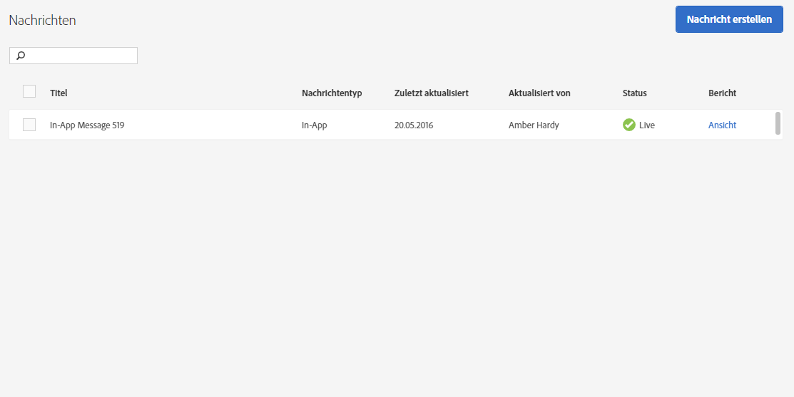

# Nachrichten verwalten{#manage-messages}

{#eol}

Zeigen Sie eine Liste Ihrer In-App- und Push-Nachrichten mit Informationen zum Zeitpunkt der letzten Aktualisierung sowie zum Status (live oder deaktiviert) jeder Nachricht an.

Sie können Nachrichten duplizieren, aktivieren/deaktivieren und archivieren und deren Archivierung aufheben. Sie können auch einen Bericht anzeigen, der die Anzahl der Benutzer, die die Nachricht angesehen haben, und die Anzahl der Benutzer, die sich durch die Nachricht durchgeklickt haben, anzeigt.

Um Nachrichten zu verwalten, klicken Sie auf ***Ihr_App_Name*** > **[!UICONTROL Nachrichten]** > Nachrichten **[!UICONTROL verwalten]**.

Im Folgenden finden Sie weitere Informationen zu den Aufgaben, die Sie für Nachrichten ausführen können:

* **Nachrichten suchen und filtern**

   Benutzen Sie das oberhalb der Liste angezeigte Suchfeld, um nach Nachrichten zu suchen und diese zu filtern. Alles, was Sie in das Suchfeld eingeben, zeigt übereinstimmende Nachrichten aus der Liste an. Die Suche funktioniert über alle Tabellenspalten hinweg. Sie können beispielsweise  `Draft` eingeben, um nur Nachrichten mit dem entsprechenden Status anzuzeigen. Sie können auch den Namen eines Benutzers eingeben, damit nur Nachrichten angezeigt werden, die von diesem Benutzer aktualisiert wurden.

   Sie können außerdem auf eine beliebige Spaltenüberschrift klicken, um die Liste in auf- oder absteigender Reihenfolge nach dieser Spalte zu sortieren.

   Wenn Sie z. B. die Spalte **[!UICONTROL Nachrichtentyp]** in aufsteigender Reihenfolge sortieren, werden Ihre gesamten In-App-Nachrichten vor Ihren Push-Nachrichten angezeigt. Wenn Sie die Spalte **[!UICONTROL Zuletzt aktualisiert]** in absteigender Reihenfolge sortieren, zeigt die Liste zuerst Ihre zuletzt aktualisierten Nachrichten an.

* **Nachrichten duplizieren**

   1. Aktivieren Sie das Kontrollkästchen neben mindestens einer Nachricht und klicken Sie auf **[!UICONTROL Ausgewählte duplizieren]**.
   1. Wählen Sie die App aus, für die Sie eine Nachricht duplizieren möchten.
   1. Geben Sie einen Namen für die Nachricht ein.

      Um eine Nachricht für dieselbe App zu duplizieren, geben Sie einen neuen Namen für die Nachricht ein. Wenn Sie denselben Namen beibehalten, überschreiben Sie die ursprüngliche Nachricht. Wenn Sie eine Nachricht für eine andere App duplizieren, können Sie denselben Namen beibehalten, ohne dass die ursprüngliche Nachricht überschrieben wird.

   1. Klicken Sie gegebenenfalls auf **[!UICONTROL Duplizieren]** oder auf **[!UICONTROL Überschreiben]**.

* **Nachrichten deaktivieren oder aktivieren**

   Um eine Nachricht zu deaktivieren, aktivieren Sie das Kontrollkästchen neben mindestens einer aktiven Nachricht und klicken Sie auf **[!UICONTROL Auswahl deaktivieren]**.

   Um eine deaktivierte Nachricht zu aktivieren, aktivieren Sie das Kontrollkästchen neben mindestens einer deaktivierten Nachricht und klicken Sie auf **[!UICONTROL Auswahl aktivieren]**.

* **Nachrichten archivieren**

   Archivieren von Nachrichten und Aufräumen der Nachrichtenliste:

   >[!TIP]
   >
   >Bevor Sie eine Nachricht archivieren können, müssen Sie sie zunächst deaktivieren.

   1. Aktivieren Sie das Kontrollkästchen neben mindestens einer deaktivierten Nachricht und klicken Sie auf **[!UICONTROL Ausgewählte archivieren]**.

* **Archivierte Nachrichten anzeigen**

   1. Klicken Sie auf **[!UICONTROL Archiv anzeigen]**.
   1. Aktivieren Sie das Kontrollkästchen neben mindestens einer archivierten Nachricht und klicken Sie auf **[!UICONTROL Archivierung der Ausgewählten aufheben]**.
