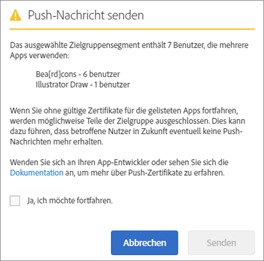

# Zielgruppe: Push-Nachrichten {#audience-define-and-configure-audience-segments-for-push-messages}

Sie können Zielgruppenoptionen für Push-Nachrichten definieren und konfigurieren, einschließlich Datumsbereichsoptionen, Analytics-Segmenten und benutzerdefinierter Segmente.

## Zielgruppensegmente definieren {#section_7C4D2393CF7441959FE2381A02867CAC}

Wenn ein Zielgruppensegment für Push-Messaging erstellt wird, beinhaltet das Segment möglicherweise Benutzer aus einer oder mehreren Apps, da auch Report Suites bzw. Virtual Report Suites Daten aus einer oder mehreren Apps enthalten können. Weitere Informationen zu Virtual Report Suites finden Sie unter  [Virtual Report Suites](/help/using/manage-apps/c-mob-vrs.md).

In Adobe Mobile Services können Marketer Push-Benachrichtigungen nur an eine App pro Plattform senden. Wenn Marketer versuchen, Push-Benachrichtigungen an Segmente zu senden, die Benutzer aus mehreren Apps enthalten, wird eine Warnung angezeigt, in der erklärt wird, dass ein Fortfahren zu schwerwiegenden Push-Fehlern führen kann und Benutzer möglicherweise auf die Sperrliste gesetzt werden. Wenn bei Ihnen Push-Fehler auftreten, lesen Sie den Abschnitt *Beheben von Push-Fehlern* unter  [Fehlerbehebung für Push-Nachrichten](/help/using/in-app-messaging/t-create-push-message/c-schedule-push-message.md).

Informationen zur Verwendung von Audience Manager-Daten in Ihrer Segmentdefinition finden Sie unter [Audience Analytics](https://docs.adobe.com/content/help/de-DE/analytics/integration/audience-analytics/mc-audiences-aam.html).

>[!IMPORTANT]
>
>Wenn App-Benutzer in der Sperrliste enthalten sind, können Marketingexperten **keine** Push-Nachrichten an die betroffenen Benutzer mehr senden.

Wenn Sie ein Zielgruppensegment auswählen, das Benutzer mehrerer Apps enthält, wird möglicherweise folgender Warnhinweis angezeigt:

Der App-Name basiert auf der reduzierten Version der AppId, die automatisch vom Mobile Services-SDK im Format `<app name> <version number> (<bundle id>)` an Adobe Analytics gesendet wird.

>[!TIP]
>
>Die Versionsnummer ist optional.

Es werden bis zu sechs Zahlensätze für die Version und fünf Zahlensätze für die Paket-ID entfernt.

Beispiel:

* `Bea[rd]cons 1.0 (123)` wird angezeigt als `Bea[rd]cons`
* `Bea[rd]cons 1.2 (1.2)` wird angezeigt als `Bea[rd]cons`
* `Bea[rd]cons 1.2.3.4.5.6.7 (1111)` wird angezeigt als `Bea[rd]cons .7`
* `Bea[rd]cons 1.2.3. (1.2.3.4.5.6)` wird angezeigt als `Bea[rd]cons (.6)`

Um mit dem Senden von Push-Nachrichten an die aufgeführten Apps fortzufahren, aktivieren Sie das Kontrollkästchen **[!UICONTROL Ja, ich möchte fortfahren]** und klicken Sie auf **[!UICONTROL Senden]**.

## Best Practices

Im Folgenden finden Sie einige nützliche Best Practices:

* Um unnötige Verwirrung zu vermeiden, definieren Sie **keine** Mobile App Virtual Report Suites, die Daten aus mehreren Apps enthalten.
* Verwenden Sie **jedes Mal**, wenn Sie eine Push-Nachricht senden möchten, eine eindeutige App-ID als Teil eines Zielgruppensegments.
So wird gewährleistet, dass Push-Benachrichtigungen an ein Zielgruppensegment gesendet werden, das **nur** zu einer App gehört.

### Beispiele

Im Folgenden finden Sie einige Beispiele, wie Sie Segmente korrekt definieren können:

**Richtig**: Der Marketer stellt Push-Zertifikate für die iOS- und Android-Versionen einer einzigen App bereit, z. B. für Adobe Photoshop. Der Marketer sendet möglicherweise eine Push-Benachrichtigung an ein Benutzersegment, das sich über beide Plattformen erstreckt.

**Falsch**: Marketer stellen Push-Zertifikate für iOS- und Android-Versionen einer einzigen App bereit, z. B. für Adobe Photoshop. Wenn ein Marketer *in den letzten 30 Tagen ein Segment aller aktiven Benutzer* erstellt und an dieses gepusht hat, erhalten nur die Benutzer der Adobe Photoshop-iOS- und -Android-App den Push-Vorgang und alle Benutzer der Adobe Illustrator-iOS- und -Android-App werden auf die Sperrliste gesetzt. Weitere Informationen und Beispiele finden Sie im Abschnitt *Beheben von Push-Nachrichtenfehlern* unter  [Fehlerbehebung für Push-Nachrichten](/help/using/in-app-messaging/t-create-push-message/c-troubleshooting-push-messaging.md).

## Zielgruppensegmente konfigurieren {#section_A92C60885A30421B8150820EC1CCBF13}

1. Gehen Sie zur Seite „Zielgruppe“ einer neuen Push-Nachricht.

   Weitere Informationen finden Sie unter [Push-Nachrichten erstellen](/help/using/in-app-messaging/t-create-push-message/t-create-push-message.md).

   Denken Sie beim Konfigurieren der Zielgruppenoptionen an folgende **wichtigen** Informationen:

   * **[!UICONTROL Geschätzte Teilnehmer-Zielgruppe]** beschreibt die Anzahl der Geräte, die dem Adobe Analytics-Segment entsprechen, **und** die Anzahl teilnehmender Geräte.

      Sie können eine Schätzung der Anzahl der Benutzer in Ihren ausgewählten Segmenten anzeigen, die sich per Opt-in für den Empfang von Nachrichten entschieden haben und die Push-Nachricht erhalten. Die Gesamtzahl der App-Benutzer wird unabhängig vom Opt-in-Status unterhalb der Schätzung angezeigt.

   * **[!UICONTROL Gesamt]** beschreibt die Anzahl der Geräte, die dem Adobe Analytics-Segment entsprechen.

   * Die Push-Nachrichten werden an die Geräte gesendet, die Teil des definierten Adobe Analytics-Segments sind **und** auf denen der Erhalt von Push-Nachrichten aktiviert wurde.

      Das bedeutet, dass das SDK für die Push-Teilnehmer-eVar den Wert `True` gesendet hat.

   * Obwohl das Gerät über ein gültiges Gerätetoken verfügt, wird die Nachricht nicht an das Gerät gepusht, sofern Adobe Analytics nicht die Teilnehmer-Markierung festgelegt hat.

   * Weitere Informationen zur Fehlerbehebung bei Push-Nachrichten finden Sie unter folgenden Themen:

      * [Push-Nachrichten in iOS](https://docs.adobe.com/content/help/de-DE/mobile-services/ios/messaging-ios/push-messaging/push-messaging.html)

      * [Push-Nachrichten in Android](https://docs.adobe.com/content/help/de-DE/mobile-services/android/messaging-android/push-messaging/push-messaging.html)

1. Geben Sie Informationen in folgende Felder ein:

   * **[!UICONTROL Während]**

      Geben Sie hier den Zeitraum für die geschätzte Zielgruppe an. Wählen Sie aus der Dropdown-Liste **[!UICONTROL Während]** eine Option aus:

   * **[!UICONTROL Mit der letzten]** können Sie einen relativen Zeitraum, wie z. B. die letzten 7, 30 oder 60 Tage, ab dem Zeitpunkt auswählen, zu dem die Nachricht gepusht werden sollte.

      Wenn Sie beispielsweise die letzten 30 Tage auswählen und die Übertragung der Nachricht für den 31. Oktober planen, setzt sich die geschätzte Zielgruppe aus den Benutzern zusammen, die den Erhalt von Push-Nachrichten in den 30 Tagen vor dem 31. Oktober aktiviert haben.

   * Mit **[!UICONTROL statischer Bereich]** können Sie einen statischen Bereich auswählen, indem Sie das Start- und Enddatum für den geschätzten Zielgruppenbereich festlegen.

      Um nochmals das vorangegangene Beispiel heranzuziehen: Wenn Sie einen Datumsbereich zwischen dem 1. Oktober und dem 15. Oktober auswählen, die Übertragung der Nachricht jedoch für den 31. Oktober planen, setzt sich die geschätzte Zielgruppe aus den Benutzern zusammen, die den Erhalt von Push-Nachrichten im angegebenen statischen Bereich (1. Oktober bis 15. Oktober) aktiviert haben.

   * **[!UICONTROL Analytics-Segmente]**

      Wählen Sie ein vorhandenes Adobe Analytics-Segment aus der Dropdown-Liste aus. Weitere Informationen finden Sie unter [Aufbau von Segmenten](https://docs.adobe.com/content/help/de-DE/analytics/components/segmentation/segmentation-workflow/seg-build.html).

   * **[!UICONTROL Benutzerdefinierte Segmente]**

      Wählen Sie aus der Dropdown-Liste eine Metrik oder Variable aus (z. B. **[!UICONTROL Tage seit der letzten Verwendung]** oder **[!UICONTROL Zielpunkt]**) und konfigurieren Sie den Filter nach Ihren Anforderungen. Das folgende benutzerdefinierte Segment beispielsweise ist auf Benutzer ausgerichtet, die ein Smartphone mit iOS besitzen und sich in der Region Kalifornien (USA) aufhalten.
   >[!IMPORTANT]
   >
   >Wenn Sie im Abschnitt **[!UICONTROL Zielgruppe erstellen]** auf **[!UICONTROL Und]** klicken, werden Sie per Dialogfenster daran erinnert, dass jede aufgeführte App über ein gültiges Zertifikat verfügen **muss**. Wenn Sie auf **[!UICONTROL Oder]** klicken, wird das standardmäßige Dialogfenster angezeigt. Weitere Informationen zu gültigen Zertifikaten und Report Suites finden Sie unter [Virtual Report Suites](/help/using/manage-apps/c-mob-vrs.md).
