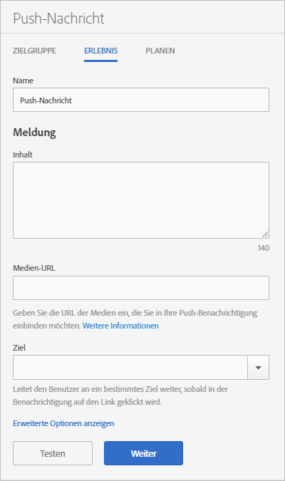

# Erlebnis: Push-Nachrichten {#experience-push-message}

Sie können Erlebnisoptionen für Push-Nachrichten und Rich-Push-Nachrichten, einschließlich Namen, Nachrichtentext und Zieloptionen, konfigurieren. Sie können auch erweiterte Optionen konfigurieren, einschließlich Payload-Optionen und benutzerdefinierte Optionen für iOS-Geräte.

1. Klicken Sie auf der Seite „Zielgruppe“ einer neuer Push-Nachricht auf **[!UICONTROL Erlebnis]**.

   

1. Geben Sie den Namen der Nachricht ein.
1. Geben Sie in folgende Felder im Abschnitt **[!UICONTROL Meldung]** Informationen ein:

   * **[!UICONTROL Inhalt]**

      Geben Sie den Text der Nachricht ein. Sie können maximal 140 Zeichen angeben.

   * **[!UICONTROL Medien-URL]**

      Geben Sie die URL der Mediendatei ein, die Sie für die Push-Nachricht verwenden möchten. Anforderungen für die Verwendung von Rich-Push-Benachrichtigungen finden Sie unter *Anforderungen für Rich-Push-Benachrichtigungen* weiter unten.

      >[!IMPORTANT]
      >
      >Beachten Sie beim Anzeigen von Bildern oder Videos in Push-Nachrichten folgende Punkte:
      > * Die `attachment-url`-Daten werden in der Push-Nutzlast verarbeitet.
      > * Die Medien-URL muss kurzzeitige Zunahmen der Anfragenanzahl verkraften können.

   * **[!UICONTROL Ziel]**

      Wählen Sie ein bestimmtes Ziel aus, wie z. B. einen Web-, Deep- oder Hybrid-Link, zu dem Benutzer nach dem Clickthrough weitergeleitet werden. Weitere Informationen finden Sie in [Ziele](/help/using/acquisition-main/c-create-destinations.md).

      >[!TIP]
      >
      >Wenn Sie den Zieltyp * **[!UICONTROL Web-Link]** oder **[!UICONTROL Benutzerspezifischer Link]** verwenden, wird der Zieltyp nicht verfolgt. Nur **[!UICONTROL Deep-Links]** werden verfolgt.

## Anforderungen für Rich-Push-Benachrichtigungen

Hier finden Sie die Anforderungen zum Senden von Rich-Push-Benachrichtigungen:

* **Unterstützte Versionen**

   Rich-Push-Benachrichtigungen werden in den folgenden Versionen unterstützt:
   * Android 4.1.0 oder höher
   * iOS 10 oder höher

      >[!IMPORTANT]
      >
      >Berücksichtigen Sie folgende Informationen:
      >* Rich-Push-Nachrichten können zwar an niedrigere Versionen gesendet werden, jedoch wird hier nur der Text angezeigt.
      >* Derzeit steht keine Unterstützung für die Uhr zur Verfügung.

* **Dateiformate**

   Die folgenden Dateiformate werden unterstützt:
   * Bilder: JPG und PNG
   * Animationen (nur iOS): GIF
   * Videos (nur iOS): MP4

* **URL-Formate**
   * Nur HTTPS

* **Größe**
   * Bilder müssen im 2:1-Format vorliegen, andernfalls werden die Seiten abgeschnitten.

Weitere Informationen zur Konfiguration von Rich-Push-Benachrichtigungen finden Sie unter folgenden Themen:

* [Push-Benachrichtigungen in Android empfangen](/help/android/messaging-main/push-messaging/c-set-up-rich-push-notif-android.md)
* [Rich-Push-Benachrichtigungen in iOS empfangen](/help/ios/messaging-main/push-messaging/c-set-up-rich-push-notif-ios.md)

Konfigurieren einer Push-Nachricht auf der Seite „Erlebnis“:

1. (**Optional**) Klicken Sie auf den Link **[!UICONTROL Erweiterte Optionen anzeigen]**, um zusätzliche Optionen zu konfigurieren:

   * **[!UICONTROL Payload: Daten]**

      Stellen Sie eine benutzerdefinierte Push-Nutzlast in JSON bereit, die per Push- oder lokale Benachrichtigung an die App gesendet wird. Der Grenzwert unter Android und iOS liegt bei 4 KB.

   * **[!UICONTROL Apple-Optionen: Kategorie]**

      Geben Sie eine Kategorie für Push- und lokale Benachrichtigungen an. Weitere Informationen finden Sie unter [Managing Your App&#39;s Notification Support](https://developer.apple.com/library/content/documentation/NetworkingInternet/Conceptual/RemoteNotificationsPG/SupportingNotificationsinYourApp.html#//apple_ref/doc/uid/TP40008194-CH4-SW9) in der *iOS Developer Library*.

   * **[!UICONTROL Apple-Optionen: Sound]**

      Geben Sie den Namen der Sounddatei an, die in Ihrem App-Bundle wiedergegeben werden soll. Es ist kein standardmäßiger Sound für Warnhinweise festgelegt. Weitere Informationen finden Sie unter [Managing Your App&#39;s Notification Support](https://developer.apple.com/library/content/documentation/NetworkingInternet/Conceptual/RemoteNotificationsPG/SupportingNotificationsinYourApp.html#//apple_ref/doc/uid/TP40008194-CH4-SW10) in der *iOS Developer Library*.

   * **[!UICONTROL Apple-Optionen: Inhalt verfügbar]**

      Wählen Sie diese Option, damit iOS beim Eintreffen der Nachricht Ihre im Hintergrund laufende App aktiviert und ihr auf der Grundlage der Payload der Nachricht das Ausführen von Code erlaubt. Weitere Informationen finden Sie unter [Apple Push Notification Service](https://developer.apple.com/library/content/documentation/NetworkingInternet/Conceptual/RemoteNotificationsPG/APNSOverview.html#//apple_ref/doc/uid/TP40008194-CH8-SW1) in der *iOS Developer Library*.

1. (Optional) Zeigen Sie eine Vorschau des Layouts Ihrer Nachricht an, indem Sie auf folgende Symbole klicken:

   * **[!UICONTROL x Zusammenfassung]**

      Blendet das Vorschaufenster aus. Klicken Sie auf , um das Vorschaufenster erneut anzuzeigen.

   * **[!UICONTROL Ausrichtung ändern]**

      Klicken Sie auf , um die Ausrichtung der Vorschau von Hochformat in Querformat zu ändern. Bei Watches ändert sich die Vorschau von einem runden Zifferblatt in ein eckiges Zifferblatt.

   * **[!UICONTROL Vorschau auf der Uhr eines Benutzers]**

      Um eine Vorschau der Nachricht anzuzeigen, wie sie auf der Uhr eines Benutzers angezeigt wird, klicken Sie auf .

   * **[!UICONTROL Vorschau auf dem Mobiltelefon eines Benutzers]**

      Um eine Vorschau der Nachricht anzuzeigen, wie sie auf den Mobiltelefonen eines Benutzers angezeigt wird, klicken Sie auf .

   * **[!UICONTROL Vorschau auf dem Tablet eines Benutzers]**

      Um eine Vorschau der Nachricht auf dem Tablet eines Benutzers anzuzeigen, klicken Sie auf .
   Unten in der Vorschauansicht finden Sie eine Beschreibung der Zielgruppe, die Sie im vorigen Schritt ausgewählt haben.

1. (**Optional**) Klicken Sie auf **[!UICONTROL Test]**, um die Nachricht zu Testzwecken per Push an die angegebenen Geräte zu senden.
1. Wählen Sie den Service aus und geben Sie die Push-Token für mindestens ein Gerät ein, an das die Nachricht gesendet werden soll.

   Geben Sie die Token in einer kommagetrennten Liste an, um die Nachricht an mehrere Geräte zu senden.

1. Konfigurieren Sie die Planungsoptionen für die Nachricht.

   Weitere Informationen finden Sie unter [Zeitplan: Push-Nachrichten](/help/using/in-app-messaging/t-create-push-message/c-schedule-push-message.md).
