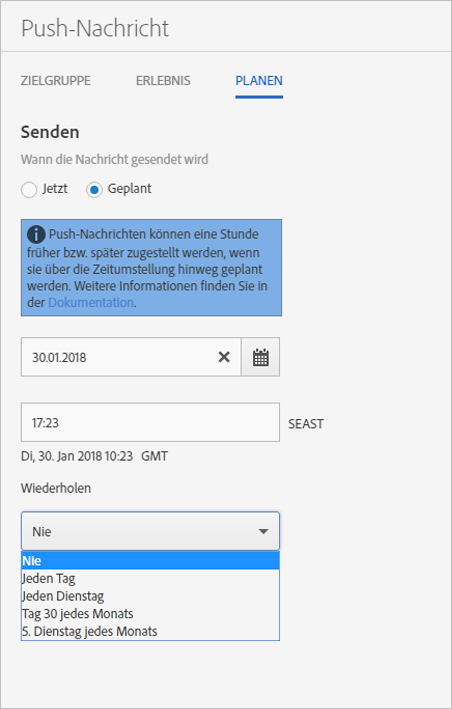

# Zeitplan: Push-Nachrichten {#schedule-push-message}

In der Benutzeroberfläche von Adobe Mobile Services können Sie eine Push-Nachricht für den sofortigen Versand, für einen späteren Versand und als wiederkehrendes Ereignis planen. Diese Ereignisse können täglich, wöchentlich oder monatlich geplant werden.

>[!TIP]
>
>Die Benutzer können die Planungseinstellungen für Push-Nachrichten jederzeit ändern. Wenn es kein zutreffendes Datum für das Senden einer wiederkehrenden geplanten Nachricht gibt, wird keine Nachricht gesendet (z. B. bei einem monatlich wiederkehrenden Vorgang am 31. Tag, am 31. Februar; oder am 5. Dienstag).

Beachten Sie die folgenden Informationen:

* Das richtige Datums- und Uhrzeitformat lautet `hh:mm` und `mm/dd/yyyy`.

* Sie können eine geplante Nachricht auf folgende Weise bearbeiten:

   * Ändern Sie das Datum auf einen späteren Zeitpunkt.
   * Ändern Sie das Wiederholungsintervall in ein anderes Intervall.

      Wenn Sie zum Beispiel ursprünglich eine Nachricht hatten, die täglich gesendet wurde, können Sie die Wiederholung auf wöchentlich umstellen.

## Vor der Planung wiederkehrender Push-Nachrichten

Sie **müssen** folgende Informationen verinnerlichen, bevor Sie wiederkehrende Push-Nachrichten planen:

* Die Optionen, die in der Dropdown-Liste **[!UICONTROL Wiederholen]** angezeigt werden, hängen vom eingegebenen bzw. ausgewählten Datum ab.

   Wenn Sie beispielsweise `Saturday, October 7` eingegeben haben, werden die folgenden Optionen angezeigt:

   * **[!UICONTROL Nie]**
   * **[!UICONTROL Jeden Tag]**
   * **[!UICONTROL Jeden Samstag]**
   * **[!UICONTROL Am 7. jeden Monats]**
   * **[!UICONTROL Am 1. Samstag jeden Monats]**

* Push-Nachrichten werden auf der Grundlage der Greenwich Mean Time (GMT) geplant und versendet.

   Wenn Sie beispielsweise eine wiederkehrende Nachricht geplant haben, die ab dem 7. Oktober jeden Samstag um 12:00 Uhr **PST** gesendet wird, wird die Nachricht tatsächlich am Samstag um 19:00 Uhr **GMT** gesendet.
* Nachrichten werden unterschiedlich gesendet, je nachdem, ob Sie sich in den USA, Europa oder Asien befinden.

   Wenn Sie sich beispielsweise in San Jose, Kalifornien, befinden und eine Nachricht planen, die am ***31. Oktober*** um 17:30 Uhr **PST** gesendet werden soll, wird die Nachricht tatsächlich am ***1. November*** um 12:30 Uhr **GMT** gesendet. Wenn Sie sich in Tokio befinden und eine Nachricht planen, die am ***1. Januar*** um 5:30 Uhr gesendet werden soll, wird sie am ***31. Dezember*** um 20:30 Uhr **GMT** gesendet.
* Push-Nachrichten werden eine Stunde früher oder später gesendet, je nachdem, wann die Sommerzeit beginnt.
* Wenn Sie sich Ihren Push-Nachrichtenbericht ansehen, wird die Nachricht in der lokalen Zeitzone Ihres Systems angezeigt.

   Wenn Ihre Startzeit beispielsweise 12:00 Uhr **PST** ist, wird im Nachrichtenbericht die Uhrzeit als 12:00 Uhr **PST** angezeigt, obwohl die Nachricht um 19:00 Uhr **GMT** gesendet wird.

## Wiederkehrende Push-Nachrichten planen {#section_675BD754E5A04423A1751193698A978F}

1. Wählen Sie auf der Seite „Zeitplan“ einer neuen Push-Nachricht die Option **[!UICONTROL Geplant]** oder **[!UICONTROL Jetzt]** aus.

   Weitere Informationen finden Sie unter [Push-Nachrichten erstellen](/help/using/in-app-messaging/t-create-push-message/t-create-push-message.md).

   Wenn Sie **[!UICONTROL Jetzt]** ausgewählt haben, wird die Nachricht umgehend übertragen. Um zu verhindern, dass eine Nachricht sofort geplant wird, klicken Sie auf **[!UICONTROL Als Entwurf speichern]**.

   

1. Wenn Sie **[!UICONTROL Geplant]** ausgewählt haben, klicken Sie auf das Kalendersymbol und wählen Sie ein Startdatum aus bzw. geben eines ein.
1. Geben Sie eine Uhrzeit ein. 
1. Wählen Sie unter **[!UICONTROL Wiederholen]** eine der folgenden Optionen aus:

   * **[!UICONTROL Nie]**
   * **[!UICONTROL Jeden Tag]**
   * **[!UICONTROL Jeden Dienstag]**
   * **`<Day x>`des Monats**

      Die angezeigten Optionen hängen von dem ausgewählten bzw. eingegebenen Starttag ab.
   * **`<nth day>`jedes Monats**

      Der angezeigte Wert hängt vom ausgewählten bzw. eingegebenen Startdatum ab.

1. Geben Sie unter **[!UICONTROL Wiederholung beenden]** Enddatum und -uhrzeit ein.
1. Klicken Sie auf eine der folgenden Optionen:

   * **[!UICONTROL Als Entwurf speichern]**

      Mit dieser Option speichern Sie die Nachricht im Entwurfsformat. Sie können diese Option wählen, um eine noch nicht fertige Nachricht zu speichern oder um die Nachricht zu speichern, sodass sie von einer anderen Person bearbeitet und genehmigt werden kann, bevor sie aktiviert wird.

      Wenn Sie im vorigen Schritt die Option **[!UICONTROL Jetzt]** ausgewählt haben, wird der Nachrichtenentwurf sofort nach Aktivierung gesendet. Wenn Sie ein Datum und eine Uhrzeit zum Senden der Nachricht ausgewählt haben, wird die Nachricht gemäß diesem Zeitplan gesendet.

   * **[!UICONTROL Speichern und planen]**

      Diese Option sendet die Nachricht am geplanten Tag und zur geplanten Uhrzeit.

Um den Nachrichtenentwurf zu einem späteren Zeitpunkt zu senden, führen Sie eine der folgenden Aufgaben aus:

* Klicken Sie auf **[!UICONTROL Nachrichten verwalten]**, aktivieren Sie das Kontrollkästchen neben der entsprechenden Nachricht und klicken Sie auf **[!UICONTROL Auswahl aktivieren]**.
* Klicken Sie auf **[!UICONTROL Speichern &amp; Senden]**, um die Nachricht zu speichern und zu senden.
