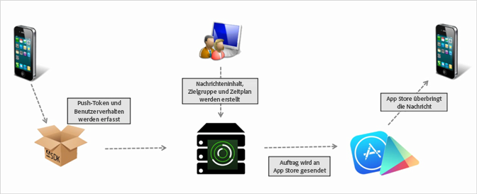

# Push-Nachrichten erstellen {#create-a-push-message}

{#eol}

Sie können über die Mobile Services-Benutzeroberfläche Push-Nachrichten an Analytics-Segmente senden, um die umfassenden Analytics-Daten bei der Interaktion mit Kunden zu nutzen.

>[!IMPORTANT]
>
>Bevor Sie eine Push-Nachricht erstellen, lesen Sie [Voraussetzungen für die Aktivierung der Push-Benachrichtigung](/help/using/c-manage-app-settings/c-mob-confg-app/configure-push-messaging/prerequisites-push-messaging.md).

Push-Nachrichten werden Benutzern angezeigt, die sich dafür entschieden haben, Benachrichtigungen zu erhalten, wenn sie Ihre App nicht aktiv verwenden. Diese Benachrichtigungen informieren Benutzer über neue Updates, Angebote und Erinnerungen. Mit diesen Benachrichtigungen können Sie mit einem optimierten Workflow Push-Nachrichten erstellen, testen und verwalten sowie Berichte zu diesen Nachrichten erstellen.

Push-Nachrichten werden Server-seitig von den Appstores und nicht von Adobe Mobile Services gesendet:

Erstellen einer Push-Nachricht:

1. Klicken Sie auf ***Ihr_App_Name*** > **[!UICONTROL Messaging]** > **[!UICONTROL Nachrichten verwalten]** > **[!UICONTROL Nachricht erstellen]** > **[!UICONTROL Push-Nachricht erstellen]**.
1. Konfigurieren Sie die Zielgruppenoptionen.

   Weitere Informationen finden Sie unter [Zielgruppe: Zielgruppensegmente für Push-Nachrichten definieren und konfigurieren](/help/using/in-app-messaging/t-create-push-message/c-audience-push-message.md).
