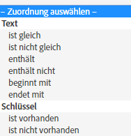

# Zielgruppe: In-App-Nachricht {#audience-in-app-message}

Sie können Zielgruppenoptionen für In-App-Nachrichten konfigurieren, einschließlich der Anzeige-, Auslöse- und Eigenschaftsoptionen.

1. Klicken Sie in Ihrer App auf **[!UICONTROL Messaging]** > **[!UICONTROL Nachrichten verwalten]** > **[!UICONTROL Nachricht erstellen]** > **[!UICONTROL In-App-Nachricht erstellen]**.
1. Geben Sie auf der Seite „Zielgruppe“ Informationen in folgende Felder ein:

   * **[!UICONTROL Ansicht]**

      Wählen Sie eine Option für das Anzeigen einer Nachricht aus:

      * **[!UICONTROL Immer]**

         Mit dieser Option wird die Nachricht jedes Mal angezeigt, wenn der Auslöser auftritt.

      * **[!UICONTROL Einmal]**

         Mit dieser Option wird die Nachricht nur beim ersten Auftreten des Auslösers angezeigt.

      * **[!UICONTROL Bis zum Clickthrough]**

         Mit dieser Option wird die Nachricht jedes Mal, wenn der Auslöser auftritt, bis zum Clickthrough des Benutzers angezeigt. Dieser Auslöser gilt nur für Vollbildmeldungen und Warnhinweise. Die meisten Meldungen müssen weitergeleitet werden oder eine Internetressource verwenden und werden nicht offline angezeigt. Um die Meldung unabhängig von der Netzwerkverbindung anzuzeigen, aktivieren Sie das Kontrollkästchen **[!UICONTROL Offline anzeigen]**.
   * **[!UICONTROL Auslöser]**

      Wählen Sie eine Option aus dem Dropdown-Menü sowie eine Bedingung aus. Beispielsweise können Sie aus der ersten Dropdown-Liste die Option **[!UICONTROL Gestartet]** und aus der zweiten Dropdown-Liste die Option **[!UICONTROL Vorhanden]** auswählen. Sie können auch benutzerspezifische Kontextdaten angeben, die im auslösenden Treffer enthalten sein müssen, damit die Nachricht angezeigt wird.

      >[!IMPORTANT]
      >
      >Wenn Sie mehrere Auslöser auswählen, müssen alle Auslöser im selben Treffer auftreten, damit die Nachricht angezeigt wird.

   * **[!UICONTROL Eigenschaften]**
Sie können bestimmen, wem die In-App-Nachricht angezeigt wird, wenn sie ausgelöst wird, und die Zielgruppe nach Treffern filtern (segmentieren), die bestimmte Daten aufweisen. Sie können beispielsweise eine Regel definieren, in der Zielpunkte Denver enthalten. Mit diesem Filter können Sie die Nachricht Kunden anzeigen, die zum Zeitpunkt des Auslösers an einem Ihrer Zielpunkte mit Denver im Namen sind.

## Zusätzliche Informationen über Eigenschaften und Auslöser {#section_48C39EFB8CAA4F62B994FCC91DF588E6}

>[!IMPORTANT]
>
>Auslöser und Eigenschaften verwenden Daten, die von Ihrer App an Analytics weitergegeben werden. Diese Werte werden als Kontextdaten, zugeordnete Variablen und Metriken übergeben. Eine Variable ist ein textbasierter Wert und eine Metrik ist ein numerischer Wert.

Um die Zuordnung dieser Schlüsselwertpaare in der Mobile Services-Benutzeroberfläche anzuzeigen und den Wert für Ihren Auslöser zu validieren, klicken Sie auf **[!UICONTROL App-Einstellungen verwalten]** > **[!UICONTROL Variablen und Metriken verwalten]** >, das die folgenden Registerkarten anzeigt:

* **[!UICONTROL Standardvariablen und Metriken]**
* **[!UICONTROL Benutzerdefinierte Variablen]**
* **[!UICONTROL Benutzerspezifische Metriken]**

Nachdem Sie die Zuordnung validiert haben, wählen Sie den passenden Matcher oder logischen Operator, um Ihre Zielgruppe für die Nachricht zu konfigurieren.

### Metriken und Variablen auswählen {#example_AB126F03BD1C4094B791E230B3DB1189}

Mithilfe der folgenden Szenarien können Sie bestimmen, ob Sie eine Metrik oder eine Variable als Auslöser auswählen möchten:

### Metriken

Eine Metrik ist eine Zahl, beispielsweise die Anzahl der Einkäufe.

1. Klicken Sie auf **[!UICONTROL Nachrichten verwalten]** > **[!UICONTROL Nachricht erstellen]**.
1. Führen Sie die folgenden Schritte im Abschnitt **[!UICONTROL Auslöser]** auf der Registerkarte **[!UICONTROL Zielgruppe]** aus:

   1. Wählen Sie ein Standardereignis, z. B. **[!UICONTROL Gestartet]**, und wählen Sie **[!UICONTROL Vorhanden]** aus.
   1. Wählen Sie einen zweiten Auslöser aus, der ein benutzerdefinierter Datenpunkt ist und der einer Metrik zugeordnet ist.
   1. Wählen Sie unter **[!UICONTROL Zahl]** eine Matcher-Option aus.

### Variablen

Eine Variable ist eine Textzeichenfolge, die eine eindeutige Kennung darstellt. Beispiele sind Land, Flughafen usw.

1. Klicken Sie auf **[!UICONTROL Nachrichten verwalten]** > **[!UICONTROL Nachricht erstellen]**.
1. Führen Sie die folgenden Schritte im Abschnitt **[!UICONTROL Auslöser]** auf der Registerkarte **[!UICONTROL Zielgruppe]** aus:

   1. Wählen Sie ein Standardereignis, z. B. **[!UICONTROL Gestartet]**, und wählen Sie **[!UICONTROL Vorhanden]** aus.
   1. Wählen Sie einen zweiten Auslöser, der ein benutzerdefinierter Datenpunkt ist und der einer Variablen zugeordnet ist.
   1. Wählen Sie unter **[!UICONTROL Text]** eine Matcher-Option aus.

Weitere Informationen zu Kontextdaten, Variablen und Metriken finden Sie unter [App verwalten](/help/using/manage-apps/manage-apps.md).
