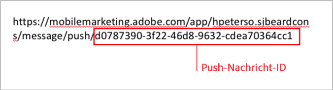
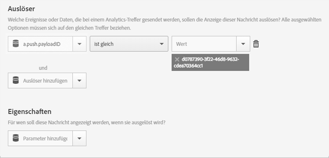

# In-App-Nachricht auslösen, wenn die App von einer Push-Nachricht aus geöffnet wird{#trigger-an-in-app-message-when-the-app-is-opened-from-a-push-message}

Sie können die Push-Nachricht-ID als Auslöser für die In-App-Nachricht festlegen, die gesendet wird, wenn ein Anwender die App von der Push-Nachricht aus öffnet.

1. Ermitteln Sie die Push-Nachricht-ID für die Push-Nachricht, die an den Anwender gesendet wird.

   Sie finden die Push-Nachricht-ID während des Erstellungsarbeitsablaufs der Nachricht in der URL.

   Siehe folgendes Beispiel:

   

1. Speichern und aktivieren Sie die In-App-Nachricht mit dem folgenden Auslöser:

   `"a.push.payloadID" =`

   >[!TIP]
   >
   >Bei der Push-Nachricht-ID handelt es sich um die ID, die Sie in Schritt 1 ermittelt haben.

   Dieser Auslöser muss manuell hinzugefügt werden, da er in der Dropdown-Liste **[!UICONTROL Auslöser]** nicht verfügbar ist.

   

1. Speichern und senden Sie die Push-Nachricht, die über die in Schritt 1 ermittelte Push-ID verfügt.
1. Klicken Sie durch die Push-Nachricht, um die App zu öffnen und zu überprüfen, dass die In-App-Nachricht beim Öffnen der App angezeigt wird.

   Beachten Sie beim Testen die folgenden Informationen:

   * Nach dem Speichern der In-App-Nachricht dauert es etwa 45 Sekunden, bis die gehostete Konfigurationsdatei mit der neuen Nachricht aktualisiert wird.
   * Die App sucht nach Aktualisierungen der Konfigurationsdatei (der neuen In-App-Nachricht), wenn ein **neuer** Launch vorhanden ist. Stellen Sie daher sicher, dass die App einen neuen Launch auslöst, wenn auf die Push-Nachricht geklickt wird.
   Dies bedeutet normalerweise, dass Sie sicherstellen müssen, dass das Sitzungs-Timeout aufgetreten ist. Der Standardwert für die Zeitüberschreitung beträgt 5 Minuten.
