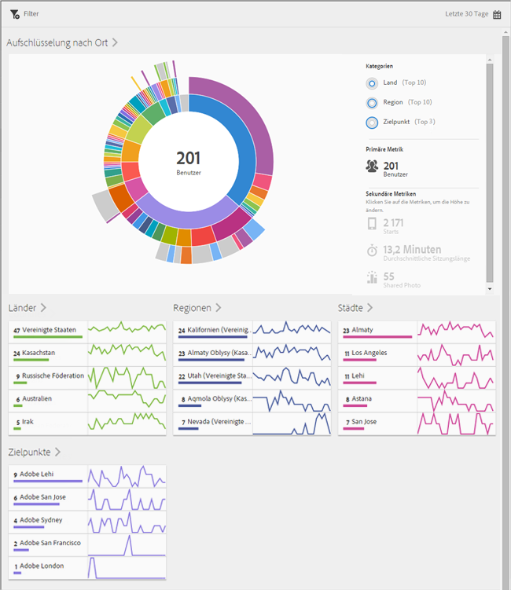
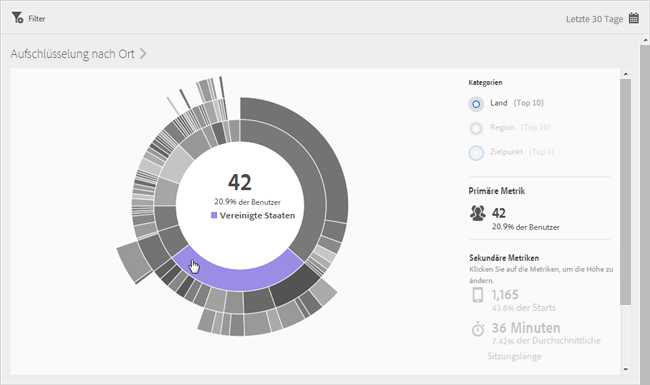
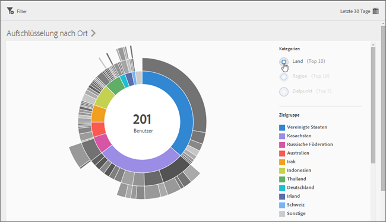
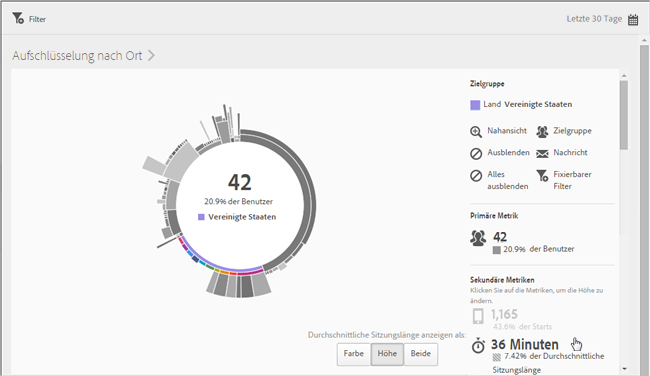
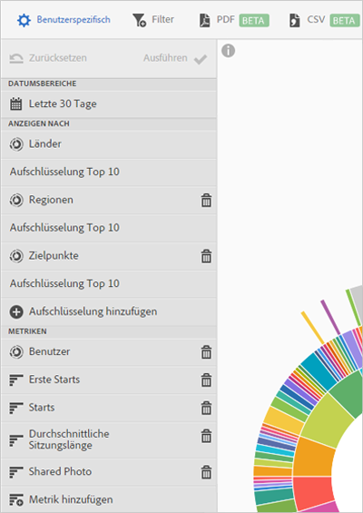

# Übersicht (Standort){#overview-location}

Im **[!UICONTROL Standortübersichtsbericht]** werden die verschiedenen Länder, Regionen und Zielpunkte angezeigt, in bzw. an denen Ihre App verwendet wird.

Dieser Bericht bietet Ihnen eine Sunburst-Grafik vorhandener Daten, die Sie nutzen können, um Zielgruppensegmente (Besuchergruppen) für das Targeting zu ermitteln. Das Erstellen und Verwalten von Zielgruppen verläuft ähnlich wie das Erstellen und Verwenden von Segmenten. Zielgruppen können Sie jedoch für die Verwendung in der Experience Cloud zur Verfügung stellen.

Im Folgenden einige zusätzliche Informationen zu diesem Bericht:

## Navigation und Verwendung {#section_4A88C3849B5847BF8CF433CCFD99FDC3}

Diese Visualisierung besteht beispielsweise aus dem Basisbericht und Aufschlüsselungen. Die Visualisierung verwendet die Höhe, um die zu betrachtende Metrik und die Leistungsunterschiede zwischen den Metriken anzuzeigen. Jeder Ring stellt ein Zielgruppensegment in der Kategorie des Rings dar. Sie können Aktionen für eine Zielgruppe ausführen, z. B. einen fixierbaren Filter anwenden, eine Metrik ausblenden und Metriken anzeigen.

>[!TIP]
>
>Neben diesen Informationen können Sie ein in das Produkt integriertes Tutorial anzeigen, in dem beschrieben wird, wie Sie mit der Sunburst-Grafik interagieren. Um das Tutorial zu starten, klicken Sie in der Titelleiste des Berichts auf **[!UICONTROL Aufschlüsselung nach Ort]** und dann auf das Symbol **[!UICONTROL i]**.

Diese Sunburst-Grafik ist interaktiv. Sie können den Zeitraum ändern, indem Sie oben rechts auf das **[!UICONTROL Kalendersymbol]** klicken. Bewegen Sie den Mauszeiger über einen beliebigen Teil der Grafik, um weitere Informationen anzuzeigen. In der folgenden Abbildung sehen Sie beispielsweise die Gesamtzahl und den Prozentsatz der Benutzer, die Ihre App in den Vereinigten Staaten verwenden.

In der Abbildung können Sie mit den Schaltflächen **[!UICONTROL Kategorien]** rechts oben die Anzeige umschalten. So können Sie zwischen Informationen zu den Top-10-Ländern und -Regionen und den Top-3-**[!UICONTROL Zielpunkten]** wechseln.

So sieht die Grafik aus, wenn Sie **[!UICONTROL Land]** auswählen:

So sieht die Grafik aus, wenn Sie **[!UICONTROL Zielpunkte]** auswählen:

Sie können auf ein Segment im Ring klicken, um die Zielgruppe auszuwählen, an der Sie dann Aktionen durchführen können, z. B. das Heranzoomen, Ausblenden von Zielgruppen oder das Erstellen einer In-App-Nachricht oder eines fixierbaren Filters.

Sie können auf der rechten Seite auf eine sekundäre Metrik klicken, um sie zur Grafik hinzuzufügen, und die Metrik per Farbe, Höhe oder beidem anzuzeigen.

## Aufschlüsselungen und Metriken hinzufügen {#section_15833511E82648869E7B1EFC24EF7B82}

Sie können Aufschlüsselungen und sekundäre Metriken hinzufügen, die dann die Höhe der jeweiligen Zielgruppe in Bezug auf die anderen im Diagramm aufgeführten Zielgruppen ändern.

>[!TIP]
>
>Je mehr Ringe Sie der grafischen Darstellung hinzufügen, umso länger dauert die Verarbeitung.

Um Aufschlüsselungen und sekundäre Metriken hinzuzufügen, klicken Sie in der Titelleiste des Berichts auf **[!UICONTROL Aufschlüsselung nach Ort]** und dann auf **[!UICONTROL Anpassen]**. Hierdurch wird die rechte Leiste geöffnet.

Wenn Sie auf **[!UICONTROL Aufschlüsselung hinzufügen]** oder **[!UICONTROL Metrik hinzufügen]** klicken, wird ein neues Element mit demselben Namen wie das vorherige Element in der jeweiligen Liste eingeblendet. Klicken Sie auf die neu erstellte Aufschlüsselung oder Metrik, um eine Dropdown-Liste zu öffnen, aus der Sie ein neues Element auswählen können.

## Fixierbaren Filter erstellen {#section_365999D49FC744ECBF9273132497E06C}

Klicken Sie auf ein Segment im Ring, um die Zielgruppe auszuwählen, für die Sie einen fixierbaren Filter erstellen möchten, und klicken Sie auf **[!UICONTROL Fixierbarer Filter]**. Mit einem fixierbaren Filter können Sie die aktuellen Filter anwenden und einen neuen Bericht ausführen, der auf diesen Filtern basiert.

## Berichte freigeben  {#section_F8AF2AA73D4C4C008976D45847F82D0B}

Nachdem Sie einen Bericht erstellt haben, wird unter Verwendung Ihrer Einstellungen eine benutzerdefinierte URL erstellt, die Sie kopieren und weitergeben können.

## Zusätzliche Informationen

Weitere Informationen zum Standort finden Sie unter folgenden Themen:

* [Zuordnung](/help/using/location/c-map-points.md)
* [Zielpunkte verwalten](/help/using/location/t-manage-points.md)
