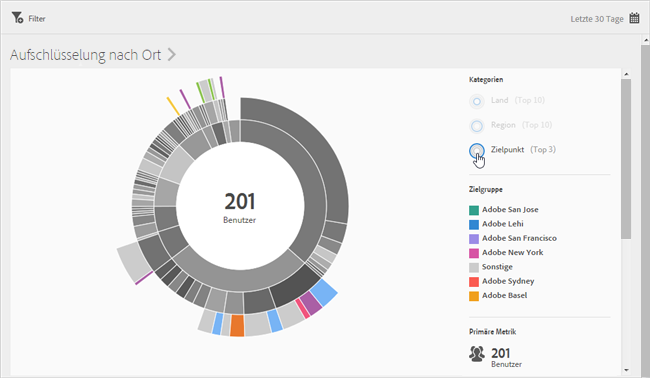
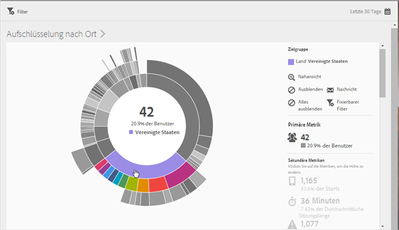

# Übersicht (Standort){#overview-location}

The **[!UICONTROL Location Overview]** report lets you see the different countries, regions, and points of interest (POI) where your app is being used.

Dieser Bericht bietet Ihnen eine Sunburst-Grafik vorhandener Daten, die Sie nutzen können, um Zielgruppensegmente (Besuchergruppen) für das Targeting zu ermitteln. Das Erstellen und Verwalten von Zielgruppen verläuft ähnlich wie das Erstellen und Verwenden von Segmenten. Zielgruppen können Sie jedoch für die Verwendung in der Experience Cloud zur Verfügung stellen.

Im Folgenden finden Sie weitere Informationen zu diesem Bericht:

## Navigation and usage {#section_4A88C3849B5847BF8CF433CCFD99FDC3}

Diese Grafik enthält beispielsweise neben dem Basisbericht auch Aufschlüsselungen. Dabei werden die untersuchten Metriken durch entsprechende Höhen visualisiert, sodass Leistungsunterschiede leicht erkennbar sind. Jeder Ring repräsentiert ein Zielgruppensegment in der jeweiligen Kategorie des Rings. An einer Zielgruppe können Sie auch Aktionen durchführen, wie zum Beispiel einen fixierbaren Filter anwenden sowie Metriken ausblenden oder anzeigen.

>[!TIP]
>
>In addition to this information, you can view an in-product tutorial that describes how to interact with the sunburst chart. Um das Tutorial zu starten, klicken Sie in der Titelleiste des Berichts auf **[!UICONTROL Aufschlüsselung nach Ort]** und dann auf das Symbol **i[!UICONTROL .]**

Diese Sunburst-Grafik ist interaktiv. Sie können den Zeitraum ändern, indem Sie oben rechts auf das **[!UICONTROL Kalendersymbol]klicken.** Wenn Sie den Mauszeiger über einen Teil der Darstellung bewegen, werden mehr Informationen angezeigt. In unten stehender Abbildung beispielsweise werden die Gesamtzahl und der Prozentsatz der Benutzer angegeben, die Ihre App in den USA verwenden.

In this illustration, the **[!UICONTROL Categories]** buttons in the upper right corner allow you to toggle between viewing information about the top ten countries, regions, and the top three **[!UICONTROL Points of Interest]**.

So sieht die Grafik aus, wenn Sie **[!UICONTROL Land auswählen]**:

So sieht die Grafik aus, wenn Sie **[!UICONTROL Zielpunkte auswählen]**:

Sie können auf ein Segment im Ring klicken, um die Zielgruppe auszuwählen, an der Sie dann Aktionen durchführen können, z. B. Heranzoomen, Ausblenden von Zielgruppen oder Erstellen einer In-App-Nachricht oder eines fixierbaren Filters.

Sie können auf der rechten Seite auf eine sekundäre Metrik klicken, um sie zur Grafik hinzuzufügen, und die Metrik per Farbe, Höhe oder beidem anzuzeigen.

## Add breakdowns and metrics {#section_15833511E82648869E7B1EFC24EF7B82}

Sie können Aufschlüsselungen und sekundäre Metriken hinzufügen, die dann die Höhe der jeweiligen Zielgruppe in Bezug auf die anderen im Diagramm aufgeführten Zielgruppen ändern.

>[!TIP]
>
>Je mehr Ringe Sie zum Sonnenbrand hinzufügen, desto länger dauert die Verarbeitung.

Um Aufschlüsselungen und sekundäre Metriken hinzuzufügen, klicken Sie in der Titelleiste des Berichts auf **[!UICONTROL Aufschlüsselung nach Ort]** und dann auf **Benutzerspezifisch]. Hierdurch wird die rechte Leiste geöffnet.[!UICONTROL **

When you click **[!UICONTROL Add Breakdown]** or **[!UICONTROL Add Metric]**, a new item displays with the same name as the previous item in the respective list. Klicken Sie auf die neu erstellte Aufschlüsselung oder Metrik, um eine Dropdown-Liste zu öffnen, aus der Sie ein neues Element auswählen können.

## Create a sticky filter {#section_365999D49FC744ECBF9273132497E06C}

Klicken Sie auf ein Segment im Ring, um die Zielgruppe auszuwählen, für die Sie einen fixierbaren Filter erstellen möchten, und klicken Sie auf **[!UICONTROL Fixierbarer Filter]**. Mit einem fixierbaren Filter können Sie die aktuellen Filter anwenden und einen neuen Bericht ausführen, der auf diesen Filtern basiert.

## Berichte freigeben {#section_F8AF2AA73D4C4C008976D45847F82D0B}

Nachdem Sie einen Bericht erstellt haben, wird unter Verwendung Ihrer Einstellungen eine benutzerdefinierte URL erstellt, die Sie kopieren und weitergeben können.

## Zusätzliche Informationen

Weitere Informationen zum Standort finden Sie unter folgenden Themen:

* [Landkarte](/help/using/location/c-map-points.md)
* [Zielpunkte verwalten](/help/using/location/t-manage-points.md)