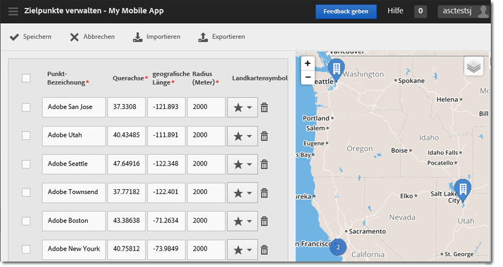

# Zielpunkte verwalten {#manage-points-of-interest}

Sie können Zielpunkte erstellen und verwalten, mit denen Sie geografische Standorte definieren können, die Sie für Korrelationszwecke, zum Ansprechen von Zielgruppen mit In-App-Nachrichten und vieles mehr verwenden können. Wenn ein Treffer innerhalb eines Zielpunkts gesendet wird, wird der Zielpunkt an den Treffer angehängt.

Bevor Sie die Standort-Funktion verwenden können, überprüfen Sie die folgenden Anforderungen:

* Sie müssen über Analytics – Mobile Apps oder Analytics Premium verfügen.
* Sie müssen **[!UICONTROL Standortberichte]** für die App aktivieren.
* Wenn Sie eine Version des iOS SDK oder Android SDK verwenden, die älter als Version 4.2 ist, müssen Sie nach dem Hinzufügen neuer **[!UICONTROL Zielpunkte]** eine neue Konfigurationsdatei herunterladen und sie an Ihre App-Entwickler senden.

   Wenn Sie Version 4.2 (oder höher) des iOS SDK oder des Android SDK verwenden, müssen Sie kein App-Update an den Store senden, um Ihre **[!UICONTROL Zielpunkte]** zu aktualisieren. Wenn Sie auf der Seite „Zielpunkte verwalten“ auf **[!UICONTROL Speichern]** klicken, werden die Änderungen in die Liste der **[!UICONTROL Zielpunkte]** gepackt und die Konfigurationsdatei für die Live-App aktualisiert. Außerdem wird die Punkteliste in Ihrer App auf den Geräten der Benutzer aktualisiert, solange die App das aktualisierte SDK und die Konfiguration mit einer entfernten Zielpunkte-URL verwendet.

Damit ein Treffer auf dem Gerät des Benutzers einem **[!UICONTROL Zielpunkt]** zugeordnet werden kann, muss die Standortfunktion für die App aktiviert sein.

Führen Sie die folgenden Aufgaben aus, um die Standort-Funktion zu verwenden:

1. Klicken Sie auf den Namen der App, um die zugehörige Seite App-Einstellungen verwalten aufzurufen.
1. Klicken Sie auf **[!UICONTROL Standort]** > **[!UICONTROL Zielpunkte verwalten]**.

   

1. Geben Sie die Informationen in die folgenden Felder ein:

   * **[!UICONTROL Punktbezeichnung]**

      Geben Sie den Namen des **[!UICONTROL Zielpunkts]** ein.

      Dabei kann es sich um den Namen einer Stadt, eines Bundeslandes oder einer Region handeln. Sie können auch **[!UICONTROL Zielpunkte]** für spezifische Standorte wie Sportstadien oder Geschäfte erstellen.

   * **[!UICONTROL Breitengrad]**

      Geben Sie den Breitengrad des **[!UICONTROL Zielpunkts]** ein. Sie können diese Information über andere Quellen wie das Internet herausfinden.

   * **[!UICONTROL Längengrad]**

      Geben Sie den Längengrad des **[!UICONTROL Zielpunkts]** ein. Sie können diese Information über andere Quellen wie das Internet herausfinden.

   * **[!UICONTROL Radius (Meter)]**

      Geben Sie den Radius (in Metern) um den **[!UICONTROL Zielpunkt]** ein, der mit eingeschlossen werden soll. Wenn Sie beispielsweise einen Zielpunkt für Denver, Colorado, erstellen, können Sie den Radius so groß definieren, dass die Stadt Denver und Umgebung eingeschlossen sind, Colorado Springs jedoch nicht.

   * **[!UICONTROL Landkartensymbol]**

      Wählen Sie ein Symbol aus, das in den Berichten [Übersicht](/help/using/location/c-location-overview.md) und [Landkarte](/help/using/location/c-map-points.md) angezeigt wird.

1. Fügen Sie ggf. weitere Zielpunkte hinzu.

   Es wird empfohlen, nicht mehr als 5.000 Zielpunkte hinzuzufügen. Wenn Sie mehr als 5.000 Zielpunkte hinzufügen, können Sie die Punkte zwar speichern, Sie erhalten jedoch eine Warnmeldung, dass gemäß den Best Practices weniger als 5.000 Zielpunkte vorhanden sein sollten.

1. Klicken Sie auf **[!UICONTROL Speichern]**.

Um einen oder mehrere Zielpunkte zu löschen, markieren Sie die entsprechenden Kontrollkästchen und klicken Sie dann auf **[!UICONTROL Auswahl entfernen]**.

Klicken Sie auf **[!UICONTROL Importieren]** oder **[!UICONTROL Exportieren]**, um unter Verwendung einer `.csv`-Datei mit den Daten zu arbeiten, statt die Adobe Mobile-Benutzeroberfläche zu verwenden.
