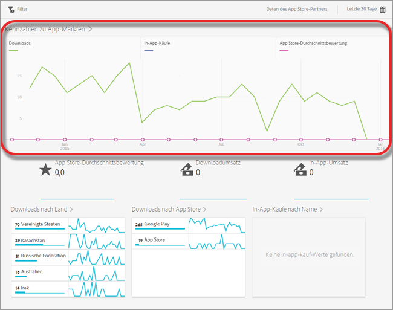
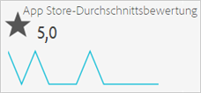
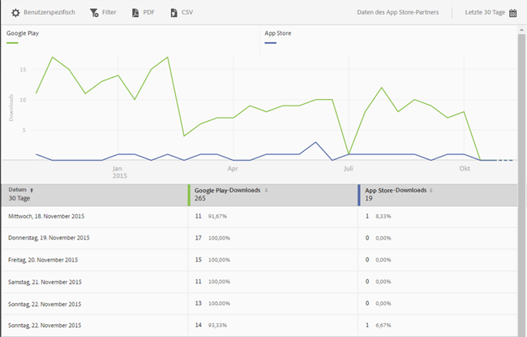
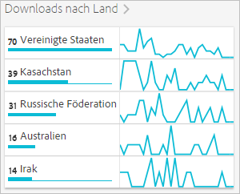
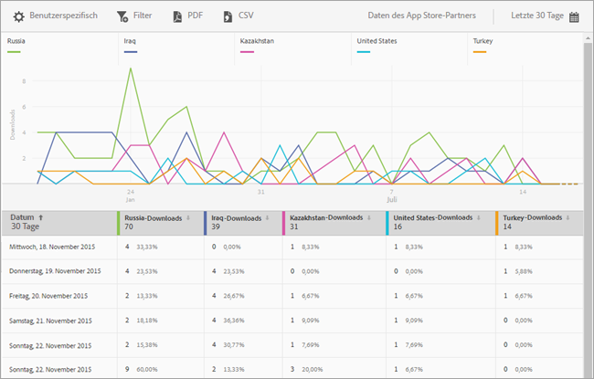
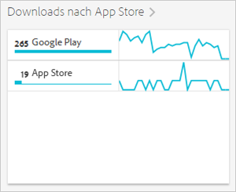

# Bericht „Appstore-Übersicht“ {#app-store-overview-report}

Der Bericht **[!UICONTROL Appstore-Übersicht]** zeigt eine Momentaufnahme Ihrer Appstore-Metriken, einschließlich Download-Anzahl, In-App-Käufen, durchschnittlicher Appstore-Bewertung, Download-Umsatz, In-App-Umsatz, Downloads nach Ländern, Downloads nach Appstore sowie In-App-Käufen nach Namen.

>[!TIP]
>
>In der Mobile Services-Benutzeroberfläche werden das Menüelement **[!UICONTROL Appstore]** und der Bericht **[!UICONTROL Übersicht]** nach der Konfiguration der Integration im linken Navigationsmenü angezeigt.

Der Bericht **[!UICONTROL Übersicht]** enthält ein Zeitdiagramm mit Informationen zur Anzahl der Appstore-Downloads, zu den In-App-Käufen über Ihre App und zur durchschnittlichen App-Bewertung.

Sie können auf eine beliebige Metrik klicken, um die zugehörige Zeile ein- oder auszublenden. Um die Daten für einen Tag anzuzeigen, fahren Sie mit dem Mauszeiger über den entsprechenden Tag.

>[!IMPORTANT]
>
>Appstore-Metriken wie Downloads, Rang, Umsatz, Bewertung usw. in Adobe Analytics erfordern eine Data Connector-Integration mit einem entsprechenden Anbieter. `appFigures` bietet derzeit eine Integration, die den Kauf des entsprechenden Produkts bzw. Services von `appFigures` erfordert, **bevor** Sie die Integration aktivieren können. Weitere Informationen zu Data Connector-Integrationen finden Sie bei [Adobe Exchange](https://www.adobeexchange.com/experiencecloud.html).

>[!TIP]
>
>Sie können nicht nur den Datumsbereich des Berichts ändern, indem Sie oben rechts auf das Kalendersymbol klicken, sondern auch einige der Drilldown-Berichte anpassen, Filter und Reihen (Metriken) sowie fixierbare Filter hinzufügen und den Bericht im PDF- oder CSV-Format herunterladen. Weitere Informationen finden Sie in [Berichte anpassen](/help/using/usage/reports-customize/reports-customize.md).

## App Store-Durchschnittsbewertung {#section_60D0D21824AE4450BC3E34D7ACA12A7A}

Dieser Bericht zeigt die durchschnittliche Bewertung, die Ihre App über Appstore-Funktionen von ihren Benutzern erhalten hat.

Klicken Sie auf eine beliebige Stelle des Widgets **[!UICONTROL Appstore-Durchschnittsbewertung]**, um ein Diagramm mit der durchschnittlichen Bewertung nach Datum anzuzeigen. Um die Daten für einen Tag anzuzeigen, fahren Sie mit dem Mauszeiger über den entsprechenden Tag.

## Downloadumsatz {#section_34F05998E8444544A1B507C1B852C4EE}

Dieser Bericht zeigt die Höhe des Umsatzes, die durch das Herunterladen Ihrer App generiert wurde.

## In-App-Umsatz  {#section_58792ED9C4B54B7D836E30CF09E8E204}

Dieser Bericht zeigt die Höhe des Umsatzes aus In-App-Käufen, die mithilfe der App getätigt wurden.

## Downloads nach Land  {#section_10373CD28CA94BA5859DFDEED7D548C6}

Dieser Bericht zeigt die Anzahl der Downloads Ihrer App nach Ländern gruppiert.

Um ein Diagramm anzuzeigen, das die Anzahl der Downloads pro Land nach Datum anzeigt, klicken Sie auf **[!UICONTROL Downloads nach Land]**. Sie können auch mit dem Mauszeiger über ein Datum fahren, um die Daten für einen Tag anzuzeigen.

## Downloads nach App Store  {#section_F1CD1A3F0105469D879E4F280CE32484}

Dieser Bericht zeigt die Anzahl der Downloads Ihrer App nach Appstore gruppiert.

Um ein Diagramm anzuzeigen, das die Anzahl der Downloads pro Appstore nach Datum anzeigt, klicken Sie auf **[!UICONTROL Downloads nach Appstore]**. Sie können auch mit dem Mauszeiger über ein Datum fahren, um die Daten für den entsprechenden Tag anzuzeigen.

## In-App-Käufe nach Namen  {#section_D747A64F9F6449E0A02EF31D56C92F83}

Dieser Bericht zeigt alle In-App-Käufe nach Namen.
