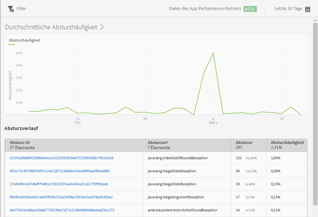

# Bericht „Abstürze“ {#crashes}

{#eol}

Der Bericht **[!UICONTROL Abstürze]** zeigt eine Momentaufnahme der Abstürze Ihrer App. Er enthält die Anzahl der Abstürze, die Absturzhäufigkeit sowie die Anmeldungen bei der Apteligent-Benutzeroberfläche.

>[!IMPORTANT]
>
>Um den Bericht **[!UICONTROL Abstürze]** im linken Navigationsbereich anzuzeigen, müssen Sie Ihre App zunächst in Apteligent integrieren.

Das Diagramm **[!UICONTROL Durchschnittliche Absturzhäufigkeit]** zeigt die Absturzhäufigkeit nach Datum. Sie können mit dem Mauszeiger über ein Datum fahren, um die Absturzhäufigkeit an diesem Tag anzuzeigen.

Das Diagramm **[!UICONTROL Absturzverlauf]** enthält Informationen zu den einzelnen App-Abstürzen mit Absturz-ID, Absturztyp, Anzahl der Abstürze und Absturzdatum. Um sich bei Apteligent anzumelden und weitere Details zu einem Absturz anzuzeigen, klicken Sie auf den Link in der Spalte **[!UICONTROL Absturz-ID]**.

Für diesen Bericht können folgende Optionen konfiguriert werden:

* **[!UICONTROL Zeitraum]**

   Klicken Sie auf das **[!UICONTROL Kalendersymbol]** und wählen Sie einen benutzerdefinierten oder einen vorgegebenen Zeitraum aus der Dropdown-Liste aus.

* **[!UICONTROL Filter]**

   Klicken Sie auf **[!UICONTROL Filter]**, um einen Filter zu erstellen, der verschiedene Berichte umfasst. Auf diese Weise können Sie die Performance eines Segments für alle Mobilberichte anzeigen. Mit einem fixierbaren Filter können Sie einen Filter definieren, der auf alle Berichte (außer auf Pfadsetzungsberichte) angewendet werden kann.

   Weitere Informationen finden Sie in [Fixierbaren Filter hinzufügen](/help/using/usage/reports-customize/t-sticky-filter.md).
