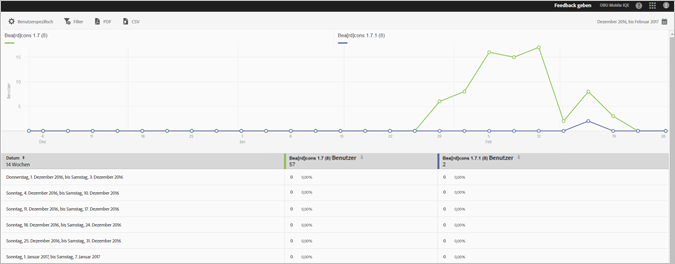

# Versionsbericht {#versions}

Der Versionsbericht ist ein Zeitverlaufsbericht, in dem Informationen über die verschiedenen Versionen der App angezeigt werden, die auf den Geräten der Benutzer ausgeführt werden.

Im Folgenden finden Sie ein Beispiel dieses Berichts:

