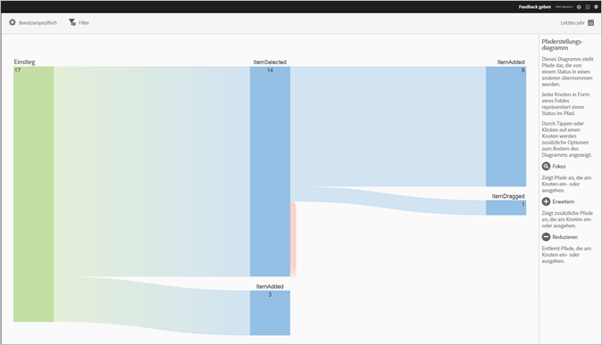

# Bericht „Action Paths“{#action-paths}

Der Bericht „Aktionspfade“ dient der Pfadanalyse. Er zeigt ein Pfadsetzungsdiagramm an, in dem die Pfade dargestellt werden, die von einem App-Status zu einem anderen führen.

Bei den Berichten **[!UICONTROL Ansichtspfade]** und **[!UICONTROL Aktionspfade]** handelt es sich um Pfadsetzungsberichte. Im Bericht **[!UICONTROL Ansichtspfade]** wird angezeigt, wie Benutzer in der App von einem Bildschirm zum nächsten navigieren. Der Bericht **[!UICONTROL Aktionspfade]** zeigt die Abfolge von Aktionen und Ereignissen, wie z. B. Klicks, Auswahlen, Größenänderungen usw., die der Benutzer in Ihrer App durchführt.

>[!TIP]
>
>Sie können einen Trichterbericht verwenden, um Navigation und Aktionen in einem Bericht zu kombinieren. Weitere Informationen finden Sie in [Trichter](/help/using/usage/reports-funnel.md).

Jeder boxförmige Knoten stellt einen Status in den Pfaden der Benutzer durch eine App dar. In der oben stehenden Grafik beispielsweise stellt der oberste Knoten die Anzahl der Benutzer dar, die die App gestartet und dann ein Foto aus der Galerie ausgewählt haben.

Um die Optionen zur Änderung des Diagramms anzuzeigen, klicken Sie auf einen Knoten und anschließend auf **[!UICONTROL Fokus]** oder **[!UICONTROL Erweitern]**. Wenn Sie beispielsweise im obersten Knoten auf den Status **[!UICONTROL PhotoPicked]** klicken, werden die Symbole **[!UICONTROL Fokus]** und **[!UICONTROL Erweitern]** angezeigt.

Klicken Sie zum Erweitern auf das Symbol **[!UICONTROL +]**. Mit dieser Option werden zusätzliche Pfade angezeigt, die zum Knoten hin oder von ihm weg führen. In der unten stehenden Grafik entspricht Status 1 dem Starten der App und Status 2 der Auswahl eines Fotos (das zuvor erweiterte Element). Status 3 enthält die verschiedenen Pfade, auf denen sich Benutzer bewegt haben:

* Auswahl eines Elements
* Hinzufügen eines Elements
* Ziehen eines Elements
* Größenänderung eines Elements

Das Erweitern eines Status ähnelt einem Trichter.

Um den Knoten zu isolieren und Pfade anzuzeigen, die zum ausgewählten Pfad bzw. von ihm weg führen, klicken Sie auf das Symbol . In der unten stehenden Grafik wurden folgende Pfade abgeschlossen, **bevor** Benutzer ein Foto ausgewählt haben:

* Drehen eines Elements
* Größenänderung eines Elements
* Ziehen eines Elements
* Entfernen eines Elements

Benutzer, die ein Foto ausgewählt haben, haben folgende Pfade abgeschlossen, **nachdem** das Foto ausgewählt wurde:

* Auswahl eines Elements
* Hinzufügen eines Elements
* Ziehen eines Elements
* Größenänderung eines Elements

Sie können mehrere Knoten fokussieren oder erweitern, um eine detaillierte Darstellung der Pfade zu erhalten, denen Benutzer in Ihrer App folgen. Beispiel:

Für diesen Bericht können folgende Optionen konfiguriert werden:

* **[!UICONTROL Zeitraum]**

   Klicken Sie auf das **[!UICONTROL Kalendersymbol]** und wählen Sie einen benutzerdefinierten oder einen vorgegebenen Zeitraum aus der Dropdownliste aus.

* **[!UICONTROL Anpassen]**

   Passen Sie Ihre Berichte an, indem Sie beispielsweise die Option **[!UICONTROL Anzeigen nach]** ändern oder Metriken und Filter bzw. zusätzliche Reihen (Metriken) hinzufügen. Weitere Informationen finden Sie in [Berichte anpassen](/help/using/usage/reports-customize/reports-customize.md).

* **[!UICONTROL Filter]**

   Klicken Sie auf **[!UICONTROL Filter]**, um einen Filter zu erstellen, der verschiedene Berichte umfasst. Auf diese Weise können Sie die Performance eines Segments für alle Mobilberichte anzeigen. Mit einem fixierbaren Filter können Sie einen Filter definieren, der auf alle Berichte (außer auf Pfadsetzungsberichte) angewendet werden kann. Weitere Informationen finden Sie in [Fixierbaren Filter hinzufügen](/help/using/usage/reports-customize/t-sticky-filter.md).

* **[!UICONTROL Download]**

   Klicken Sie auf **[!UICONTROL PDF]** oder **[!UICONTROL CSV]**, um Dokumente herunterzuladen bzw. zu öffnen und diese mit Benutzern zu teilen, die keinen Zugriff auf Mobile Services haben, oder in Präsentationen zu verwenden.