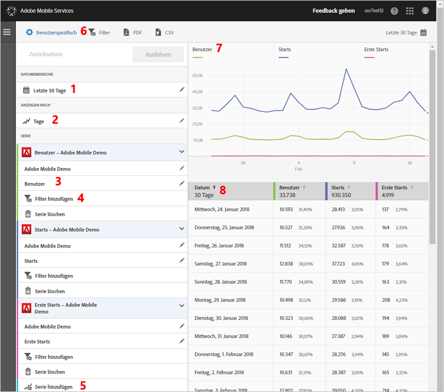

# Customize reports{#customize-reports}

Mithilfe dieser Informationen können Sie die Funktion der integrierten Berichte ermitteln und die Berichte anpassen.

Sie können Ihre Berichte anpassen, indem Sie z. B. den Datumsbereich ändern, die Optionen für **[!UICONTROL Anzeigen nach]festlegen (um Diagramm- und Tabellendaten nach Zeiträumen oder nach Dimensionen anzuzeigen), Metriken und Filter hinzufügen oder zusätzliche Reihen (Metriken) hinzufügen.**

Um die Leiste Benutzerspezifisch einzublenden, klicken Sie auf den Namen der App, wodurch die zugehörige Seite Überblick geöffnet wird, und klicken Sie auf **[!UICONTROL Benutzerspezifisch]**.

Im folgenden Beispiel ist der Bericht Benutzer und Sitzungen mit geöffneter Leiste **Benutzerspezifisch** dargestellt. In diesem Beispiel werden Daten der letzten 30 Tage nach Tagen und mit vier aktiven Reihen angezeigt:

* **[!UICONTROL Benutzer]**
* **[!UICONTROL Starts]**
* **[!UICONTROL Erste Starts]**
* **[!UICONTROL App Store-Downloads]**

Im Folgenden werden die einzelnen Bereiche des Berichts und die Leiste **[!UICONTROL Benutzerspezifisch]beschrieben:**

| Zahl | Beschreibung |
|--- |--- |
| 1 | In **[!UICONTROL Date Ranges]**, the drop-down list lets you select various date ranges for your report. Alle Daten im Diagramm (7) und in der zugehörigen Tabelle (8) richten sich nach dem ausgewählten Datumsbereich. |
| 2 | In **[!UICONTROL Show By]**, the drop-down list lets you select a time-based or dimension-based display for your report.  In der Abbildung beispielsweise ist Tage ausgewählt. Wenn Sie sich die Datumsangaben unterhalb des Diagramms (7) und die Zeilen in der Tabelle (8) ansehen, erkennen Sie, dass die Daten nach Datum in einem Zeitverlaufsbericht angeordnet sind. Durch Hinzufügen zusätzlicher Reihen können in Zeitverlaufsberichten maximal sechs Metriken dargestellt werden.  Wenn Sie eine Lebenszyklus-Dimension auswählen, können Sie die Top-50-Werte in einer Rangliste, die Top-5-Werte als Trends nach Tag oder Woche oder eine Aufschlüsselung der Top-5- oder Top-10-Werte anzeigen. |
| 3 | **[!UICONTROL Reihen:]** Reihen stellen einzelne Metriken dar, wie z. B. Benutzer, Starts, Erste Starts und App Store-Downloads im oben stehenden Beispiel. Jede Reihe ist farbcodiert mit Daten im Diagramm (7) und in der Tabelle (8).  Sie können zusätzliche Reihen (Metriken) und sogar Apps in anderen Report Suites hinzufügen, um Daten zu vergleichen.  Weitere Informationen finden Sie unter [Hinzufügen von Reihen (Metriken) zu Berichten](/help/using/usage/reports-customize/t-reports-series.md). |
| 4 | With **[!UICONTROL Add Filter]**, you can customize the built-in reports by adding additional filters (segments).  Weitere Informationen finden Sie unter Filter zu Berichten [hinzufügen](/help/using/usage/reports-customize/t-reports-customize.md). |
| 5 | With **[!UICONTROL Add Series]**, you can customize the built-in reports by adding additional series (metrics) or apps in different report suites to compare data.  For more information, see Add Series (Metrics) to Reports. |
| 6 | With **[!UICONTROL Sticky Filter]**, you can create a filter that spans different reports. So können sie beispielsweise die Performance eines bestimmten Segments in sämtlichen Mobile-Berichten ermitteln. Mit einem fixierbaren Filter können Sie einen Filter definieren, der auf alle Berichte (außer auf Pfadsetzungsberichte) angewendet werden kann.  For more information, see Add Sticky Filter. |
| 7 | **[!UICONTROL Datendiagramm:]Das Datendiagramm stellt Daten basierend auf den ausgewählten Metriken in einem geeigneten Diagramm dar.** Mögliche Diagrammtypen sind Liniendiagramm, Balkendiagramm, Ringdiagramm usw. |
| 8 | **[!UICONTROL Datentabelle:]Die Datentabelle zeigt Daten im Tabellenformat an.** Klicken Sie auf eine Spaltenüberschrift, um die Daten in auf- oder absteigender Reihenfolge zu sortieren. |

