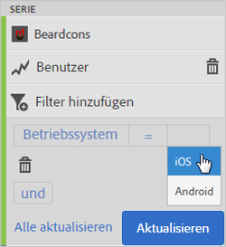
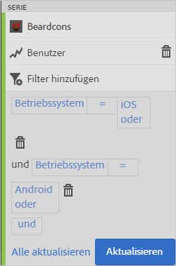
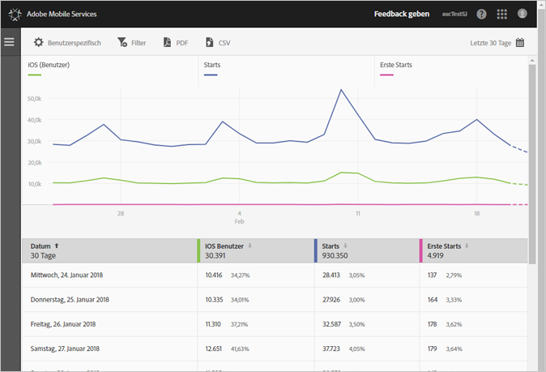
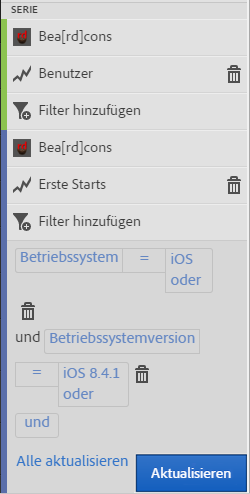
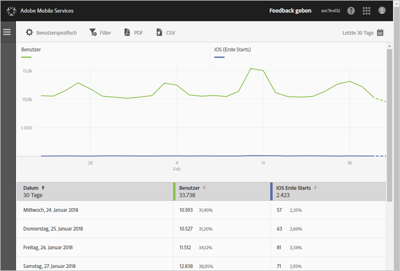

# Filter zu Berichten hinzufügen {#add-filters-to-reports}

Mithilfe dieser Informationen können Sie die integrierten Berichte durch Hinzufügen zusätzlicher Filter (Segmente) anpassen.

>[!IMPORTANT]
>
>App-Metriken sind auch in Marketing Reports &amp; Analytics, Ad-hoc-Analysen, Data Warehouse- und anderen Analytics-Schnittstellen für die Berichterstellung verfügbar. Wenn eine Aufschlüsselung oder ein Berichtstyp in Adobe Mobile nicht zur Verfügung steht, kann er mithilfe einer anderen Berichtsschnittstelle generiert werden.

Im folgenden Beispiel passen wir den Bericht **[!UICONTROL Benutzer und Sitzungen]** an, die Anweisungen gelten jedoch für alle Berichte.

1. Öffnen Sie Ihre App und klicken Sie auf **[!UICONTROL Nutzung]** > **[!UICONTROL Benutzer und Sitzungen]**.

   

   Dieser Bericht bietet einen vollständigen Überblick über die App-Benutzer im Zeitverlauf. Metriken für iOS- und Android-Versionen dieser App werden jedoch in derselben Report Suite erfasst. Wir können Benutzer nach Mobilbetriebssystem segmentieren, indem wir einen benutzerdefinierten Filter zur Benutzermetrik hinzufügen.

1. Klicken Sie auf **[!UICONTROL Anpassen]**.

   

1. Klicken Sie unter **[!UICONTROL Benutzer]** auf **[!UICONTROL Filter hinzufügen]** und klicken Sie auf **[!UICONTROL Regel hinzufügen]**.

1. Wählen Sie **[!UICONTROL Betriebssysteme]** und anschließend **[!UICONTROL iOS]** aus der Dropdown-Liste aus.

   

   Wiederholen Sie diesen Schritt, um Android als Filter hinzuzufügen.

1. Klicken Sie auf **[!UICONTROL Und]**, wählen Sie **[!UICONTROL Betriebssysteme]** aus der Dropdown-Liste und anschließend **[!UICONTROL Android]** aus.

   Die Filter sollten jetzt wie folgt aussehen:

   

1. Klicken Sie auf **[!UICONTROL Aktualisieren]**.
1. Um den Bericht neu zu erstellen, klicken Sie auf **[!UICONTROL Ausführen]**.

   Dieser Bericht zeigt nun Benutzer aufgeschlüsselt nach Betriebssystem an. Der Berichttitel wurde geändert, um den Filtern zu entsprechen, die auf den Bericht angewendet wurden.

   

   Sie können den Bericht aber noch weiter anpassen. Ab iOS 8.3 können Sie die Metrik „Erste Starts“ mit einem Filter für die Betriebssystemversion iOS 8.3 hinzufügen, um zu sehen, wie viele iOS 8.3-Kunden ihre Apps aktualisiert und einen ersten Start durchgeführt haben.
1. Klicken Sie unter **[!UICONTROL Erste Starts]** auf **[!UICONTROL Filter hinzufügen]** und dann auf **[!UICONTROL Regel hinzufügen]**. Wählen Sie aus der Dropdown-Liste den Eintrag **[!UICONTROL Betriebssysteme]** und dann **[!UICONTROL iOS]** aus.
1. Klicken Sie auf **[!UICONTROL Und]** und wählen Sie aus der Dropdown-Liste den Eintrag **[!UICONTROL Betriebssystemversionen]** und dann **[!UICONTROL iOS 8.3]** aus.

   Die Filter sollten jetzt wie folgt aussehen:

   

1. Klicken Sie auf **[!UICONTROL Aktualisieren]** und **[!UICONTROL Ausführen]**.

   Dieser Bericht zeigt jetzt Benutzer mit iOS 8.3 an, die die App zum ersten Mal gestartet haben.

   

   Nehmen Sie sich etwas Zeit, um die verschiedenen Optionen im Menü zur Berichtsanpassung zu testen und sicherzustellen, dass Sie Ihre Favoriten mit einem Lesezeichen versehen. Berichts-URLs in Adobe Mobile sind funktionsfähig und können per E-Mail versendet oder Ihren Favoriten hinzufügt werden.
