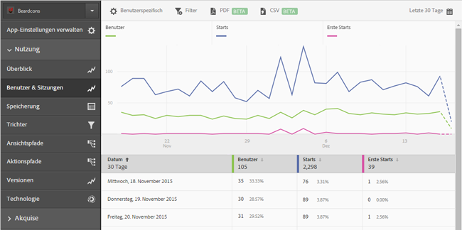
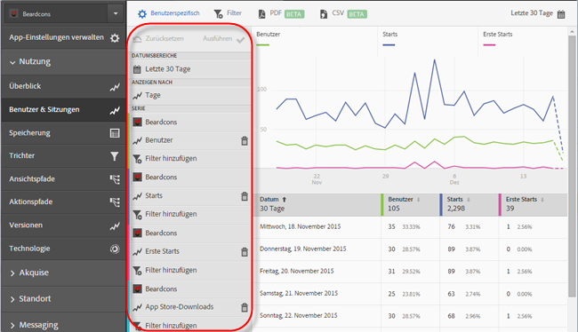
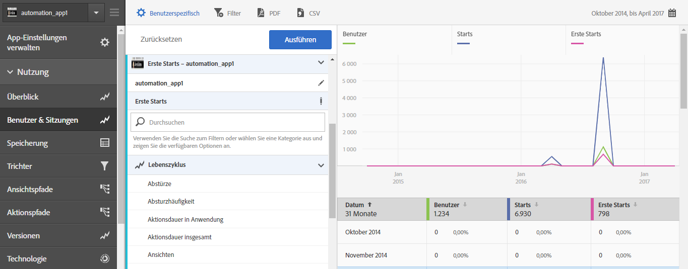
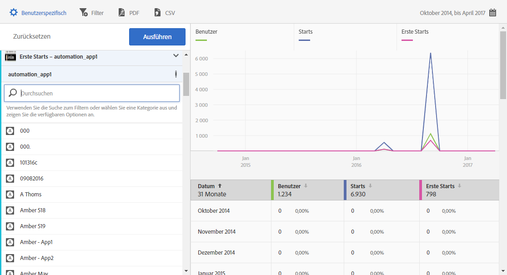

# Reihen (Metriken) zu Berichten hinzufügen {#add-series-metrics-to-reports}

Mithilfe dieser Informationen können Sie die integrierten Berichte durch Hinzufügen zusätzlicher Reihen (Metriken) oder Apps in anderen Report Suites anpassen, um Daten zu vergleichen.

>[!IMPORTANT]
>
>App-Metriken sind auch in Marketing Reports &amp; Analytics, Ad-hoc-Analysen, Data Warehouse- und anderen Analytics-Schnittstellen für die Berichterstellung verfügbar. Wenn eine Aufschlüsselung oder ein Berichtstyp in Adobe Mobile nicht zur Verfügung steht, kann er mithilfe einer anderen Berichtsschnittstelle generiert werden.

Im folgenden Beispiel passen wir den Bericht **[!UICONTROL Benutzer und Sitzungen]** an, die Anweisungen gelten jedoch für alle Berichte.

1. Öffnen Sie Ihre App und klicken Sie auf **[!UICONTROL Nutzung]** > **[!UICONTROL Benutzer und Sitzungen]**.

   

   Dieser Bericht bietet einen vollständigen Überblick über die App-Benutzer im Zeitverlauf. Wir möchten jedoch eine Reihe hinzufügen, um über App-Abstürze zu berichten.

1. Klicken Sie auf **[!UICONTROL Anpassen]**.

   

1. Scrollen Sie herunter und klicken Sie auf **[!UICONTROL Reihe hinzufügen]**.

   Der Name der Reihe wird mit dem Namen der letzten Reihe in der Liste ausgefüllt. In der vorigen Abbildung lautet die neueste Reihe **[!UICONTROL Appstore-Downloads]**. Deshalb erhält auch die neu hinzugefügte Reihe den Namen **[!UICONTROL Appstore-Downloads]**.

1. Führen Sie eine der folgenden Aufgaben aus:

   * Um eine neue Reihe (Metrik) hinzuzufügen, klicken Sie auf den Namen der eben erstellten Reihe und wählen Sie eine neue Lebenszyklusmetrik aus der Dropdownliste aus.

      

   * Um eine neue App in einer anderen Report Suite hinzuzufügen, damit Sie Daten zwischen Apps vergleichen können, klicken Sie in der neu erstellten Reihe auf den App-Namen und wählen Sie die gewünschte App aus.

      

1. (Bedingt) Fügen Sie der neuen Reihe Filter hinzu.

   Weitere Informationen finden Sie unter [Filter zu Berichten hinzufügen](/help/using/usage/reports-customize/t-reports-customize.md).
1. Klicken Sie auf **[!UICONTROL Aktualisieren]** und **[!UICONTROL Ausführen]**.
