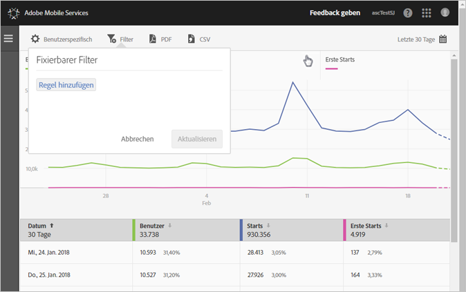
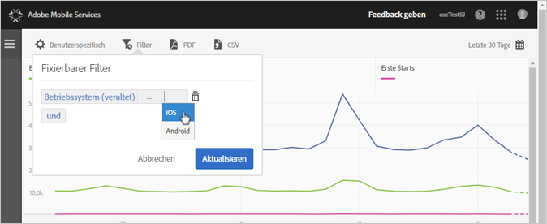
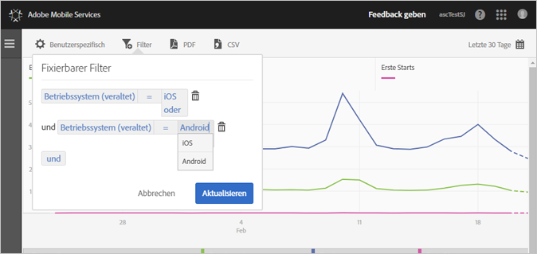

# Add a sticky filter{#add-sticky-filter}

Erstellen Sie einen Filter, der verschiedene Berichte umfasst. Auf diese Weise können Sie die Leistung eines bestimmten Segments für alle Mobilberichte anzeigen. Mit einem fixierbaren Filter können Sie einen Filter definieren, der auf alle Berichte (außer auf Pfadsetzungsberichte) angewendet werden kann.

Im folgenden Beispiel werden dem Bericht „**[!UICONTROL Benutzer und Sitzungen]“ fixierbare Filter für die Betriebssysteme iOS und Android hinzugefügt, die Anweisungen gelten jedoch für alle Berichte oder Metriken.**

1. Klicken Sie auf das Symbol **[!UICONTROL Filter]** oben in einem beliebigen Bericht in Adobe Mobile.

   

1. Klicken Sie im Dialogfeld Fixierbarer Filter auf Regel **** hinzufügen, wählen Sie **[!UICONTROL Betriebssysteme]** und wählen Sie aus der Dropdownliste **[!UICONTROL iOS]**.

   Um Android als Filter hinzuzufügen, wiederholen Sie diesen Schritt.

   

1. Click **[!UICONTROL And]**, select **[!UICONTROL Operating Systems]**, and from the drop-down list, select **[!UICONTROL Android]**.

   Die Filter sollten jetzt wie folgt aussehen:

   

1. Click **[!UICONTROL Update]** and **[!UICONTROL Run]**.
