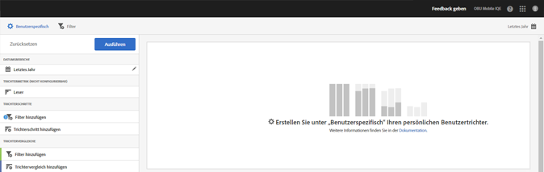
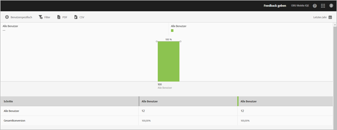

# Trichterbericht{#funnel}

{#eol}

Mit dem **[!UICONTROL Trichterbericht]** können Sie feststellen, wo Kunden bei der Interaktion mit Ihrer App eine Marketing-Kampagne verlassen haben oder von einem definierten Konversionspfad abgewichen sind. Sie können den **[!UICONTROL Trichterbericht]** auch dazu verwenden, die Aktionen verschiedener Segmente zu vergleichen.

Indem Sie Einblicke in Kundenentscheidungen bei jedem Schritt erhalten, können Sie nachvollziehen, wo die Kunden zurückgehalten werden, welchem Pfad sie für gewöhnlich folgen und wann sie die App verlassen.

Wenn Sie den **[!UICONTROL Trichterbericht]** öffnen, müssen Sie einen benutzerdefinierten Trichter erstellen. Weitere Informationen finden Sie in [Berichte anpassen](/help/using/usage/reports-customize/reports-customize.md).

>[!TIP]
>
>Wenn Sie Ihren benutzerdefinierten Trichter speichern möchten, speichern Sie die URL, nachdem Sie seine Einstellungen konfiguriert und den Bericht ausgeführt haben. Sie können die URL freigeben oder in einem Dokument speichern.

Im Folgenden finden Sie ein Beispiel dieses Berichts:

Um einen einfachen Trichter zu demonstrieren, finden Sie hier die Einstellungen für eine Konfiguration, die drei Trichterschritte und zwei Trichtervergleiche verwendet. Wir gehen davon aus, dass eine Demo-App Benutzern ermöglicht, ein Element, wie z. B. ein Foto, hinzuzufügen und dann freizugeben.

Im Fenster „Anpassen“ gibt es Abschnitte, in denen angegeben wird, dass der Benutzer die App gestartet, ein Foto aus einer Galerie in der App hinzugefügt, ein oder mehrere Fotos aus der App in sozialen Medien, Textnachrichten, E-Mails usw. freigegeben hat. Die Trichtervergleiche ermöglichen es Ihnen, den Grad des Hinzufügens und der Freigabe von Fotos zwischen Benutzern der iOS-App und der Android-App zu vergleichen.

Um den Bericht zu erstellen, klicken Sie auf **[!UICONTROL Ausführen]**.

Im Folgenden finden Sie ein Beispiel eines generierten Berichts:

Die erste Reihe zeigt, dass 100 Prozent der Benutzer die App gestartet haben. Die zweite Reihe zeigt, dass ein höherer Prozentsatz von Android-Benutzern ein Foto aus der Galerie hinzugefügt hat. Die dritte Reihe zeigt, dass fast die Hälfte der iOS-Benutzer das Foto freigegeben hat, aber keiner der Android-Benutzer das Foto freigegeben hat. Dies weist möglicherweise auf ein Problem mit der App hin, das untersucht werden muss.

Um zusätzliche Informationen anzuzeigen, fahren Sie mit der Maus über einen Balken im Diagramm.

Für diesen Bericht können folgende Optionen konfiguriert werden:

* **[!UICONTROL Zeitraum]**

   Klicken Sie auf das **[!UICONTROL Kalendersymbol]** und wählen Sie einen benutzerdefinierten oder einen vorgegebenen Zeitraum aus der Dropdown-Liste aus.
* **[!UICONTROL Anpassen]**

   Passen Sie Ihre Berichte an, indem Sie beispielsweise die Option **[!UICONTROL Anzeigen nach]** ändern oder Metriken und Filter bzw. zusätzliche Reihen (Metriken) hinzufügen. Weitere Informationen finden Sie in [Berichte anpassen](/help/using/usage/reports-customize/reports-customize.md).
* **[!UICONTROL Filter]**

   Klicken Sie auf **[!UICONTROL Filter]**, um einen Filter zu erstellen, der verschiedene Berichte umfasst. Auf diese Weise können Sie die Performance eines Segments für alle Mobilberichte anzeigen. Mit einem fixierbaren Filter können Sie einen Filter definieren, der auf alle Berichte (außer auf Pfadsetzungsberichte) angewendet werden kann. Weitere Informationen finden Sie unter [Fixierbaren Filter hinzufügen](/help/using/usage/reports-customize/t-sticky-filter.md).
* **[!UICONTROL Herunterladen]**

   Klicken Sie auf **[!UICONTROL PDF]** oder **[!UICONTROL CSV]**, um Dokumente herunterzuladen bzw. zu öffnen und diese mit Benutzern zu teilen, die keinen Zugriff auf Mobile Services haben, oder in Präsentationen zu verwenden.
