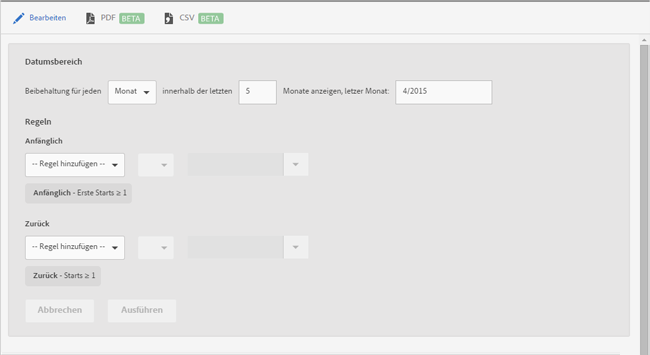

# Treuebericht {#retention}

Der **[!UICONTROL Treuebericht]** (ehemals „Erste-Start-Kohorten“) ist ein Kohortenbericht, in dem angezeigt wird, wie viele Unique Users die App zum ersten Mal gestartet und dann in den Folgemonaten mindestens einmal erneut gestartet haben.

Dieser Bericht zeigt standardmäßig die Bindung von Benutzergruppen an – basierend darauf, wann sie die App zum ersten Mal gestartet haben. Sie können diesen Bericht anpassen, um neben „Erster Programmstart“ weitere Metriken zu verwenden und zusätzliche Aktionen hinzuzufügen.

Eine Kohorte ist eine Gruppe von Personen, für die innerhalb eines festgelegten Zeitraums ein gemeinsames Merkmal bzw. Ereignis vorliegt. Im **[!UICONTROL Treuebericht]** werden Benutzer erfasst, die die App an einem bestimmten Tag, in einer bestimmten Woche oder in einem bestimmten Monat installiert haben (das gemeinsame Merkmal), und aufgezeigt, wie viele dieser Benutzer die App in den darauffolgenden X Tagen, Wochen oder Monaten gestartet haben. An dem Bericht lässt sich ablesen, wie aktiv die Besucher sind bzw. wie stark diese eingebunden sind.

Im Folgenden finden Sie ein Beispiel dieses Berichts:

In der Spalte **[!UICONTROL M0]** wird die Anzahl der Benutzer angezeigt, die die App im November 2014 zum ersten Mal gestartet haben. Die Spalte **[!UICONTROL M1]** enthält die Anzahl der Benutzer, die die App im Dezember 2014 erneut gestartet haben usw.

Um den Datumsbereich oder die Berichtsregeln zu ändern, klicken Sie auf **[!UICONTROL Bearbeiten]**.

Sie können dem Bericht beliebige Variablen oder Metriken hinzufügen, wie z. B. Lebenszyklusmetriken (jedoch ausgenommen berechneter Metriken).
