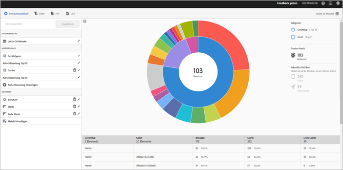

# Bericht „Technologie“ {#technology}

Im Bericht **[!UICONTROL Technologie]** werden die verschiedenen Gerätetypen, Betriebssysteme, Betriebssystemversionen und Mobilnetzbetreiber angezeigt, mit denen Ihre App verwendet wird.

Dieser Bericht bietet Ihnen eine Sunburst-Grafik vorhandener Daten, die Sie nutzen können, um Zielgruppensegmente (Besuchergruppen) für das Targeting zu ermitteln. Das Erstellen und Verwalten von Zielgruppen verläuft ähnlich wie das Erstellen und Verwenden von Segmenten. Zielgruppen können Sie jedoch für die Verwendung in der Experience Cloud zur Verfügung stellen.

## Navigation und Verwendung {#section_83CA60E1AE6245FEBCBFF3205615C4DF}

Diese Visualisierung bietet beispielsweise den Basisbericht und Aufschlüsselungen, verwendet Höhe, um die zu betrachtende Metrik und die Leistungsunterschiede zwischen den Metriken anzuzeigen. Jeder Ring stellt ein Zielgruppensegment in der Kategorie des Rings dar. Sie können Aktionen für eine Zielgruppe ausführen, z. B. einen fixierbaren Filter anwenden, eine Metrik ausblenden und Metriken anzeigen.

>[!TIP]
>
>Neben diesen Informationen können Sie ein in das Produkt integriertes Tutorial anzeigen, in dem beschrieben wird, wie Sie mit der Sunburst-Grafik interagieren. Um das Tutorial zu starten, klicken Sie in der Titelleiste des Berichts auf **[!UICONTROL Aufschlüsselung nach Technologie]**, auf **[!UICONTROL Anpassen]** und dann auf das Symbol **[!UICONTROL i]**.

Die Sunburst-Grafik ist interaktiv. Sie können die folgenden Aufgaben ausführen:

* Bewegen Sie den Mauszeiger über einen beliebigen Teil der Grafik, um weitere Informationen anzuzeigen.
* Sie können den Zeitraum ändern, indem Sie auf das **[!UICONTROL Kalendersymbol]** klicken.
* Klicken Sie auf ein Segment im Ring, um die Zielgruppe auszuwählen, an der Sie dann Aktionen durchführen können, z. B. das Heranzoomen, Ausblenden von Zielgruppen oder das Erstellen einer In-App-Nachricht oder eines fixierbaren Filters.
* Wählen Sie oben rechts **[!UICONTROL Gerätetyp]** und **[!UICONTROL Gerät]** aus, um Informationen zu den Geräten und Gerätetypen anzuzeigen.

* Klicken Sie auf eine sekundäre Metrik auf der rechten Seite, um sie der Visualisierung hinzuzufügen.

   Sie können die sekundäre Metrik mit Farbe, Höhe oder beidem darstellen lassen.

In folgender Tabelle werden die Standardberichte beschrieben und es wird angegeben, wie die Berichte in Mobile Services ausgefüllt werden:

| Bericht | Erfassungsmethode | Beschreibung |
|--- |--- |--- |
| Gerät | Lebenszyklusmetriken | Allgemeine Metriken, aufgeschlüsselt nach Gerätetyp. |
| Betriebssysteme | Automatisch | Allgemeine Metriken, aufgeschlüsselt nach Betriebssystem. |
| Betriebssystemversion | Lebenszyklusmetriken | Allgemeine Metriken, aufgeschlüsselt nach Betriebssystemversion. |
| Netzbetreiber | Automatisch | Allgemeine Metriken, aufgeschlüsselt nach Netzbetreiber. |

>[!TIP]
>
>Im Bericht **[!UICONTROL Netzbetreiber]** werden WLAN-Benutzer als `none` angegeben.

## Aufschlüsselungen und Metriken hinzufügen {#section_15833511E82648869E7B1EFC24EF7B82}

Sie können Aufschlüsselungen und sekundäre Metriken hinzufügen, die dann die Höhe der jeweiligen Zielgruppe in Bezug auf die anderen im Diagramm aufgeführten Zielgruppen ändern.

>[!IMPORTANT]
>
>Je mehr Ringe Sie der grafischen Darstellung hinzufügen, umso länger dauert die Verarbeitung.

Um Aufschlüsselungen und sekundäre Metriken hinzuzufügen, klicken Sie in der Titelleiste des Berichts auf **[!UICONTROL Aufschlüsselung nach Technologie]** und dann auf **[!UICONTROL Anpassen]**.

Wenn Sie auf **[!UICONTROL Aufschlüsselung hinzufügen]** oder **[!UICONTROL Metrik hinzufügen]** klicken, wird ein neues Element mit demselben Namen wie das vorherige Element in der Liste angezeigt. Klicken Sie auf die neu erstellte Aufschlüsselung oder Metrik, um eine Dropdown-Liste zu öffnen, aus der Sie ein neues Element auswählen können.

## Fixierbaren Filter erstellen {#section_B4E355CD1FE34E4C8ADC38139ED67FC8}

Klicken Sie auf ein Segment im Ring, um die Zielgruppe auszuwählen, für die Sie einen fixierbaren Filter erstellen möchten, und klicken Sie auf **[!UICONTROL Fixierbarer Filter]**. Mit diesem Filter können Sie die aktuellen Filter anwenden und einen neuen Bericht ausführen, der auf diesen Filtern basiert.

## Berichte freigeben  {#section_560DD5CED5144249B7E49461E2422100}

Nachdem Sie einen Bericht erstellt haben, wird unter Verwendung Ihrer Einstellungen eine benutzerdefinierte URL erstellt, die Sie kopieren und weitergeben können.
