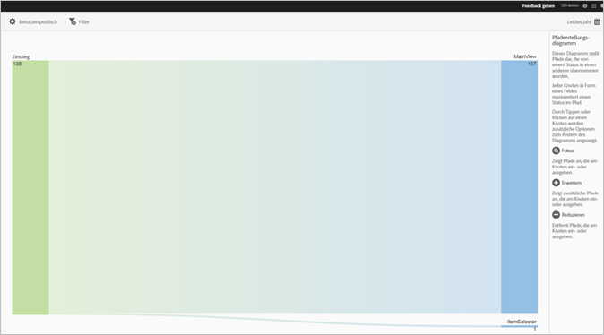
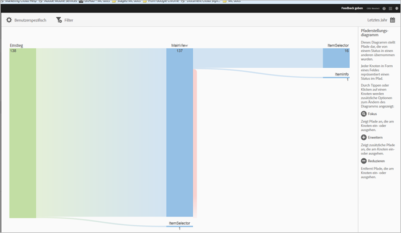
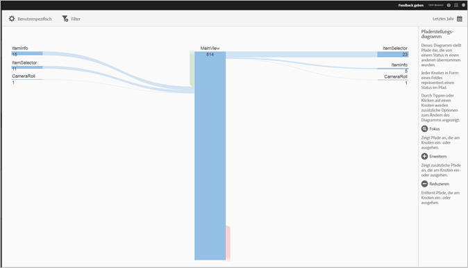
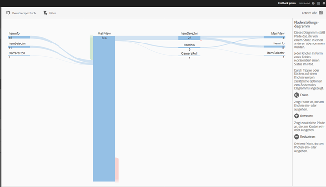

# View Paths report {#view-paths}

Der Bericht **[!UICONTROL Ansichtspfade]basiert auf Pfadanalysen und enthält ein Pfaddiagramm, das die Pfade darstellt, auf denen sich Benutzer von einem App-Status zu einem anderen bewegt haben.**

>[!TIP]
>
>The **[!UICONTROL View Paths]** and **[!UICONTROL View Action]** reports are similar because both are pathing reports. Im Bericht **[!UICONTROL Ansichtspfade]wird angezeigt, wie Benutzer in der App von einem Bildschirm zum nächsten navigieren.** Der Bericht **[!UICONTROL Aktionspfade]zeigt die Abfolge von Aktionen und Ereignissen, wie z. B. Klicks, Auswahlen, Größenänderungen usw., die der Benutzer in Ihrer App durchführt.** You can use a funnel report to combine navigation and actions in one report. For more information, see [Funnel](/help/using/usage/reports-funnel.md).

Jeder boxförmige Knoten stellt einen Status in den Pfaden der Benutzer durch eine App dar. In der oben stehenden Abbildung beispielsweise stellt der oberste Knoten die Anzahl der Benutzer dar, die die App gestartet haben und zur Hauptansicht navigiert sind.

Wenn Sie auf einen Knoten klicken, werden zur Anpassung des Diagramms zusätzliche Option, wie z. B. **[!UICONTROL Fokus]** oder **Erweitern], angezeigt.[!UICONTROL ** Wenn Sie beispielsweise im obersten Knoten auf den Status **[!UICONTROL MainView]** klicken, werden die Symbole **[!UICONTROL Fokus]und** Erweitern] angezeigt.**[!UICONTROL **

To expand the view, click the **[!UICONTROL +]** icon to display the additional paths that come in to or go from the node. In der unten stehenden Abbildung steht Status 1 für das Starten der App und Status 2 für das Aufrufen der Hauptseite der App. Status 3 enthält die folgenden von Benutzern genutzten Pfade:

* Navigation zu „Aufnahmen“
* Navigation zur Elementauswahl
* Navigation zur Kamera
* Navigation zur Infoseite des Elements

Click  to isolate the node and to show the paths that are coming into and going out of the selected node. In der unten stehenden Ansicht gingen folgende Pfade Benutzern voraus, die die Hauptseite der App aufgerufen haben:

* Elementinfo
* Elementauswahl
* Aufnahmen
* Kamera

Sie können mehrere Knoten fokussieren oder erweitern, um eine detaillierte Darstellung der Pfade zu erhalten, denen Benutzer in Ihrer App folgen. Beispiel:

Für diesen Bericht können folgende Optionen konfiguriert werden:

* **[!UICONTROL Zeitraum]** Klicken Sie auf das Symbol **[!UICONTROL Kalender]** , um einen benutzerspezifischen Zeitraum auszuwählen oder einen voreingestellten Zeitraum aus der Dropdownliste auszuwählen.
* **[!UICONTROL Passen Sie]** Sie Ihre Berichte an, indem Sie die Optionen **[!UICONTROL Anzeigen nach]** ändern, Metriken und Filter hinzufügen, zusätzliche Reihen (Metriken) hinzufügen und vieles mehr. For more information, see [Customize Reports](/help/using/usage/reports-customize/reports-customize.md).
* **[!UICONTROL Filter]** Klicken Sie auf **[!UICONTROL Filter]** , um einen Filter zu erstellen, der verschiedene Berichte umfasst, um zu sehen, wie ein Segment in allen Mobilberichten funktioniert. Mit einem fixierbaren Filter können Sie einen Filter definieren, der auf alle Berichte (außer auf Pfadsetzungsberichte) angewendet werden kann. For more information, see Add Sticky Filter.
* **[!UICONTROL Download
Click PDF or CSV to download or open documents and share with users who do not have access to Mobile Services or to use the file in presentations.]**********