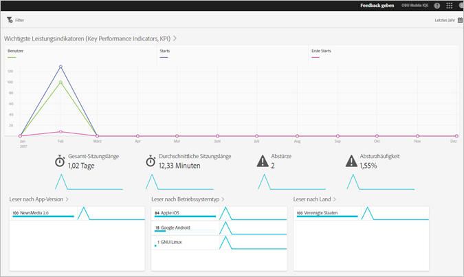

# Übersichtsbericht{#overview}

Der Übersichtsbericht zeigt eine Momentaufnahme Ihrer Schlüsselmetriken an.

Im Folgenden finden Sie ein Beispiel dieses Berichts:

Sie können den Datumsbereich für diesen Bericht ändern, indem Sie oben rechts auf das Kalendersymbol klicken. Sie können auch einen fixierbaren Filter erstellen, der sich über verschiedene Berichte erstreckt, um zu sehen, wie leistungsfähig ein Segment in allen Mobilberichten ist. Weitere Informationen zum Erstellen eines fixierbaren Filters finden Sie unter [Hinzufügen eines fixierbaren Filters](/help/using/usage/reports-customize/t-sticky-filter.md).

>[!TIP]
>
>Sie konfigurieren die Schlüsselmetriken für diesen Bericht, während Sie die App erstellen. Weitere Informationen finden Sie unter [Konfigurieren der App](/help/using/c-manage-app-settings/c-mob-confg-app/c-mob-confg-app.md).

