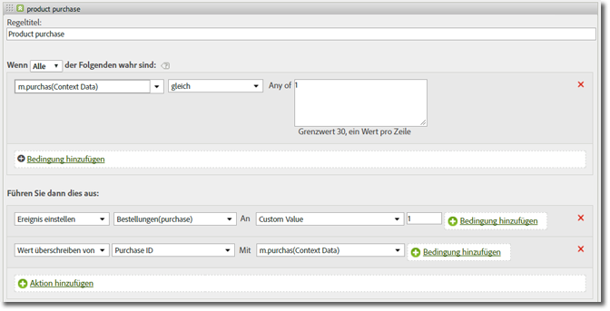

# Variable „products“ {#products-variable}

Die Variable &quot;products&quot;kann nicht mit Verarbeitungsregeln eingestellt werden. Im mobilen SDK müssen Sie eine spezielle Syntax innerhalb des Kontextdatenparameters verwenden, um Produkte direkt beim Server-Aufruf festzulegen.

Um die Variable *`products`* festzulegen, setzen Sie einen Kontextdatenschlüssel auf `"&&products"` und legen Sie den Wert mit der für *`products`* definierten Syntax fest:

```js
cdata["&&products"] = "Category;Product;Quantity;Price[,Category;Product;Quantity;Price]";
```

Beispiel:

```js
//create a context data dictionary 
var cdata = new Windows.Foundation.Collections.PropertySet(); 
 
// add products, a purchase id, a purchase context data key, and any other data you want to collect. 
// Note the special syntax for products 
cdata["&&products"] = ";Running Shoes;1;69.95,;Running Socks;10;29.99"; 
cdata["m.purchaseid"] = "1234567890"; 
cdata["m.purchase"] = "1"; 
 
var ADB = ADBMobile; 
// send the tracking call - use either a trackAction or TrackState call. 
// trackAction example: 
ADB.Analytics.trackAction("purchase", cdata); 
// trackState example: 
ADB.Analytics.trackState("Order Confirmation", cdata);
```

*`products`* wird direkt für die Bildanforderung festgelegt und die anderen Variablen werden als Kontextdaten festgelegt. Alle Kontextdatenvariablen müssen mithilfe von Verarbeitungsregeln zugeordnet werden:



Sie müssen die Variable *`products`* nicht mithilfe von Verarbeitungsregeln zuordnen, da sie direkt auf der Bildanforderung des SDK eingestellt wird.
