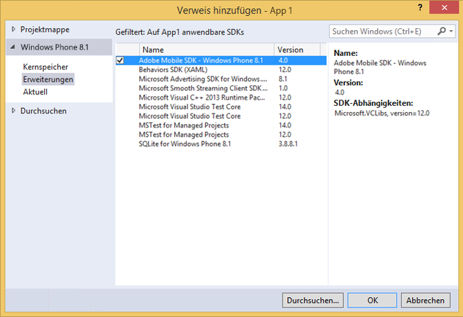

# Windows Visual Studio-Erweiterungen für Experience Cloud-Lösungen mit SDK 4.x {#windows-visual-studio-extensions-for-experience-cloud-solutions-x-sdk}

Diese Erweiterungen bieten Ihnen eine wesentlich einfachere Möglichkeit, die Referenz zum Windows-SDK für Experience Cloud-Lösungen 4.x in Ihrem Projekt hinzuzufügen.

## Bibliothek von GitHub installieren {#section_F55DB6241EF1475286C05FEAEBF996A3}

1. Laden Sie das universelle Windows-SDK von [GitHub](https://github.com/Adobe-Marketing-Cloud/mobile-services/releases) herunter.
1. Dekomprimieren Sie die heruntergeladene Datei lokal.
1. Doppelklicken Sie auf die Datei ADBMobileWindowsStoreVSIX.vsix oder ADBMobileWindowsPhoneVSIX.vsix , um das Installationsprogramm zu öffnen.

1. Wählen Sie **[!UICONTROL Global Location]** aus und installieren Sie die Bibliothek.

## Hinzufügen von Referenzen zu Ihrem Projekt {#section_00C14FE9243D4330BE1F4BB56FCF08B1}

1. Öffnen Sie Ihr Windows 8.1- oder Windows Phone 8.1-Projekt.
1. Öffnen Sie das Dialogfeld Referenz-Manager .

   

1. Suchen Sie auf der Registerkarte **[!UICONTROL Erweiterungen]** von Windows 8.1 oder Windows Phone 8.1 nach **[!UICONTROL Adobe Mobile SDK]** und wählen Sie sie aus.
1. Klicken Sie auf **[!UICONTROL OK]**, um sie zu speichern.

   Das Adobe Mobile SDK wird Ihrem Projekt hinzugefügt. Wenn es noch nicht hinzugefügt wurde, wird auch das Paket **[!UICONTROL Microsoft Visual C++ Runtime]** hinzugefügt.

1. Wählen Sie im Configuration Manager einen Platform-Typ aus und beginnen Sie mit dem Testen Ihrer App.
